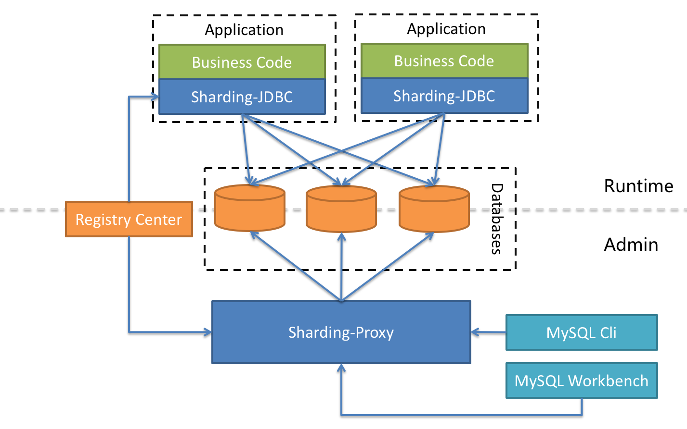
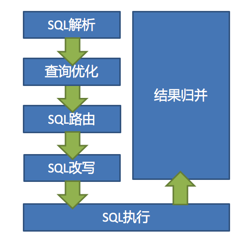
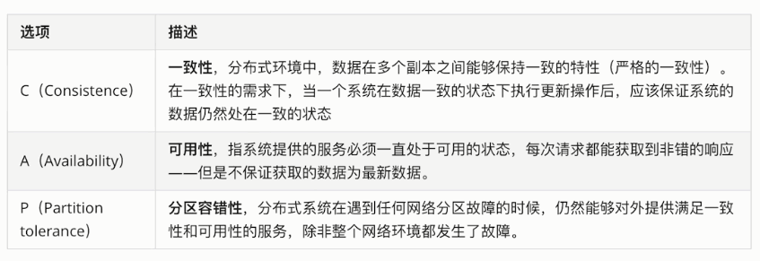
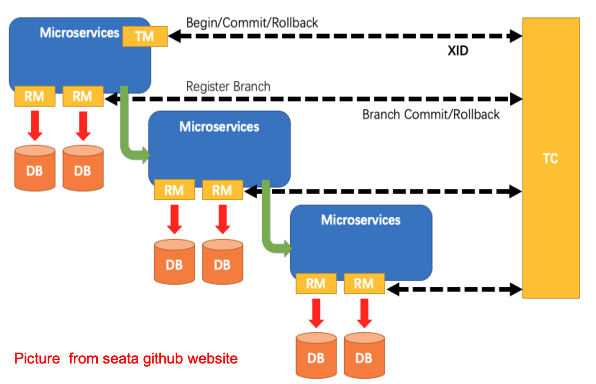

------

# 分库分表实战及中间件

## 1 ShardingSphere实战

### 1.1 ShardingSphere

- Apache ShardingSphere是一款开源的分布式数据库中间件组成的生态圈。由Sharding-JDBC、Sharding-Proxy和Sharding-Sidecar（规划中）这3款相互独立的产品组成。 它们均提供标准化的数据分片、分布式事务和数据库治理功能，可适用于如Java同构、异构语言、容器、云原生等各种多样化的应用场景。

- ShardingSphere定位为关系型数据库中间件，旨在充分合理地在分布式的场景下利用关系型数据库的计算和存储能力，而并非实现一个全新的关系型数据库。

    - 

    - Sharding-JDBC：被定位为轻量级Java框架，在Java的JDBC层提供的额外服务，以jar包形式使用。
    
    - Sharding-Proxy：被定位为透明化的数据库代理端，提供封装了数据库二进制协议的服务端版本，用于完成对异构语言的支持。
    
    - Sharding-Sidecar：被定位为Kubernetes或Mesos的云原生数据库代理，以DaemonSet的形式代理所有对数据库的访问。

### 1.2 Sharding-JDBC

- Sharding-JDBC定位为轻量级Java框架，在Java的JDBC层提供的额外服务。 它使用客户端直连数据库，以jar包形式提供服务，无需额外部署和依赖，可理解为增强版的JDBC驱动，完全兼容JDBC和各种ORM框架的使用。
  
    - 适用于任何基于Java的ORM框架，如：JPA, Hibernate, Mybatis, Spring JDBC Template或直接使用JDBC。
  
    - 基于任何第三方的数据库连接池，如：DBCP, C3P0, BoneCP, Druid, HikariCP等。
  
    - 支持任意实现JDBC规范的数据库。目前支持MySQL，Oracle，SQLServer和PostgreSQL。

- Sharding-JDBC主要功能：
  
    - 数据分片
  
        - 分库、分表
  
        - 读写分离
  
        - 分片策略
  
        - 分布式主键
  
    - 分布式事务
  
        - 标准化的事务接口
  
        - XA强一致性事务
  
        - 柔性事务
  
    - 数据库治理
  
        - 配置动态化
  
        - 编排和治理
  
        - 数据脱敏
  
        - 可视化链路追踪

### 1.3 数据分片剖析实战

#### 1.3.1 核心概念

- 表概念

    - 真实表
      
        - 数据库中真实存在的物理表。
    
    - 逻辑表
      
        - 在分片之后，同一类表结构的名称（总称）。
      
    - 数据节点
      
        - 在分片之后，由数据源和数据表组成。
    
    - 绑定表
      
        - 指的是分片规则一致的关系表（主表、子表），例如b_order和b_order_item，均按照order_id分片，则此两个表互为绑定表关系。绑定表之间的多表关联查询不会出现笛卡尔积关联，可以提升关联查询效率。
    
    - 广播表
      
        - 在使用中，有些表没必要做分片，例如字典表、省份信息等，因为他们数据量不大，而且这种表可能需要与海量数据的表进行关联查询。广播表会在不同的数据节点上进行存储，存储的表结构和数据完全相同。

- 分片算法（ShardingAlgorithm）
  
    - 由于分片算法和业务实现紧密相关，因此并未提供内置分片算法，而是通过分片策略将各种场景提炼出来，提供更高层级的抽象，并提供接口让应用开发者自行实现分片算法。目前提供4种分片算法。
    
        - 精确分片算法PreciseShardingAlgorithm
        
            - 用于处理使用单一键作为分片键的=与IN进行分片的场景。
        
        - 范围分片算法RangeShardingAlgorithm
        
            - 用于处理使用单一键作为分片键的BETWEEN AND、>、<、>=、<=进行分片的场景。
        
        - 复合分片算法ComplexKeysShardingAlgorithm
        
            - 用于处理使用多键作为分片键进行分片的场景，多个分片键的逻辑较复杂，需要应用开发者自行处理其中的复杂度。
        
        - Hint分片算法HintShardingAlgorithm
        
            - 用于处理使用Hint行分片的场景。对于分片字段非SQL决定，而由其他外置条件决定的场景，可使用SQL Hint灵活的注入分片字段。例：内部系统，按照员工登录主键分库，而数据库中并无此字段。SQL Hint支持通过Java API和SQL注释两种方式使用。

- 分片策略（ShardingStrategy）
  
    - 分片策略包含分片键和分片算法，真正可用于分片操作的是分片键 + 分片算法，也就是分片策略。目前提供5种分片策略。
    
        - 标准分片策略StandardShardingStrategy
          
            - 只支持单分片键，提供对SQL语句中的=, >, <, >=, <=, IN和BETWEEN AND的分片操作支持。提供PreciseShardingAlgorithm和RangeShardingAlgorithm两个分片算法。
          
            - PreciseShardingAlgorithm是必选的，RangeShardingAlgorithm是可选的。但是SQL中使用了范围操作，如果不配置RangeShardingAlgorithm会采用全库路由扫描，效率低。

        - 复合分片策略ComplexShardingStrategy
        
            - 支持多分片键。提供对SQL语句中的=, >, <, >=, <=, IN和BETWEEN AND的分片操作支持。由于多分片键之间的关系复杂，因此并未进行过多的封装，而是直接将分片键值组合以及分片操作符透传至分片算法，完全由应用开发者实现，提供最大的灵活度。
        
        - 行表达式分片策略InlineShardingStrategy
        
            - 只支持单分片键。使用Groovy的表达式，提供对SQL语句中的=和IN的分片操作支持，对于简单的分片算法，可以通过简单的配置使用，从而避免繁琐的Java代码开发。如: t_user_$->{u_id % 8} 表示t_user表根据u_id模8，而分成8张表，表名称为t_user_0到t_user_7。
        
        - Hint分片策略HintShardingStrategy
        
            - 通过Hint指定分片值而非从SQL中提取分片值的方式进行分片的策略。
        
        - 不分片策略NoneShardingStrategy
        
            - 不分片的策略。

- 分片策略配置
  
    - 对于分片策略存有数据源分片策略和表分片策略两种维度，两种策略的API完全相同。

        - 数据源分片策略
  
            - 用于配置数据被分配的目标数据源。
  
        - 表分片策略
  
            - 用于配置数据被分配的目标表，由于表存在与数据源内，所以表分片策略是依赖数据源分片策略结果的。

#### 1.3.2 流程剖析

- ShardingSphere 3个产品的数据分片功能主要流程是完全一致的，如下图所示。

    - 
    
    - SQL解析
      
        - SQL解析分为词法解析和语法解析。 先通过词法解析器将SQL拆分为一个个不可再分的单词。再使用语法解析器对SQL进行理解，并最终提炼出解析上下文。
    
    - 查询优化
      
        - 负责合并和优化分片条件，如OR等。
    
    - SQL路由
      
        - 根据解析上下文匹配用户配置的分片策略，并生成路由路径。目前支持分片路由和广播路由。
    
    - SQL改写
      
        - 将SQL改写为在真实数据库中可以正确执行的语句。SQL改写分为正确性改写和优化改写。
      
    - SQL执行
      
        - 通过多线程执行器异步执行SQL。
    
    - 结果归并
      
        - 将多个执行结果集归并以便于通过统一的JDBC接口输出。结果归并包括流式归并、内存归并和使用装饰者模式的追加归并这几种方式。

#### 1.3.3 SQL使用规范

- SQL使用规范

    - 支持项
    
        - 路由至单数据节点时，目前MySQL数据库100%全兼容，其他数据库完善中。
        
        - 路由至多数据节点时，全面支持DQL、DML、DDL、DCL、TCL。支持分页、去重、排序、分组、聚合、关联查询（不支持跨库关联）。
    
    - 不支持项（路由至多数据节点）
      
        - 不支持CASE WHEN、HAVING、UNION (ALL)
    
    - 支持分页子查询，但其他子查询有限支持，无论嵌套多少层，只能解析至第一个包含数据表的子查询，一旦在下层嵌套中再次找到包含数据表的子查询将直接抛出解析异常。
    
    - 由于归并的限制，子查询中包含聚合函数目前无法支持。
    
    - 不支持包含schema的SQL。因为ShardingSphere的理念是像使用一个数据源一样使用多数据源，因此对SQL的访问都是在同一个逻辑schema之上。
    
    - 当分片键处于运算表达式或函数中的SQL时，将采用全路由的形式获取结果。

#### 1.3.4 其他功能

- Inline行表达式
  
    - InlineShardingStrategy：采用Inline行表达式进行分片的配置。
  
    - Inline是可以简化数据节点和分片算法配置信息。主要是解决配置简化、配置一体化。

- 分布式主键
  
    - ShardingSphere不仅提供了内置的分布式主键生成器，例如UUID、SNOWFLAKE，还抽离出分布式主键生成器的接口，方便用户自行实现自定义的自增主键生成器。

### 1.4 读写分离剖析实战

- 读写分离是通过主从的配置方式，将查询请求均匀的分散到多个数据副本，进一步的提升系统的处理能力。

- 将水平分片和读写分离联合使用，能够更加有效的提升系统性能。

- 主从架构和分库分表架构区别：

    - 主从架构：读写分离，目的是高可用、读写扩展。主从库内容相同，根据SQL语义进行路由。
    
    - 分库分表架构：数据分片，目的读写扩展、存储扩容。库和表内容不同，根据分片配置进行路由。

- 读写分离应用方案

    - 读写分离
    
        - 在数据量不是很多的情况下，可以将数据库进行读写分离，以应对高并发的需求，通过水平扩展从库，来缓解查询的压力。
    
    - 分表+读写分离
      
        - 在数据量达到500万的时候，这时数据量预估千万级别，可以将数据进行分表存储。
    
    - 分库分表+读写分离

        - 在数据量继续扩大，这时可以考虑分库分表，将数据存储在不同数据库的不同表中。

- 主库、从库、主从同步、负载均衡
  
    - 核心功能
  
        - 提供一主多从的读写分离配置。仅支持单主库，可以支持独立使用，也可以配合分库分表使用
  
        - 独立使用读写分离，支持SQL透传。不需要SQL改写流程
  
        - 同一线程且同一数据库连接内，能保证数据一致性。如果有写入操作，后续的读操作均从主库读取。
  
        - 基于Hint的强制主库路由。可以强制路由走主库查询实时数据，避免主从同步数据延迟。
  
    - 不支持项
  
        - 主库和从库的数据同步
  
        - 主库和从库的数据同步延迟
  
        - 主库双写或多写
  
        - 跨主库和从库之间的事务的数据不一致。建议在主从架构中，事务中的读写均用主库操作。

### 1.5 强制路由剖析实战

- 在一些应用场景中，分片条件并不存在于SQL，而存在于外部业务逻辑。因此需要提供一种通过在外部业务代码中指定路由配置的一种方式，在ShardingSphere中叫做Hint。如果使用Hint指定了强制分片路由，那么SQL将会无视原有的分片逻辑，直接路由至指定的数据节点操作。

- HintManager主要使用ThreadLocal管理分片键信息，进行hint强制路由。在代码中向HintManager添加的配置信息只能在当前线程内有效。

- Hint使用场景：
  
    - 数据分片操作，如果分片键没有在SQL或数据表中，而是在业务逻辑代码中
  
    - 读写分离操作，如果强制在主库进行某些数据操作

### 1.6 数据脱敏剖析实战

- 数据脱敏是指对某些敏感信息通过脱敏规则进行数据的变形，实现敏感隐私数据的可靠保护。涉及客户安全数据或者一些商业性敏感数据，如身份证号、手机号、卡号、客户号等个人信息按照规定，都需要进行数据脱敏。

- 数据脱敏模块属于ShardingSphere分布式治理这一核心功能下的子功能模块。
  
    - 在更新操作时，它通过对用户输入的SQL进行解析，并依据用户提供的脱敏配置对SQL进行改写，从而实现对原文数据进行加密，并将密文数据存储到底层数据库。
  
    - 在查询数据时，它又从数据库中取出密文数据，并对其解密，最终将解密后的原始数据返回给用户。

### 1.7 分布式事务剖析实战

#### 1.7.1 分布式事务理论

- CAP（强一致性）
  
    - CAP 定理，又被叫作布鲁尔定理。对于共享数据系统，最多只能同时拥有CAP其中的两个，任意两个都有其适应的场景。
    
    - 

- BASE（最终一致性）
  
    - BASE 是指基本可用（Basically Available）、软状态（ Soft State）、最终一致性（ Eventual Consistency）。核心思想是即使无法做到强一致性（CAP 就是强一致性），但应用可以采用适合的方式达到最终一致性。
  
        - BA指的是基本业务可用性，支持分区失败；
  
        - S表示柔性状态，也就是允许短时间内不同步；
  
        - E表示最终一致性，数据最终是一致的，但是实时是不一致的。
  
    - 原子性和持久性必须从根本上保障，为了可用性、性能和服务降级的需要，只有降低一致性和隔离性的要求。BASE 解决了 CAP 理论中没有考虑到的网络延迟问题，在BASE中用软状态和最终一致，保证了延迟后的一致性。

#### 1.7.2 分布式事务模式

- 2PC模式（强一致性）

    - 2PC是Two-Phase Commit缩写，即两阶段提交，就是将事务的提交过程分为两个阶段来进行处理。事务的发起者称协调者，事务的执行者称参与者。协调者统一协调参与者执行。

- 3PC模式（强一致性）

    - 3PC 三阶段提交，是两阶段提交的改进版本，与两阶段提交不同的是，引入超时机制。同时在协调者和参与者中都引入超时机制。三阶段提交将两阶段的准备阶段拆分为 2 个阶段，插入了一个preCommit 阶段，解决了原先在两阶段提交中，参与者在准备之后，由于协调者或参与者发生崩溃或错误，而导致参与者无法知晓处于长时间等待的问题。如果在指定的时间内协调者没有收到参与者的消息则默认失败。

    - 相比2PC模式，3PC模式降低了阻塞范围，在等待超时后协调者或参与者会中断事务。避免了协调者单点问题，阶段 3 中协调者出现问题时（比如网络中断等），参与者会继续提交事务。

- XA（强一致性）

    - XA是由X/Open组织提出的分布式事务的规范，是基于两阶段提交协议。 XA规范主要定义了全局事务管理器（TM）和局部资源管理器（RM）之间的接口。目前主流的关系型数据库产品都是实现了XA接口。
    
- TCC模式（最终一致性）

    - TCC（Try-Confirm-Cancel）是服务化的两阶段编程模型，其 Try、Confirm、Cancel 3 个方法均由业务编码实现：
      
        - Try 操作作为一阶段，负责资源的检查和预留；
      
        - Confirm 操作作为二阶段提交操作，执行真正的业务；
      
        - Cancel 是预留资源的取消；
    
    - TCC 模式相比于 XA，解决了如下几个缺点：
      
        - 解决了协调者单点，由主业务方发起并完成这个业务活动。业务活动管理器可以变成多点，引入集群。
      
        - 同步阻塞：引入超时机制，超时后进行补偿，并且不会锁定整个资源，将资源转换为业务逻辑形式，粒度变小。
      
        - 数据一致性，有了补偿机制之后，由业务活动管理器控制一致性。

- 消息队列模式（最终一致性）

    - 消息队列的方案最初是由 eBay 提出，基于TCC模式，消息中间件可以基于 Kafka、RocketMQ 等消息队列。此方案的核心是将分布式事务拆分成本地事务进行处理，将需要分布式处理的任务通过消息日志的方式来异步执行。消息日志可以存储到本地文本、数据库或MQ中间件，再通过业务规则人工发起重试。
    
- Saga模式（最终一致性）

    - 一个Saga事务是一个有多个短时事务组成的长时的事务。 在分布式事务场景下，我们把一个Saga分布式事务看做是一个由多个本地事务组成的事务，每个本地事务都有一个与之对应的补偿事务。在Saga事务的执行过程中，如果某一步执行出现异常，Saga事务会被终止，同时会调用对应的补偿事务完成相关的恢复操作，这样保证Saga相关的本地事务要么都是执行成功，要么通过补偿恢复成为事务执行之前的状态。（自动反向补偿机制）。

- Seata框架
    
    - Seata（Simple Extensible Autonomous Transaction Architecture）是一套一站式分布式事务解决方案，是阿里集团和蚂蚁金服联合打造的分布式事务框架。Seata目前的事务模式有AT、TCC、Saga和XA，默认是AT模式，AT本质上是2PC协议的一种实现。
    
    - Seata AT事务模型包含TM(事务管理器)，RM(资源管理器)，TC(事务协调器)。其中TC是一个独立的服务需要单独部署，TM和RM以jar包的方式同业务应用部署在一起，它们同TC建立长连接，在整个事务生命周期内，保持RPC通信。
    
        - 全局事务的发起方作为TM，全局事务的参与者作为RM
        
        - TM负责全局事务的begin和commit/rollback
        
        - RM负责分支事务的执行结果上报，并且通过TC的协调进行commit/rollback。
        
        - 
        
            - 在 Seata 中，AT时分为两个阶段的，第一阶段，就是各个阶段本地提交操作；第二阶段会根据第一阶段的情况决定是进行全局提交还是全局回滚操作。具体的执行流程如下：
            
                - TM 开启分布式事务，负责全局事务的begin和commit/rollback（TM 向 TC 注册全局事务记录）；
                
                - RM 作为参与者，负责分支事务的执行结果上报，并且通过TC的协调进行commit/rollback（RM 向 TC 汇报资源准备状态 ）；
                
                - RM分支事务结束，事务一阶段结束;
                
                - 根据TC 汇总事务信息，由TM发起事务提交或回滚操作；
                
                - TC 通知所有 RM 提交/回滚资源，事务二阶段结束；

### 1.8 编排治理剖析

- 编排治理模块提供配置中心/注册中心（以及规划中的元数据中心）、配置动态化、数据库熔断禁用、调用链路等治理能力。

    - 配置中心
    
        - 配置集中化：越来越多的运行时实例，使得散落的配置难于管理，配置不同步导致的问题十分严重。将配置集中于配置中心，可以更加有效进行管理。
        
        - 配置动态化：配置修改后的分发，是配置中心可以提供的另一个重要能力。它可支持数据源、表与分片及读写分离策略的动态切换。

    - 注册中心

        - 相对于配置中心管理配置数据，注册中心存放运行时的动态/临时状态数据，比如可用的proxy的实例，需要禁用或熔断的datasource实例。通过注册中心，可以提供熔断数据库访问程序对数据库的访问和禁用从库的访问的编排治理能力。治理仍然有大量未完成的功能（比如流控等）

## 2 Mycat实战

### 2.1 Mycat 简介

- Mycat 是一个实现了 MySQL 协议的 Server，前端用户可以把它看作是一个数据库代理，用 MySQL 客户端工具和命令行访问，而其后端可以用 MySQL 原生协议或JDBC 协议与多个 MySQL 服务器通信，其核心功能是分库分表和读写分离，即将一个大表水平分割为 N 个小表，存储在后端 MySQL 服务器里或者其他数据库里。

### 2.2 Mycat 核心概念

- 逻辑库

    - 对数据进行分片处理之后，从原有的一个库，被切分为多个分片数据库，所有的分片数据库集群构成了整个完整的数据库存储。Mycat在操作时，使用逻辑库来代表这个完整的数据库集群，便于对整个集群操作。

- 逻辑表

    - 既然有逻辑库，那么就会有逻辑表，分布式数据库中，对应用来说，读写数据的表就是逻辑表。

- 分片表

    - 分片表，是指那些原有的很大数据的表，需要切分到多个数据库的表，这样，每个分片都有一部分数据，所 有分片构成了完整的数据。

- 非分片表

    - 一个数据库中并不是所有的表都很大，某些表是可以不用进行切分的，非分片是相对分片表来说的，就是那些不需要进行数据切分的表。

- ER表

    - Mycat提出了基于 E-R 关系的数据分片策略，子表的记录与所关联的父表记录存放在同一个数据分片上，即子表依赖于父表，通过表分组(Table Group)保证数据 join 不会跨库操作。表分组(Table Group)是解决跨分片数据 join 的一种很好的思路，也是数据切分规划的重要一条规则。

- 全局表

    - 当业务表因为规模而进行分片以后，业务表与这些附属的字典表之间的关联，就成了比较棘手的问题，所以 Mycat 中通过数据冗余来解决这类表的 join，即所有的分片都有一份数据的拷贝，所有将字典表或者符合字典表特性的一些表定义为全局表。

- 分片节点

    - 数据切分后，一个大表被分到不同的分片数据库上面，每个表分片所在的数据库就是分片节点dataNode。

- 节点主机

    - 数据切分后，每个分片节点不一定都会独占一台机器，同一机器上面可以有多个分片数据库， 这样一个或多个分片节点所在的机器就是节点主机，为了规避单节点主机并发数限制， 尽量将读写压力高的分片节点均衡的放在不同的节点主机dataHost。

- 分片规则

    - 一个大表被分成若干个分片表，就需要一定的规则rule，这样按照某种业务规则把数据分到 某个分片的规则就是分片规则，数据切分选择合适的分片规则非常重要，将极大的避免后续数据处理的难度。

### 2.3 server.xml配置

- server.xml几乎保存了所有 mycat 需要的系统配置信息。

### 2.4 schema.xml配置

- schema.xml 作为 Mycat 中重要的配置文件之一，管理着 Mycat 的逻辑库、表、分片节点、主机等信息。

### 2.5 rule.xml配置

- rule.xml用于定义Mycat的分片规则。

### 2.6 Mycat事务

- Mycat 数据库事务

    - Mycat 目前没有出来跨分片的事务强一致性支持，单库内部可以保证事务的完整性，如果跨库事务，在执行的时候任何分片出错，可以保证所有分片回滚，但是一旦应用发起 commit 指令，无法保证所有分片都成功，考虑到某个分片挂的可能性不大所以称为弱 XA。