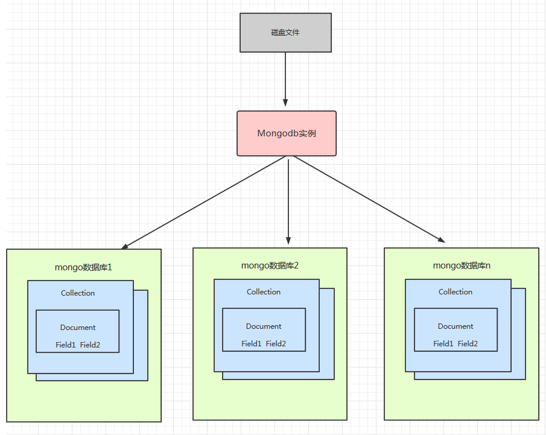
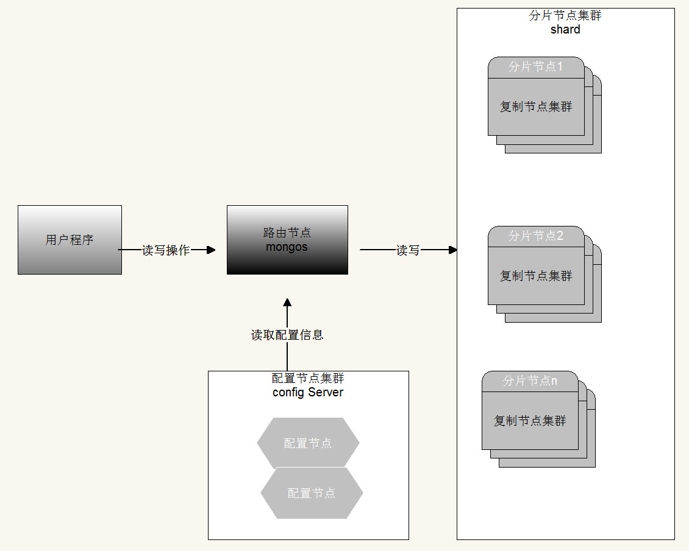

------

# 分布式文档存储MongoDB

## 1 MongoDB体系结构

### 1.1 NoSQL 和 MongoDB

- NoSQL=Not Only SQL，⽀持类似SQL的功能， 与Relational Database相辅相成。其性能较⾼，不使⽤SQL意味着没有结构化的存储要求(SQL为结构化的查询语句)，没有约束之后架构更加灵活。

- NoSQL数据库四⼤家族 列存储 Hbase，键值(Key-Value)存储 Redis，图像存储 Neo4j，⽂档存储 MongoDB。

- MongoDB 是⼀个基于分布式⽂件存储的数据库，由 C++ 编写，可以为 WEB 应⽤提供可扩展、⾼性能、易部署的数据存储解决⽅案

- MongoDB 是⼀个介于关系数据库和⾮关系数据库之间的产品，是⾮关系数据库中功能最丰富、最像关系数据库的。在⾼负载的情况下，通过添加更多的节点，可以保证服务器性能。

### 1.2 MongoDB 体系结构

- 

### 1.3 MongoDB 和RDBMS(关系型数据库)对⽐

- | RDBMS | MongoDB |
  | :-----| :---- |
  | database(数据库) | database(数据库) |
  | table （表） | collection（ 集合） |
  | row（ ⾏） | document（ BSON ⽂档） |
  | column （列） | field （字段） |
  | index（唯⼀索引、主键索引） | index （⽀持地理位置索引、全⽂索引 、哈希索引） |
  | join （主外键关联） | embedded Document (嵌套⽂档) |
  | primary key(指定1⾄N个列做主键) | primary key (指定_id field做为主键) |

### 1.4 什么是BSON

- BSON是⼀种类json的⼀种⼆进制形式的存储格式，简称Binary JSON，它和JSON⼀样，⽀持内嵌的⽂档对象和数组对象，但是BSON有JSON没有的⼀些数据类型，如Date和Binary Data类型。BSON可以做为⽹络数据交换的⼀种存储形式,是⼀种schema-less的存储形式，它的优点是灵活性⾼，但它的缺点是空间利⽤率不是很理想。

- BSON有三个特点：轻量性、可遍历性、⾼效性 

### 1.5 BSON在MongoDB中的使⽤

- | 数据类型 | 说明 | 解释说明 | Document举例 |
  | :-----| :---- | :---- | :---- |
  | String | 字符串 | UTF-8 编码的字符串才是合法的。 | {key:“cba”} |
  | Integer | 整型数值 | 根据你所采⽤的服务器，可分为 32 位或 64位。 | {key:1} |
  | Boolean | 布尔值 | ⽤于存储布尔值（真/假）。 | {key:true} |
  | Double | 双精度浮点值 | ⽤于存储浮点值 | {key:3.14} |
  | ObjectId | 对象ID | ⽤于创建⽂档的ID | {_id:new ObjectId()} |
  | Array | 数组 | ⽤于将数组或列表或多个值存储为⼀个键 | {arr:[“a”,“b”]} |
  | Timestamp | 时间戳 | 从开始纪元开始的毫秒数 | { ts: new Timestamp() } |
  | Object | 内嵌⽂档 | ⽂档可以作为⽂档中某个key的value | {o:{foo:“bar”}} |
  | Null | 空值 | 表示空值或者未定义的对象 | {key:null} |
  | Date或者ISODate | 格林尼治时间 | ⽇期时间，⽤Unix⽇期格式来存储当前⽇期或时间。 | {birth:new Date()} |
  | Code | 代码 | 可以包含JS代码 | {x:function(){}} |
  | File | ⽂件 | 1、⼆进制转码(Base64)后存储 (<16M) 2、GridFS(>16M) | GridFS ⽤两个集合来存储⼀个⽂件：fs.files与fs.chunks 真正存储需要使⽤mongofiles -d gridfs put song.mp3 |

## 2 MongoDB索引Index

### 2.1 什么是索引

- 索引是⼀种单独的、物理的对数据库表中⼀列或多列的值进⾏排序的⼀种存储结构，它是某个表中⼀列或若⼲列值的集合和相应的指向表中物理标识这些值的数据⻚的逻辑指针清单。索引的作⽤相当于图书的⽬录，可以根据⽬录中的⻚码快速找到所需的内容。索引⽬标是提⾼数据库的查询效率，没有索引的话，查询会进⾏全表扫描（scan every document in a collection）,数据量⼤时严重降低了查询效率。默认情况下Mongo在⼀个集合（collection）创建时，⾃动地对集合的_id创建了唯⼀索引。

### 2.2 索引类型

#### 2.2.1 单键索引 (Single Field)

- MongoDB⽀持所有数据类型中的单个字段索引，并且可以在⽂档的任何字段上定义。

- 对于单个字段索引，索引键的排序顺序⽆关紧要，因为MongoDB可以在任⼀⽅向读取索引。

- 特殊的单键索引 过期索引 TTL （ Time To Live）

    - TTL索引是MongoDB中⼀种特殊的索引， 可以⽀持⽂档在⼀定时间之后⾃动过期删除，⽬前TTL索引只能在单字段上建⽴，并且字段类型必须是⽇期类型。

#### 2.2.2 复合索引(Compound Index）

- 复合索引⽀持基于多个字段的索引。

- 制作复合索引时要注意的重要事项包括：字段顺序与索引⽅向。

#### 2.2.3 多键索引（Multikey indexes）

- 针对属性包含数组数据的情况，MongoDB⽀持针对数组中每⼀个element创建索引，Multikey indexes⽀持strings，numbers和nested documents

#### 2.2.4 地理空间索引（Geospatial Index）

- 针对地理空间坐标数据创建索引。

#### 2.2.5 全⽂索引

- MongoDB提供了针对string内容的⽂本查询，Text Index⽀持任意属性值为string或string数组元素的索引查询。

- 注意：⼀个集合仅⽀持最多⼀个Text Index，中⽂分词不理想 推荐ES。

#### 2.2.6 哈希索引 Hashed Index

- 针对属性的哈希值进⾏索引查询，当要使⽤Hashed index时，MongoDB能够⾃动的计算hash值，⽆需程序计算hash值。注：hash index仅⽀持等于查询，不⽀持范围查询。

### 2.3 explain 分析

- explain()不同的参数

    - queryPlanner：queryPlanner是默认参数。
    
    - executionStats：executionStats会返回执⾏计划的⼀些统计信息(有些版本中和allPlansExecution等同)。
    
    - allPlansExecution:allPlansExecution⽤来获取所有执⾏计划，结果参数基本与上⽂相同。

- executionStats返回逐层分析

    - 第⼀层，executionTimeMillis最为直观explain返回值是executionTimeMillis值，指的是这条语句的执⾏时间，这个值当然是希望越少越好。其中有3个executionTimeMillis，分别是：
        
        - executionStats.executionTimeMillis 该query的整体查询时间。
        
        - executionStats.executionStages.executionTimeMillisEstimate 该查询检索document获得数据的时间。
        
        - executionStats.executionStages.inputStage.executionTimeMillisEstimate 该查询扫描⽂档 index所⽤时间。
    
    - 第⼆层，index与document扫描数与查询返回条⽬数 这个主要讨论3个返回项 nReturned、totalKeysExamined、totalDocsExamined，分别代表该条查询返回的条⽬、索引扫描条⽬、⽂档扫描条⽬。 这些都是直观地影响到executionTimeMillis，我们需要扫描的越少速度越快。 对于⼀个查询，我们最理想的状态是：nReturned=totalKeysExamined=totalDocsExamined。
    
    - 第三层，stage状态分析 那么⼜是什么影响到了totalKeysExamined和totalDocsExamined？是stage的类型。类型列举如下：
    
        - COLLSCAN：全表扫描
        
        - IXSCAN：索引扫描
        
        - FETCH：根据索引去检索指定document
        
        - SHARD_MERGE：将各个分⽚返回数据进⾏merge
        
        - SORT：表明在内存中进⾏了排序
        
        - LIMIT：使⽤limit限制返回数
        
        - SKIP：使⽤skip进⾏跳过
        
        - IDHACK：针对_id进⾏查询
        
        - SHARDING_FILTER：通过mongos对分⽚数据进⾏查询
        
        - COUNT：利⽤db.coll.explain().count()之类进⾏count运算
        
        - TEXT：使⽤全⽂索引进⾏查询时候的stage返回
        
        - PROJECTION：限定返回字段时候stage的返回

    - 对于普通查询，我希望看到stage的组合(查询的时候尽可能⽤上索引)：
      
        - Fetch+IDHACK
      
        - Fetch+IXSCAN
      
        - Limit+（Fetch+IXSCAN）
      
        - PROJECTION+IXSCAN
      
        - SHARDING_FITER+IXSCAN
    
    - 不希望看到包含如下的stage：
      
        - COLLSCAN(全表扫描)
      
        - SORT(使⽤sort但是⽆index)
      
        - COUNT 不使⽤index进⾏count)

### 2.4 慢查询分析

- 开启内置的查询分析器,记录读写操作效率。db.setProfilingLevel(n,m),n的取值可选0,1,2。

    - 0表示不记录
    
    - 1表示记录慢速操作,如果值为1,m必须赋值单位为ms,⽤于定义慢速查询时间的阈值
    
    - 2表示记录所有的读写操作

- 查询监控结果

    - db.system.profile.find().sort({millis:-1}).limit(3)

### 2.5 MongoDB 索引底层实现原理分析

- MongoDB 是⽂档型的数据库，它使⽤BSON 格式保存数据，⽐关系型数据库存储更⽅便。MySql是关系型数据库，数据的关联性是⾮常强的，区间访问是常⻅的⼀种情况，底层索引组织数据使⽤B+树，B+树由于数据全部存储在叶⼦节点，并且通过指针串在⼀起，这样就很容易的进⾏区间遍历甚⾄全部遍历。MongoDB使⽤B-树，所有节点都有Data域，只要找到指定索引就可以进⾏访问，单次查询从结构上来看要快于MySql

- B-树是⼀种⾃平衡的搜索树，形式很简单：

    - 
    
    - B-树的特点:
      
        - 多路 ⾮⼆叉树
      
        - 每个节点 既保存数据 ⼜保存索引
      
        - 搜索时 相当于⼆分查找
    
    - B+树是B-树的变种

- B+树

    - 
    
    - B+ 树的特点:
      
        - 多路⾮⼆叉
      
        - 只有叶⼦节点保存数据
      
        - 搜索时 也相当于⼆分查找
      
        - 增加了相邻节点指针

- B-树和B+树的区别

    - 最核⼼的区别主要有俩，⼀个是数据的保存位置，⼀个是相邻节点的指向。就是这俩造成了MongoDB和MySql的差别。
    
        - B+树相邻接点的指针可以⼤⼤增加区间访问性，可使⽤在范围查询等，⽽B-树每个节点 key 和 data 在⼀起适合随机读写 ，⽽区间查找效率很差。
        
        - B+树更适合外部存储，也就是磁盘存储，使⽤B-结构的话，每次磁盘预读中的很多数据是⽤不上的数据。因此，它没能利⽤好磁盘预读的提供的数据。由于节点内⽆ data 域，每个节点能索引的范围更⼤更精确。
        
        - B-树每个节点即保存数据⼜保存索引 树的深度⼤，所以磁盘IO的次数多，B+树只有叶⼦节点保存，较B树⽽⾔深度⼩，磁盘IO少，有利于区间访问。

## 3 MongoDB 应⽤实战

### 3.1 MongoDB的适⽤场景

- ⽹站数据：Mongo ⾮常适合实时的插⼊,更新与查询，并具备⽹站实时数据存储所需的复制及⾼度伸缩性。

- 缓存：由于性能很⾼，Mongo 也适合作为信息基础设施的缓存层。在系统重启之后，由Mongo 搭建的持久化缓存层可以避免下层的数据源过载。

- ⼤尺⼨、低价值的数据：使⽤传统的关系型数据库存储⼀些⼤尺⼨低价值数据时会⽐较浪费，在此之前，很多时候程序员往往会选择传统的⽂件进⾏存储。

- ⾼伸缩性的场景：Mongo ⾮常适合由数⼗或数百台服务器组成的数据库，Mongo 的路线图中已经包含对MapReduce 引擎的内置⽀持以及集群⾼可⽤的解决⽅案。

- ⽤于对象及JSON 数据的存储：Mongo 的BSON 数据格式⾮常适合⽂档化格式的存储及查询。

### 3.2 如何抉择是否使⽤MongoDB

- | 应⽤特征 | Yes / No |
  | :-----| :---- |
  | 应⽤不需要事务及复杂 join ⽀持 | 必须 Yes |
  | 新应⽤，需求会变，数据模型⽆法确定，想快速迭代开发 | ？ |
  | 应⽤需要2000-3000以上的读写QPS（更⾼也可以）  | ？ |
  | 应⽤需要TB甚⾄ PB 级别数据存储 | ？ |
  | 应⽤发展迅速，需要能快速⽔平扩展 | ？ |
  | 应⽤要求存储的数据不丢失 | ？ |
  | 应⽤需要99.999%⾼可⽤ | ？ |
  | 应⽤需要⼤量的地理位置查询、⽂本查询 | ？ |

## 4 MongoDB架构

### 4.1 MongoDB逻辑结构

- MongoDB 与 MySQL 中的架构相差不多，底层都使⽤了可插拔的存储引擎以满⾜⽤户的不同需要。⽤户可以根据程序的数据特征选择不同的存储引擎,在最新版本的 MongoDB 中使⽤了 WiredTiger 作为默认的存储引擎，WiredTiger 提供了不同粒度的并发控制和压缩机制，能够为不同种类的应⽤提供了最好的性能和存储率。

- 在存储引擎上层的就是 MongoDB 的数据模型和查询语⾔了，由于 MongoDB 对数据的存储与 RDBMS 有较⼤的差异，所以它创建了⼀套不同的数据模型和查询语⾔。

### 4.2 MongoDB数据模型

#### 4.2.1 描述数据模型

- 内嵌：指的是把相关联的数据保存在同⼀个⽂档结构之中。MongoDB的⽂档结构允许⼀个字段或者⼀个数组内的值作为⼀个嵌套的⽂档。

- 引⽤：通过存储数据引⽤信息来实现两个不同⽂档之间的关联,应⽤程序可以通过解析这些数据引⽤来访问相关数据。

#### 4.2.2 如何选择数据模型

- 选择内嵌：

    - 数据对象之间有包含关系 ,⼀般是数据对象之间有⼀对多或者⼀对⼀的关系 。
    
    - 需要经常⼀起读取的数据。
    
    - 有 map-reduce/aggregation 需求的数据放在⼀起，这些操作都只能操作单个 collection。

- 选择引⽤：

    - 当内嵌数据会导致很多数据的重复，并且读性能的优势⼜不⾜于覆盖数据重复的弊端。
    
    - 需要表达⽐较复杂的多对多关系的时候 。
    
    - ⼤型层次结果数据集 嵌套不要太深。

### 4.3 MongoDB存储引擎

#### 4.3.1 存储引擎概述

- 存储引擎是MongoDB的核⼼组件，负责管理数据如何存储在硬盘和内存上。MongoDB⽀持的存储引擎有MMAPv1,WiredTiger和InMemory。InMemory存储引擎⽤于将数据只存储在内存中，只将少量的元数据(meta-data)和诊断⽇志（Diagnostic）存储到硬盘⽂件中，由于不需要Disk的IO操作，就能获取所需的数据，InMemory存储引擎⼤幅度降低了数据查询的延迟（Latency）。从mongodb3.2开始默认的存储引擎是WiredTiger,3.2版本之前的默认存储引擎是MMAPv1，mongodb4.x版本不再⽀持MMAPv1存储引擎。

#### 4.3.2 WiredTiger存储引擎优势

- ⽂档空间分配⽅式
   
    - WiredTiger使⽤的是BTree存储， MMAPV1 线性存储 需要Padding

- 并发级别 
   
    - WiredTiger ⽂档级别锁， MMAPV1引擎使⽤表级锁

- 数据压缩
   
    - snappy (默认) 和 zlib， 相⽐MMAPV1(⽆压缩) 空间节省数倍。

- 内存使⽤
   
    - WiredTiger 可以指定内存的使⽤⼤⼩。

- Cache使⽤
   
    - WT引擎使⽤了⼆阶缓存WiredTiger Cache，File System Cache来保证Disk上的数据的最终⼀致性。⽽MMAPv1 只有journal ⽇志。

## 5 MongoDB集群⾼可⽤

### 5.1 MongoDB主从复制架构原理和缺陷

- master-slave架构中master节点负责数据的读写，slave没有写⼊权限只负责读取数据。

- 在主从结构中，主节点的操作记录成为oplog（operation log）。oplog存储在系统数据库local的oplog.$main集合中，这个集合的每个⽂档都代表主节点上执⾏的⼀个操作。从服务器会定期从主服务器中获取oplog记录，然后在本机上执⾏！对于存储oplog的集合，MongoDB采⽤的是固定集合，也就是说随着操作过多，新的操作会覆盖旧的操作！

- 主从结构没有⾃动故障转移功能，需要指定master和slave端，不推荐在⽣产中使⽤。

- mongodb4.0后不再⽀持主从复制！

### 5.2 复制集replica sets

#### 5.2.1 什么是复制集

- 复制集是由⼀组拥有相同数据集的mongod实例做组成的集群。

- 复制集是⼀个集群，它是2台及2台以上的服务器组成，以及复制集成员包括Primary主节点,secondary从节点和投票节点。

- 复制集提供了数据的冗余备份，并在多个服务器上存储数据副本，提⾼了数据的可⽤性,保证数据的安全性。

#### 5.2.2 为什么要使⽤复制集

- ⾼可⽤
   
    - 防⽌设备（服务器、⽹络）故障。
   
    - 提供⾃动failover 功能。
   
    - 技术来保证⾼可⽤。

- 灾难恢复
   
    - 当发⽣故障时，可以从其他节点恢复 ⽤于备份。

- 功能隔离
   
    - 可以在备节点上执⾏读操作，减少主节点的压⼒。

#### 5.2.3 复制集集群架构原理

- ⼀个复制集中Primary节点上能够完成读写操作,Secondary节点仅能⽤于读操作。Primary节点需要记录所有改变数据库状态的操作,这些记录保存在 oplog 中,这个⽂件存储在 local 数据库,各个Secondary节点通过此 oplog 来复制数据并应⽤于本地,保持本地的数据与主节点的⼀致。oplog 具有幂等性,即⽆论执⾏⼏次其结果⼀致,这个⽐mysql 的⼆进制⽇志更好⽤。

- 复制集数据同步分为初始化同步和keep复制同步。初始化同步指全量从主节点同步数据，如果Primary节点数据量⽐较⼤同步时间会⽐较⻓。⽽keep复制指初始化同步过后，节点之间的实时同步⼀般是增量同步。

- 初始化同步有以下两种情况会触发：

    - Secondary第⼀次加⼊。
    
    - Secondary落后的数据量超过了oplog的⼤⼩，这样也会被全量复制。

- MongoDB的Primary节点选举基于⼼跳触发。⼀个复制集N个节点中的任意两个节点维持⼼跳，每个节点维护其他N-1个节点的状态。

    - ⼼跳检测：整个集群需要保持⼀定的通信才能知道哪些节点活着哪些节点挂掉。mongodb节点会向副本集中的其他节点每2秒就会发送⼀次pings包，如果其他节点在10秒钟之内没有返回就标示为不能访问。每个节点内部都会维护⼀个状态映射表，表明当前每个节点是什么⻆⾊、⽇志时间戳等关键信息。如果主节点发现⾃⼰⽆法与⼤部分节点通讯则把⾃⼰降级为secondary只读节点。

- 主节点选举触发的时机：

    - 第⼀次初始化⼀个复制集
    
    - Secondary节点权重⽐Primary节点⾼时，发起替换选举
    
    - Secondary节点发现集群中没有Primary时，发起选举
    
    - Primary节点不能访问到⼤部分(Majority)成员时主动降级

- 当触发选举时,Secondary节点尝试将⾃身选举为Primary。主节点选举是⼀个⼆阶段过程+多数派协议。

    - 第⼀阶段:
      
        - 检测⾃身是否有被选举的资格 如果符合资格会向其它节点发起本节点是否有选举资格的FreshnessCheck,进⾏同僚仲裁
    
    - 第⼆阶段:
      
        - 发起者向集群中存活节点发送Elect(选举)请求，仲裁者收到请求的节点会执⾏⼀系列合法性检查，如果检查通过，则仲裁者(⼀个复制集中最多50个节点 其中只有7个具有投票权)给发起者投⼀票。
      
            - pv0通过30秒选举锁防⽌⼀次选举中两次投票。
          
            - pv1使⽤了terms(⼀个单调递增的选举计数器)来防⽌在⼀次选举中投两次票的情况。
      
    - 多数派协议:

        - 发起者如果获得超过半数的投票，则选举通过，⾃身成为Primary节点。获得低于半数选票的原因，除了常⻅的⽹络问题外，相同优先级的节点同时通过第⼀阶段的同僚仲裁并进⼊第⼆阶段也是⼀个原因。因此，当选票不⾜时，会sleep[0,1]秒内的随机时间，之后再次尝试选举。

#### 5.2.4 复制集搭建

- 节点说明：

    - PRIMARY 节点： 可以查询和新增数据
    
    - SECONDARY 节点：只能查询 不能新增 基于priority 权重可以被选为主节点
    
    - ARBITER 节点： 负责选举主节点，不能查询数据 和新增数据 ，不能变成主节点

### 5.3 分⽚集群 Shard Cluster

#### 5.3.1 什么是分⽚

- 分⽚（sharding）是MongoDB⽤来将⼤型集合⽔平分割到不同服务器（或者复制集）上所采⽤的⽅法。不需要功能强⼤的⼤型计算机就可以存储更多的数据，处理更⼤的负载。

#### 5.3.2 为什么要分⽚

- 存储容量需求超出单机磁盘容量。

- 活跃的数据集超出单机内存容量，导致很多请求都要从磁盘读取数据，影响性能。

- IOPS超出单个MongoDB节点的服务能⼒，随着数据的增⻓，单机实例的瓶颈会越来越明显。

- 副本集具有节点数量限制。

#### 5.3.2 分⽚的⼯作原理

- 

    - 分⽚集群由以下3个服务组成：
    
        - Shards Server: 每个shard由⼀个或多个mongod进程组成，⽤于存储数据。
    
        - Router Server: 数据库集群的请求⼊⼝，所有请求都通过Router(mongos)进⾏协调，不需要在应⽤程序添加⼀个路由选择器，Router(mongos)就是⼀个请求分发中⼼它负责把应⽤程序的请求转发到对应的Shard服务器上。
    
        - Config Server: 配置服务器。存储所有数据库元信息（路由、分⽚）的配置。

- ⽚键（shard key）
  　
    - 为了在数据集合中分配⽂档，MongoDB使⽤分⽚主键分割集合。

- 区块（chunk）
   
    - 在⼀个shard server内部，MongoDB还是会把数据分为chunks，每个chunk代表这个shard server内部⼀部分数据。MongoDB分割分⽚数据到区块，每⼀个区块包含基于分⽚主键的左闭右开的区间范围。

- 分⽚策略

    - 范围分⽚
    
        - 范围分⽚是基于分⽚主键的值切分数据，每⼀个区块将会分配到⼀个范围。
        
        - 范围分⽚适合满⾜在⼀定范围内的查找，例如查找X的值在[20,30)之间的数据，mongo 路由根据Config server中存储的元数据，可以直接定位到指定的shard的Chunk中。
        
        - 如果shard key有明显递增（或者递减）趋势，则新插⼊的⽂档多会分布到同⼀个chunk，⽆法扩展写的能⼒。

    - hash分⽚
    
        - Hash分⽚是计算⼀个分⽚主键的hash值，每⼀个区块将分配⼀个范围的hash值。
        
        - Hash分⽚与范围分⽚互补，能将⽂档随机的分散到各个chunk，充分的扩展写能⼒，弥补了范围分⽚的不⾜，缺点是不能⾼效的服务范围查询，所有的范围查询要分发到后端所有的Shard才能找出满⾜条件的⽂档。

    - 组合⽚键
    
        - 数据库中没有⽐较合适的⽚键供选择，或者是打算使⽤的⽚键基数太⼩（即变化少如星期只有7天可变化），可以选另⼀个字段使⽤组合⽚键，甚⾄可以添加冗余字段来组合。⼀般是粗粒度+细粒度进⾏组合。

## 6 MongoDB安全认证

### 6.1 安全认证概述

- MongoDB 默认是没有账号的，可以直接连接，⽆须身份验证。需要在admin数据库添加⽤户及权限。