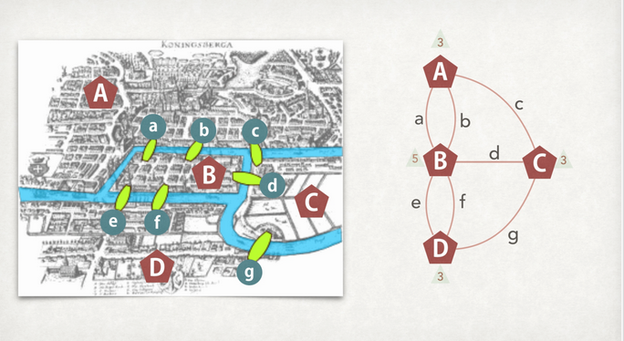

------

# 知识图谱存储Neo4j

## 1 图 和 Neo4j

### 1.1 图论

#### 1.1.1 图论起源 --- 柯尼斯堡（Konigsberg）七桥问题

- 众所周知，图论起源于一个非常经典的问题——柯尼斯堡（Konigsberg）七桥问题。1738年，瑞典数学家欧拉( Leornhard Euler)解决了柯尼斯堡七桥问题。由此图论诞生，欧拉也成为图论的创始人。

- 

- 欧拉把问题的实质归于"一笔画"问题，即判断一个图是否能够遍历完所有的边(Edge)而没有重复，而柯尼斯堡七桥问题则是一笔画问题的一个具体情境。欧拉证明这个问题不成立。

- 满足一笔画的图满足两个条件:
 
    - 图必须是一个完整图
 
    - 有零个或二个奇数点 

### 1.2 知识图谱和图库

#### 1.2.1 知识图谱

- 一种基于图的数据结构，由节点(Node)和边(Edge)组成。其中节点即实体，由一个全局唯一的ID标示，边就是关系用于连接两个节点。通俗地讲，知识图谱就是把所有不同种类的信息（Heterogeneous Information）连接在一起而得到的一个关系网络。知识图谱提供了从“关系”的角度去分析问题的能力。

- 互联网、大数据的背景下，谷歌、百度、搜狗等搜索引擎纷纷基于该背景，创建自己的知识图谱Knowledge Graph（谷歌）、知心（百度）和知立方（搜狗），主要用于改进搜索质量。

#### 1.2.2 图数据库

- 一般情况下，我们使用数据库查找事物间的联系的时候，只需要短程关系的查询（两层以内的关联）。当需要进行更长程的，更广范围的关系查询时，就需要图数据库的功能。而随着社交、电商、金融、零售、物联网等行业的快速发展，现实世界的事物之间织起了一张巨大复杂的关系网，传统数据库面对这样复杂关系往往束手无策。因此，图数据库应运而生。

- 图数据库(Graph database)指的是以图数据结构的形式来存储和查询数据的数据库。

- 知识图谱中，知识的组织形式采用的就是图结构，所以非常适合用图库进行存储。

#### 1.2.3 图形数据库优势

- 性能上，对长程关系的查询速度快

- 擅于发现隐藏的关系，例如通过判断图上两点之间有没有走的通的路径，就可以发现事物间的关联

### 1.3 Neo4j 基础

#### 1.3.1 什么是Neo4j

- Neo4j是一个开源的 无Shcema的 基于java开发的 图形数据库，它将结构化数据存储在图中而不是表中。它是一个嵌入式的、基于磁盘的、具备完全的事务特性的Java持久化引擎。程序数据是在一个面向对象的、灵活的网络结构下，而不是严格、静态的表中,但可以享受到具备完全的事务特性、企业级的数据库的所有好处。

#### 1.3.2 Neo4j 模块构建

- 节点：节点是图表的基本单位。 它包含具有键值对的属性。

- 属性：属性是用于描述图节点和关系的键值对。

- 关系：关系是图形数据库的另一个主要构建块。 它连接两个节点。

- 标签：Label将一个公共名称与一组节点或关系相关联。 节点或关系可以包含一个或多个标签。 可以为现有节点或关系创建新标签。 可以从现有节点或关系中删除现有标签。

- 数据浏览器

#### 1.3.3 Neo4j的主要应用场景

- 社交媒体和社交网络

    - 当使用图形数据库为社交网络应用程序提供动力时，可以轻松利用社交关系或根据活动推断关系。

- 推荐引擎和产品推荐系统

    - 图形驱动的推荐引擎通过实时利用多种连接，帮助公司个性化产品，内容和服务。

- 身份和访问管理
  
    - 使用图形数据库进行身份和访问管理时，可以快速有效地跟踪用户，资产，关系和授权。

- 金融反欺诈多维关联分析场景
  
    - 通过图分析可以清楚地知道洗钱网络及相关嫌疑，例如对用户所使用的帐号、发生交易时的IP地址、MAC地址、手机IMEI号等进行关联分析。

## 2 Neo4j CQL

### 2.1 CQL简介

- CQL代表Cypher查询语言。 像关系型数据库具有查询语言SQL，Neo4j使用CQL作为查询语言。

- | CQL命令/条 | 作用 |
  | :-----| :---- |
  | CREATE 创建 | 创建节点，关系和属性 |
  | MATCH 匹配 | 检索有关节点，关系和属性数据 |
  | RETURN 返回 | 返回查询结果 |
  | WHERE 条件 | 提供条件过滤检索MATCH数据 |
  | DELETE 删除 | 删除节点和关系 |
  | REMOVE 移除 | 删除节点和关系的属性 |
  | SET 设置 | 添加或更新标签 |
  | ORDER BY 排序 | 对结果排序 |
  | SKIP LIMIT 分页 | 分页 |
  | DISTINCT 排重 | 排重 |

## 3 Neo4j CQL高级

### 3.1 事务

- Neo4j支持ACID特性

- 注意：

    - 所有对Neo4j数据库的数据修改操作都必须封装在事务里。
    
    - 默认的isolation level是READ_COMMITTED。
    
    - 死锁保护已经内置到核心事务管理 。 (Neo4j会在死锁发生之前检测死锁并抛出异常。在异常抛出之前，事务会被标志为回滚。当事务结束时，事务会释放它所持有的锁，则该事务的锁所引起的死锁也就是解除，其他事务就可以继续执行。当用户需要时，抛出异常的事务可以尝试重新执行)
    
    - 除特别说明,Neo4j的API的操作都是线程安全的，Neo4j数据库的操作也就没有必要使用外部的同步方法。

### 3.2 索引

#### 3.2.1 简介

- Neo4j CQL支持节点或关系属性上的索引，以提高应用程序的性能。

- 可以为具有相同标签名称的属性上创建索引。

- 可以在MATCH或WHERE等运算符上使用这些索引列来改进CQL 的执行。

#### 3.2.2 单一索引

#### 3.2.3 复合索引

#### 3.2.4 全文模式索引

## 4 Neo4j 程序访问

### 4.1 Neo4j数据库访问

#### 4.1.1 Neo4j访问的两种方式

- 嵌入式数据库

- 服务器模式(通过REST的访问)

#### 4.1.2 An embedded database（嵌入式数据库）

- 嵌入式Neo4j数据库是性能的最佳选择。 通过指定数据存储的路径以编程方式访问嵌入式数据库。

#### 4.1.3 Neo4j Server（服务器模式）

- Neo4j Server是相互操作性，安全性和监控的最佳选择。 实际上，REST接口允许所有现代平台和编程语言与它进行互操作。 此外，作为独立应用程序，它比嵌入式配置更安全（客户端中的潜在故障不会影响服务器），并且更易于监控。 如果我们选择使用这种模式，我们的应用程序将充当Neo4j服务器的客户端。要连接到Neo4j服务器，可以使用任何编程语言的REST 访问数据库。