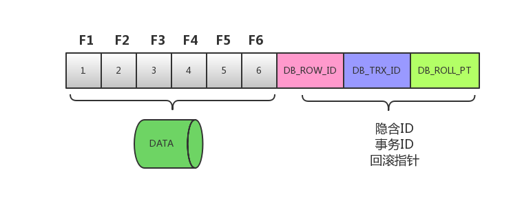
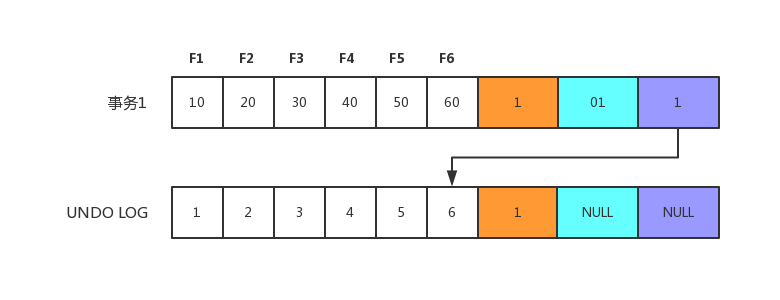
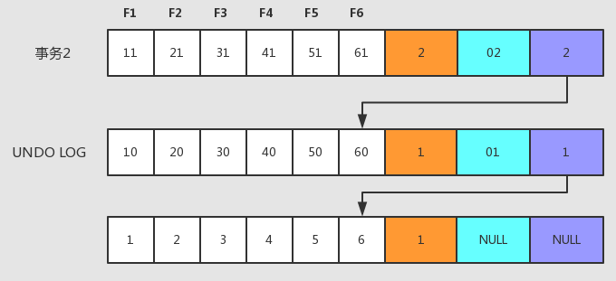
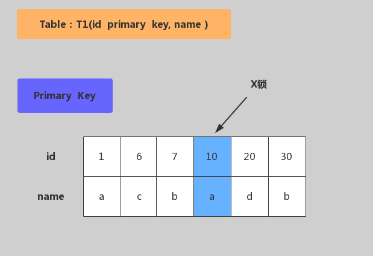
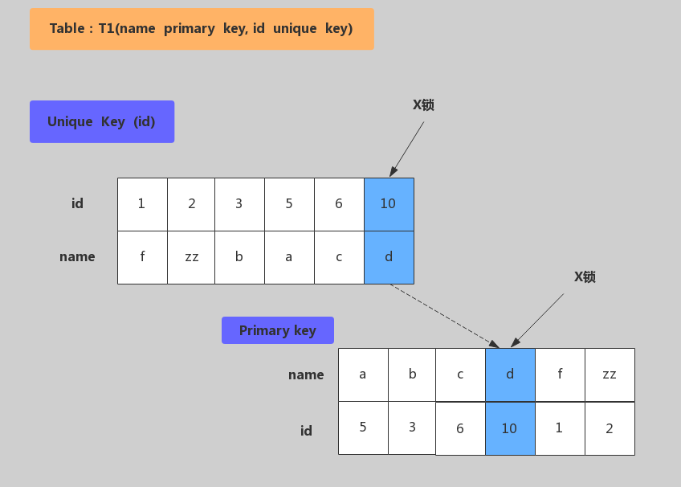
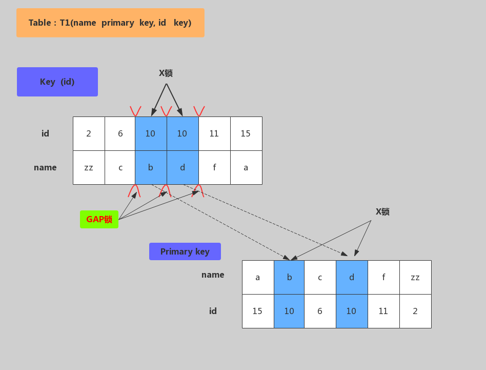
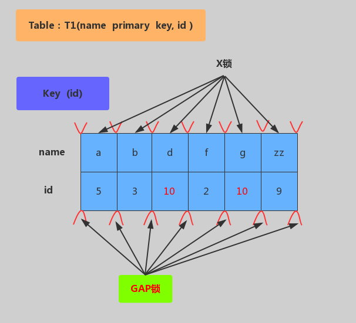

------

# MySQL事务和锁

## 1 ACID 特性

- 在关系型数据库管理系统中，一个逻辑工作单元要成为事务，必须满足这 4 个特性，即所谓的 ACID：原子性（Atomicity）、一致性（Consistency）、隔离性（Isolation）和持久性（Durability）。

### 1.1 原子性

- 事务是一个原子操作单元，其对数据的修改，要么全都执行，要么全都不执行。

- 修改---》Buffer Pool修改---》刷盘。可能会有下面两种情况：

    - 事务提交了，如果此时Buffer Pool的脏页没有刷盘，如何保证修改的数据生效？ Redo
    
    - 如果事务没提交，但是Buffer Pool的脏页刷盘了，如何保证不该存在的数据撤销？Undo

### 1.2 持久性

- 指的是一个事务一旦提交，它对数据库中数据的改变就应该是永久性的，后续的操作或故障不应该对其有任何影响，不会丢失。

- 一个“提交”动作触发的操作有：binlog落地、发送binlog、存储引擎提交、flush_logs，check_point、事务提交标记等

- MySQL的持久性也与WAL技术相关，redo log在系统Crash重启之类的情况时，可以修复数据，从而保障事务的持久性。通过原子性可以保证逻辑上的持久性，通过存储引擎的数据刷盘可以保证物理上的持久性。

### 1.3 隔离性

- 指的是一个事务的执行不能被其他事务干扰，即一个事务内部的操作及使用的数据对其他的并发事务是隔离的。

- InnoDB 支持的隔离性有 4 种，隔离性从低到高分别为：读未提交、读提交、可重复读、可串行化。锁和多版本控制（MVCC）技术就是用于保障隔离性的。

### 1.4 一致性

- 指的是事务开始之前和事务结束之后，数据库的完整性限制未被破坏。一致性包括两方面的内容，分别是约束一致性和数据一致性。

    - 约束一致性：创建表结构时所指定的外键、Check、唯一索引等约束，可惜在 MySQL 中不支持Check 。
  
    - 数据一致性：是一个综合性的规定，因为它是由原子性、持久性、隔离性共同保证的结果，而不是单单依赖于某一种技术。

- 一致性也可以理解为数据的完整性。数据的完整性是通过原子性、隔离性、持久性来保证的，而这3个特性又是通过 Redo/Undo 来保证的。逻辑上的一致性，包括唯一索引、外键约束、check 约束，这属于业务逻辑范畴。

- 原子性、持久性、隔离性与 WAL 有关系，都需要通过 Redo、Undo 日志来保证等。

    - WAL的全称为Write-Ahead Logging，先写日志，再写磁盘。

## 2 事务控制的演进

### 2.1 并发事务

- 事务并发处理可能会带来一些问题，比如：更新丢失、脏读、不可重复读、幻读等。
  
    - 更新丢失
  
        - 当两个或多个事务更新同一行记录，会产生更新丢失现象。可以分为回滚覆盖和提交覆盖。
  
            - 回滚覆盖：一个事务回滚操作，把其他事务已提交的数据给覆盖了。
  
            - 提交覆盖：一个事务提交操作，把其他事务已提交的数据给覆盖了。
  
    - 脏读
  
        - 一个事务读取到了另一个事务修改但未提交的数据。
  
    - 不可重复读
  
        - 一个事务中多次读取同一行记录不一致，后面读取的跟前面读取的不一致。
  
    - 幻读
  
        - 一个事务中多次按相同条件查询，结果不一致。后续查询的结果和面前查询结果不同，多了或少了几行记录。

### 2.2 排队

- 最简单的方法，就是完全顺序执行所有事务的数据库操作，不需要加锁，简单的说就是全局排队。序列化执行所有的事务单元，数据库某个时刻只处理一个事务操作，特点是强一致性，处理性能低。

### 2.3 排他锁

- 引入锁之后就可以支持并发处理事务，如果事务之间涉及到相同的数据项时，会使用排他锁，或叫互斥锁，先进入的事务独占数据项以后，其他事务被阻塞，等待前面的事务释放锁。

### 2.4 读写锁

- 读写锁就是进一步细化锁的颗粒度，区分读操作和写操作，让读和读之间不加锁，这样下面的两个事务就可以同时被执行了。

- 读写锁，可以让读和读并行，而读和写、写和读、写和写这几种之间还是要加排他锁。

### 2.5 MVCC

- 多版本控制MVCC，也就是Copy on Write的思想。MVCC除了支持读和读并行，还支持读和写、写和读的并行，但为了保证一致性，写和写是无法并行的。

- 在事务1开始写操作的时候会copy一个记录的副本，其他事务读操作会读取这个记录副本，因此不会影响其他事务对此记录的读取，实现写和读并行。

#### 2.5.1 MVCC概念

- MVCC（Multi Version Concurrency Control）被称为多版本控制，是指在数据库中为了实现高并发的数据访问，对数据进行多版本处理，并通过事务的可见性来保证事务能看到自己应该看到的数据版本。多版本控制很巧妙地将稀缺资源的独占互斥转换为并发，大大提高了数据库的吞吐量及读写性能。

- 如何生成的多版本？

    - 每次事务修改操作之前，都会在Undo日志中记录修改之前的数据状态和事务号，该备份记录可以用于其他事务的读取，也可以进行必要时的数据回滚。

#### 2.5.2 MVCC实现原理

- MVCC最大的好处是读不加锁，读写不冲突。在读多写少的系统应用中，读写不冲突是非常重要的，极大的提升系统的并发性能，这也是为什么现阶段几乎所有的关系型数据库都支持 MVCC 的原因，不过目前MVCC只在 Read Commited 和 Repeatable Read 两种隔离级别下工作。

- 在 MVCC 并发控制中，读操作可以分为两类: 快照读（Snapshot Read）与当前读 （Current Read）。
  
    - 快照读：读取的是记录的快照版本（有可能是历史版本），不用加锁。（select）
  
    - 当前读：读取的是记录的最新版本，并且当前读返回的记录，都会加锁，保证其他事务不会再并发修改这条记录。（select... for update 或lock in share mode，insert/delete/update）

- 案例

    - 假设 F1～F6 是表中字段的名字，1～6 是其对应的数据。后面三个隐含字段分别对应该行的隐含ID、事务号和回滚指针，如下图所示。
    
        - 
    
    - 假如一条数据是刚 INSERT 的，DB_ROW_ID 为 1，其他两个字段为空。当事务 1 更改该行的数据值时，会进行如下操作，如下图所示。

        - 
        
        - 用排他锁锁定该行；记录 Redo log；
        
        - 把该行修改前的值复制到 Undo log，即图中下面的行；
        
        - 修改当前行的值，填写事务编号，使回滚指针指向 Undo log 中修改前的行。
    
    - 接下来事务2操作，过程与事务 1 相同，此时 Undo log 中会有两行记录，并且通过回滚指针连在一起，通过当前记录的回滚指针回溯到该行创建时的初始内容，如下图所示。
    
        - 

- MVCC已经实现了读读、读写、写读并发处理，如果想进一步解决写写冲突，可以采用下面两种方案：
  
    - 乐观锁
  
    - 悲观锁

## 3 事务隔离级别

### 3.1 隔离级别类型

- | 事务隔离级别 | 回滚覆盖 | 脏读 | 不可重复读 | 提交覆盖 | 幻读 |
  | :-----:| :----: | :----: | :----: | :----: | :----: |
  | 读未提交 | x | 可能发生 | 可能发生 | 可能发生 | 可能发生 |
  | 读已提交 | x | x | 可能发生 | 可能发生 | 可能发生 |
  | 可重复读 | x | x | x | x | 可能发生 |
  | 串行化 | x | x | x | x | x |

    - 读未提交
      
        - Read Uncommitted 读未提交：解决了回滚覆盖类型的更新丢失，但可能发生脏读现象，也就是可能读取到其他会话中未提交事务修改的数据。
        
    - 已提交读
      
        - Read Committed 读已提交：只能读取到其他会话中已经提交的数据，解决了脏读。但可能发生不可重复读现象，也就是可能在一个事务中两次查询结果不一致。
    
    - 可重复读
      
        - Repeatable Read 可重复读：解决了不可重复读，它确保同一事务的多个实例在并发读取数据时，会看到同样的数据行。不过理论上会出现幻读，简单的说幻读指的的当用户读取某一范围的数据行时，另一个事务又在该范围插入了新行，当用户在读取该范围的数据时会发现有新的幻影行。
    
    - 可串行化
        
        - Serializable 串行化：所有的增删改查串行执行。它通过强制事务排序，解决相互冲突，从而解决幻度的问题。这个级别可能导致大量的超时现象的和锁竞争，效率低下。

- 数据库的事务隔离级别越高，并发问题就越小，但是并发处理能力越差（代价）。读未提交隔离级别最低，并发问题多，但是并发处理能力好。以后使用时，可以根据系统特点来选择一个合适的隔离级别，比如对不可重复读和幻读并不敏感，更多关心数据库并发处理能力，此时可以使用Read Commited隔离级别。

- 事务隔离级别，针对Innodb引擎，支持事务的功能。像MyISAM引擎没有关系。

- 事务隔离级别和锁的关系

    - 事务隔离级别是SQL92定制的标准，相当于事务并发控制的整体解决方案，本质上是对锁和MVCC使用的封装，隐藏了底层细节。
    
    - 锁是数据库实现并发控制的基础，事务隔离性是采用锁来实现，对相应操作加不同的锁，就可以防止其他事务同时对数据进行读写操作。
    
    - 对用户来讲，首先选择使用隔离级别，当选用的隔离级别不能解决并发问题或需求时，才有必要在开发中手动的设置锁。

- MySQL默认隔离级别：可重复读

- Oracle、SQLServer默认隔离级别：读已提交

- 一般使用时，建议采用默认隔离级别，然后存在的一些并发问题，可以通过悲观锁、乐观锁等实现处理。

## 4 锁机制和实战

### 4.1 锁分类

- 从操作的粒度可分为表级锁、行级锁和页级锁。
  
    - 表级锁：每次操作锁住整张表。锁定粒度大，发生锁冲突的概率最高，并发度最低。应用在MyISAM、InnoDB、BDB 等存储引擎中。
    
    - 行级锁：每次操作锁住一行数据。锁定粒度最小，发生锁冲突的概率最低，并发度最高。应用在InnoDB 存储引擎中。
    
    - 页级锁：每次锁定相邻的一组记录，锁定粒度界于表锁和行锁之间，开销和加锁时间界于表锁和行锁之间，并发度一般。应用在BDB 存储引擎中。

- 从操作的类型可分为读锁和写锁。
  
    - 读锁（S锁）：共享锁，针对同一份数据，多个读操作可以同时进行而不会互相影响。
  
    - 写锁（X锁）：排他锁，当前写操作没有完成前，它会阻断其他写锁和读锁。
  
    - IS锁、IX锁：意向读锁、意向写锁，属于表级锁，S和X主要针对行级锁。在对表记录添加S或X锁之前，会先对表添加IS或IX锁。

- 从操作的性能可分为乐观锁和悲观锁。
  
    - 乐观锁：一般的实现方式是对记录数据版本进行比对，在数据更新提交的时候才会进行冲突检测，如果发现冲突了，则提示错误信息。
    
    - 悲观锁：在对一条数据修改的时候，为了避免同时被其他人修改，在修改数据之前先锁定，再修改的控制方式。共享锁和排他锁是悲观锁的不同实现，但都属于悲观锁范畴。

### 4.2 行锁原理

- 在InnoDB引擎中，我们可以使用行锁和表锁，其中行锁又分为共享锁和排他锁。InnoDB行锁是通过对索引数据页上的记录加锁实现的，主要实现算法有 3 种：Record Lock、Gap Lock 和 Next-key Lock。

    - RecordLock锁：锁定单个行记录的锁。（记录锁，RC、RR隔离级别都支持）
  
    - GapLock锁：间隙锁，锁定索引记录间隙，确保索引记录的间隙不变。（范围锁，RR隔离级别支持）
  
    - Next-key Lock 锁：记录锁和间隙锁组合，同时锁住数据，并且锁住数据前后范围。（记录锁+范围锁，RR隔离级别支持）

- 在RR隔离级别，InnoDB对于记录加锁行为都是先采用Next-Key Lock，但是当SQL操作含有唯一索引时，Innodb会对Next-Key Lock进行优化，降级为RecordLock，仅锁住索引本身而非范围。

    - select ... from 语句：InnoDB引擎采用MVCC机制实现非阻塞读，所以对于普通的select语句，InnoDB不加锁
    
    - select ... from lock in share mode语句：追加了共享锁，InnoDB会使用Next-Key Lock锁进行处理，如果扫描发现唯一索引，可以降级为RecordLock锁。
    
    - select ... from for update语句：追加了排他锁，InnoDB会使用Next-Key Lock锁进行处理，如果扫描发现唯一索引，可以降级为RecordLock锁。
    
    - update ... where 语句：InnoDB会使用Next-Key Lock锁进行处理，如果扫描发现唯一索引，可以降级为RecordLock锁。
    
    - delete ... where 语句：InnoDB会使用Next-Key Lock锁进行处理，如果扫描发现唯一索引，可以降级为RecordLock锁。
    
    - insert语句：InnoDB会在将要插入的那一行设置一个排他的RecordLock锁。

- InnoDB对不同索引的加锁行为，以RR隔离级别为例

    - 主键加锁
    
        - 
        
        - 加锁行为：仅在id=10的主键索引记录上加X锁。
    
    - 唯一键加锁

        - 
        
        - 加锁行为：先在唯一索引id上加X锁，然后在id=10的主键索引记录上加X锁。
    
    - 非唯一键加锁
    
        - 
        
        - 加锁行为：对满足id=10条件的记录和主键分别加X锁，然后在(6,c)-(10,b)、(10,b)-(10,d)、(10,d)-(11,f)范围分别加Gap Lock。
    
    - 无索引加锁

        - 
        
        - 加锁行为：表里所有行和间隙都会加X锁。（当没有索引时，会导致全表锁定，因为InnoDB引擎锁机制是基于索引实现的记录锁定）。

### 4.3 悲观锁