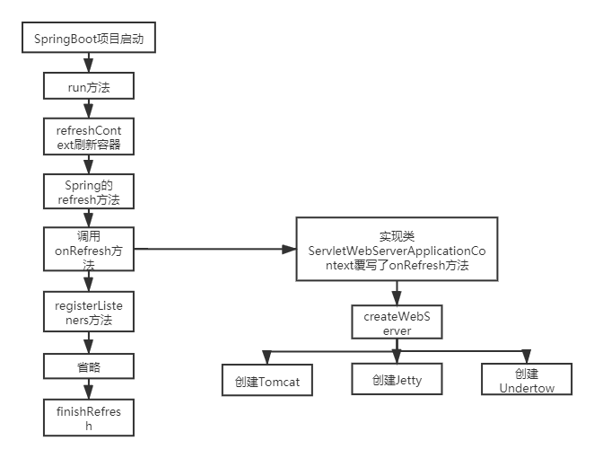

------

# SpringBoot源码剖析

## 1 依赖管理

### 1.1 为什么导入dependency时不需要指定版本？

- `spring-boot-starter-parent`通过继承`spring-boot-dependencies`从而实现了SpringBoot的版本依赖管理，所以SpringBoot工程继承`spring-boot-starter-parent`后已经具备版本锁定等配置了，因此SpringBoot项目中部分依赖不需要写版本号。

### 1.2 `spring-boot-starter-parent`父依赖启动器的主要作用是进行版本统一管理，那么项目运行依赖的JAR包是从何而来的？

- `spring-boot-starter-web`依赖启动器的主要作用是打包了Web开发场景所需的底层所有依赖，基于依赖传递，当前项目也存在对应的依赖jar包

## 2 自动配置

### 2.1 概念

- 自动配置：根据添加的JAR包依赖，会自动将一些配置类的Bean注册进IoC容器，可以在需要的地方使用@Resource或@AutoWired等注解使用。

### 2.2 SpringBoot是如何进行自动配置的，哪些组件进行了自动配置？

- SpringBoot应用的启动入口是@SpringBootApplication注解标注类中的main()方法

- @SpringBootApplication：SpringBoot应用标注在某个类上说明这个类是SpringBoot的主配置类，SpringBoot就应该运行这个类的main()方法启动SpringBoot应用

    - @SpringBootConfiguration：封装了@Configuration注解，标注该类为配置类
    
    - @EnableAutoConfiguration：启动自动配置功能
    
        - Spring中有很多以`Enable`开头的注解，其作用就是借助`@Import`来收集并注册特定场景相关的Bean，并加载到IoC容器
          
        - @EnableAutoConfiguration就是借助`@Import`来收集所有符合自动配置条件的Bean定义，并加载到IoC容器
        
        - @AutoConfigurationPackage：自动配置包，是一个组合注解
        
            > 借助@Import注解向容器中导入了`AutoConfigurationPackages.Registrar`组件类，这个组件类会注册一个`org.springframework.boot.autoconfigure.AutoConfigurationPackages.BasePackages`Bean，这个Bean有一个参数使用了@AutoConfigurationPackage注解类所在包路径，保存配置类以供之后使用。比如给JPA entity扫描器用来扫描开发人员通过注解@Entity定义的entity类。
            
        - @Import：Spring的底层注解，给容器导入一个组件类
        
            > @Import({AutoConfigurationImportSelector.class})：将`AutoConfigurationImportSelector`这个类导入到Spring容器中，`AutoConfigurationImportSelector`可以帮助SpringBoot应用将所有符合条件的@Configuration配置都加载到当前SpringBoot创建并使用的IoC容器中  
            >   
            > AutoConfigurationImportSelector实现了DeferredImportSelector接口和各种Aware接口（在某个时机触发回调获取相应的组件），DefaultAware接口又继承了ImportSelector接口  
            > 自动配置实现逻辑入口方法：DeferredImportSelectorGrouping类的getImports方法
            >> 获取各JAR包META-INF/spring.factories下的EnableAutoConfiguration的配置类，返回List  
            >> 利用LinkedHashSet移除重复的配置类  
            >> 利用@EnableAutoConfiguration注解的exclude属性，排除自动配置类  
            >> AutoConfigurationImportFilter接口去过滤自动配置类是否符合其标注注解（若有标注的话）@ConditionalOnClass，@ConditionalOnBean和@ConditionalOnWebApplication 的条件，若都符合的话则返回匹配结果  
            >> 通过需要排除的自动配置类集合和过滤后所符合条件的自动配置类集合再次筛选，排除不需要自动配置的类  
            >> 对标注@Order注解的自动配置类进行排序  
            >> 返回需要自动配置类的全路径  
            >> 最后Spring将筛选后的自动配置类导入到IoC容器中
            >> 

    - @ComponentScan：从定义的扫描路径中，找出标识了需要装配的类自动装配到Spring的IoC容器中
    
        - 常用属性：
        
            > basePackages、value：指定扫描路径，如果为空则以@ComponentScan注解的类所在的包为基本的扫描路径  
            > basePackageClasses：指定具体扫描的类  
            > includeFilters：指定满足Filter条件的类  
            > excludeFilters：指定排除Filter条件的类  

        - 当前@ComponentScan注解没有标注basePackages及value，所以扫描路径默认为@ComponentScan注解的类所在的包为基本的扫描路径（也就是标注了@SpringBootApplication注解的项目启动类所在的路径）

## 3 核心启动类

### 3.1 SpringApplication初始化过程

- 推断应用类型，根据应用类型初始化对应的环境，常用一般为Servlet环境

- 初始化classpath下META-INF/spring.factories中已配置的ApplicationContextInitializer（Spring容器在刷新之前会回调这个接口的initialize方法，实现对配置文件的修改完善工作、设置环境变量值等）

- 初始化classpath下META-INF/spring.factories中已配置的ApplicationListener（观察者模式，对Spring全生命周期监听）

- 根据调用栈，推断出main方法的类名

### 3.2 run方法执行流程

- 构建并启动StopWatch对象，记录程序运行时间

- 声明ConfigurableApplicationContext并赋null值，ConfigurableApplicationContext是ApplicationContext接口的子接口，在ApplicationContext基础上增加了配置上下文的工具，是容器的高级接口

- 获取并启动监听器

    - 获取classpath下META-INF/spring.factories中已配置的SpringApplicationRunListener，负责在SpringBoot启动不同阶段广播出不同的消息，传递给ApplicationListener监听器实现类

- 构建应用上下文环境

    - 获取计算机的环境，Java环境，Spring的运行环境，Spring项目的配置（application.properties/yml）等等信息封装到ConfigurableEnvironment

- 初始化应用上下文

    - 在createApplicationContext()方法中的，BeanUtils.instantiateClass(contextClass)方法中，不但初始化了AnnotationConfigServletWebServerApplicationContext类（应用上下文），同样也触发了GenericApplicationContext类的构造函数，从而创建了IoC容器（DefaultListableBeanFactory）
    
    - 应用上下文可以理解成IoC容器的高级表现形式，应用上下文是在IoC容器的基础上丰富了一些高级功能

- 刷新应用上下文前的准备阶段

    - 设置容器环境
    
    - 执行容器后置处理
    
    - 执行容器的ApplicationContextInitializer
    
    - 向各个监听器发送容器已经准备好的事件
    
    - 将main函数中的args参数封装成单例Bean，注册进容器
    
    - 将printedBanner也封装成单例，注册进容器
    
    - 加载启动类，将启动类注入容器
    
    - 发布容器已加载事件

- 刷新应用上下文

    - Resource定位

        - 在SpringBoot中，prepareContext()方法会先将主类解析成BeanDefinition，然后在refresh()方法的invokeBeanFactoryPostProcessors()方法中解析主类的BeanDefinition获取basePackage的路径。这样就完成了定位的过程。其次SpringBoot的各种starter是通过SPI扩展机制实现的自动装配，SpringBoot的自动装配同样也是在invokeBeanFactoryPostProcessors()方法中实现的。还有一种情况，在SpringBoot中有很多的@EnableXXX注解，底层是@Import注解，在invokeBeanFactoryPostProcessors()方法中也实现了对该注解指定的配置类的定位加载。  
        
        - 常规的在SpringBoot中有三种实现定位，第一个是主类所在包的，第二个是SPI扩展机制实现的自动装配（比如各种starter），第三种就是@Import注解指定的类。

    - BeanDefinition的载入
    
        - 载入就是通过上面的定位得到的basePackage，SpringBoot会将该路径拼接成：`classpath:com/lagou/**/.class`这样的形式，然后通过xPathMatchingResourcePatternResolver的类会将该路径下所有的.class文件都加载进来，然后遍历判断是不是有@Component注解，如果有的话，就是需要装载的BeanDefinition。
        
    - 注册BeanDefinition
    
        - 通过调用BeanDefinitionRegister接口的实现来完成。这个注册过程把载入过程中解析得到的BeanDefinition向IoC容器进行注册。在IoC容器中将BeanDefinition注入到一个ConcurrentHashMap中，IoC容器就是通过这个HashMap来持有这些BeanDefinition数据的。比如DefaultListableBeanFactory中的beanDefinitionMap属性。

    - 获取到@Import导入的AutoConfigurationImportSelector组件，调用组件内部类方法执行自动配置逻辑

- 刷新应用上下文后的扩展阶段

    - 自定义需求，如启动后打印日志等后置处理方法，重写该方法

## 4 自定义starter

### 4.1 SpringBoot starter机制

- 够抛弃以前繁杂的配置，将其统一集成进starter，应用者只需要在maven中引入starter依赖，SpringBoot就能自动扫描到要加载的信息并启动相应的默认配置

### 4.2 使用场景

- 将可独立于业务代码之外的功配置模块封装成一starter，复用的时候只需要将其在pom中引用依赖即可

### 4.3 starter命名

- 官方：spring-boot-starter-...

- 自定义：...-spring-boot-starter

### 4.4 热插拔技术

- 通过@Import和@Condition...注解实现

## 5 内嵌Tomcat原理

### 5.1 基础

- Spring Boot默认支持Tomcat，Jetty，和Undertow作为底层容器。而Spring Boot默认使用Tomcat，一旦引入spring-boot-starter-web模块，就默认使用Tomcat容器。

### 5.2 Tomcat原理图

- 

## 6 自动配置SpringMVC

### 6.1 原理

- Servlet3.0为springBoot彻底去掉xml（web.xml）奠定了基础

- 当实现了Servlet3.0规范的容器（如Tomcat7及以上版本）启动时，通过SPI扩展机制自动扫描所有添加到JAR包下的META-INF/service/javax.servlet.ServletContainerInitializer中指定的全路径类，并实例化类，然后调用实现类的onStartup方法

- onStartup方法将servlet实例添加（注册）到tomcat这样的servletContext中，才能提供请求服务

    - `servletContext.addServlet(name, this.servlet);`

### 6.2 SpringMVC自动配置类做了哪些事？

- 配置DispatcherServlet：前端控制器

- 配置DispatcherServletRegistrationBean：DispatcherServlet的注册类，负责将DispatcherServlet注册到ServletContext中