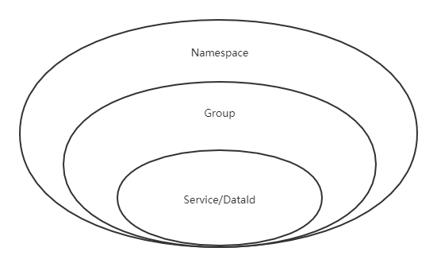
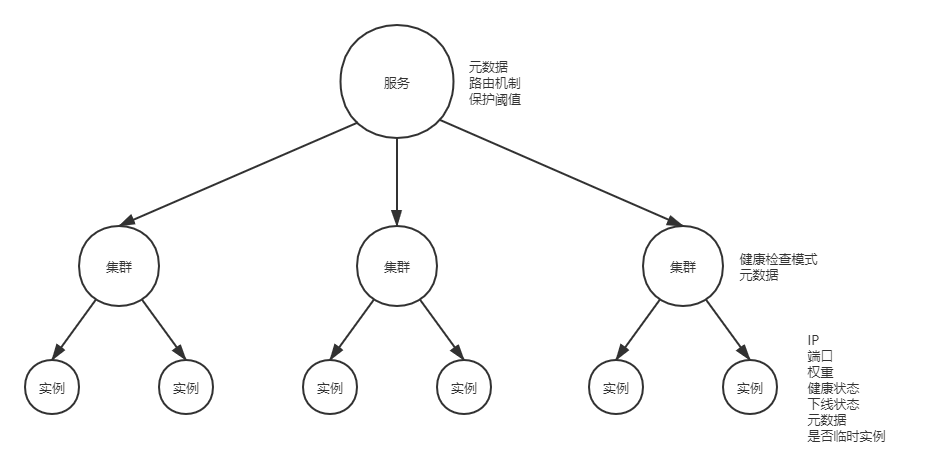
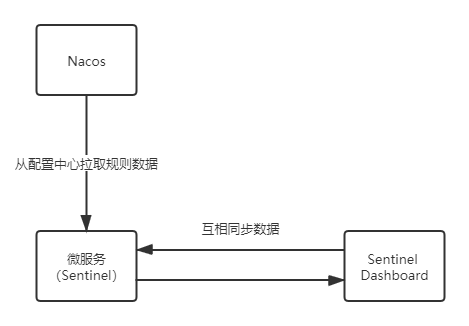

------

# SpringCloudAlibaba高级实战

## 1 SCA Nacos 服务注册和配置中⼼

### 1.1 Nacos 介绍

- Nacos （Dynamic Naming and Configuration Service）是阿⾥巴巴开源的⼀个针对微服务架构中服务发现、配置管理和服务管理平台。

- Nacos就是注册中⼼+配置中⼼的组合（Nacos=Eureka+Config+Bus）

- Nacos功能特性
  
    - 服务发现与健康检查
  
    - 动态配置管理
  
    - 动态DNS服务
  
    - 服务和元数据管理（管理平台的⻆度，nacos也有⼀个ui⻚⾯，可以看到注册的服务及其实例信息（元数据信息）等），动态的服务权重调整、动态服务优雅下线

### 1.2 Nacos 服务注册中⼼

- 保护阈值：可以设置为0-1之间的浮点数，是⼀个⽐例值（当前服务健康实例数/当前服务总实例数）

- 保护阈值的意义在于

    - 当服务A健康实例数/总实例数 < 保护阈值 的时候，说明健康实例真的不多了，这个时候保护阈值会被触发（状态true）
    
    - nacos将会把该服务所有的实例信息（健康的+不健康的）全部提供给消费者，消费者可能访问到不健康的实例，请求失败，但这样也⽐造成雪崩要好，牺牲了⼀些请求，保证了整个系统的⼀个可⽤

- 注意：阿⾥内部在使⽤nacos的时候，也经常调整这个保护阈值参数

### 1.3 Nacos 数据模型（领域模型）

- Namespace命名空间、Group分组、集群这些都是为了进⾏归类管理，把服务和配置⽂件进⾏归类，归类之后就可以实现⼀定的效果，⽐如隔离

- ⽐如，对于服务来说，不同命名空间中的服务不能够互相访问调⽤；服务优先访问同一集群下的服务等

- 

    - Namespace：命名空间，对不同的环境进⾏隔离，⽐如隔离开发环境、测试环境和⽣产环境

    - Group：分组，将若⼲个服务或者若⼲个配置集归为⼀组，通常习惯⼀个系统归为⼀个组

    - Service：某⼀个服务，⽐如简历微服务
  
    - DataId：配置集或者可以认为是⼀个配置⽂件

- | 概念 | 描述 |
  | :-----| :---- |
  | Namespace | 代表不同的环境，如开发dev、测试test、⽣产环境prod |
  | Group | 代表某项⽬，⽐如拉勾云项⽬ |
  | Service | 某个项⽬中具体xxx服务 |
  | DataId | 某个项⽬中具体的xxx配置⽂件 |

- Nacos服务的分级模型

    - 

### 1.4 Nacos Server 集群

- 主从架构（Leader + Follower）

### 1.5 Nacos 配置中⼼

- 配置信息直接配置在Nacos server中，微服务不需要依赖Bus可以完成动态刷新（仍然使用@RefreshScope）

- ⼀个微服务希望从配置中⼼Nacos server中获取多个dataId的配置信息，可以扩展多个dataId，需要手动开启扩展配置的动态刷新功能

- 优先级：根据规则⽣成的dataId > 扩展的dataId（对于扩展的dataId，[n] n越⼤优先级越⾼）

## 2  SCA Sentinel 分布式系统的流量防卫兵

### 2.1 Sentinel 介绍

- Sentinel是⼀个⾯向云原⽣微服务的流量控制、熔断降级组件。替代Hystrix，针对问题：服务雪崩、服务降级、服务熔断、服务限流

- Sentinel 分为两个部分:
  
    - 核⼼库：（Java 客户端）不依赖任何框架/库，能够运⾏于所有 Java 运⾏时环境，同时对 Dubbo / Spring Cloud 等框架也有较好的⽀持。
    
    - 控制台：（Dashboard）基于 Spring Boot 开发，打包后可以直接运⾏，不需要额外的 Tomcat 等应⽤容器

- Sentinel 具有以下特征:
  
    - 丰富的应⽤场景：Sentinel 承接了阿⾥巴巴近 10 年的双⼗⼀⼤促流量的核⼼场景，例如秒杀（即突发流量控制在系统容量可以承受的范围）、消息削峰填⾕、集群流量控制、实时熔断下游不可⽤应⽤等
    
    - 完备的实时监控：Sentinel 同时提供实时的监控功能。您可以在控制台中看到接⼊应⽤的单台机器秒级数据，甚⾄ 500 台以下规模的集群的汇总运⾏情况
    
    - ⼴泛的开源⽣态：Sentinel 提供开箱即⽤的与其它开源框架/库的整合模块，例如与 Spring Cloud、Dubbo的整合。您只需要引⼊相应的依赖并进⾏简单的配置即可快速地接⼊ Sentinel
    
    - 完善的 SPI 扩展点：Sentinel 提供简单易⽤、完善的 SPI 扩展接⼝。您可以通过实现扩展接⼝来快速地定制逻辑。例如定制规则管理、适配动态数据源等

- Sentinel 的主要特性：

    - 

### 2.2 Sentinel 关键概念

- | 概念 | 描述 |
  | :-----| :---- |
  | 资源 | 它可以是 Java 应⽤程序中的任何内容，例如，由应⽤程序提供的服务，或由应⽤程序调⽤的其它应⽤提供的服务，甚⾄可以是⼀段代码。我们请求的API接⼝就是资源 |
  | 规则 | 围绕资源的实时状态设定的规则，可以包括流量控制规则、熔断降级规则以及系统保护规则。所有规则可以动态实时调整 |

### 2.3 Sentinel 流量规则模块

- 资源名：默认请求路径
  
- 针对来源：Sentinel可以针对调⽤者进⾏限流，填写微服务名称，默认default（不区分来源）

- 阈值类型/单机阈值

    - QPS：（每秒钟请求数量）当调⽤该资源的QPS达到阈值时进⾏限流
    
    - 线程数：当调⽤该资源的线程数达到阈值的时候进⾏限流（线程处理请求的时候，如果说业务逻辑执⾏时间很⻓，流量洪峰来临时，会耗费很多线程资源，这些线程资源会堆积，最终可能造成服务不可⽤，进⼀步上游服务不可⽤，最终可能服务雪崩）

- 是否集群：是否集群限流

- 流控模式：
  
    - 直接：资源调⽤达到限流条件时，直接限流
    
    - 关联：关联的资源调⽤达到阈值时候限流⾃⼰
    
        - ⽐如⽤户注册接⼝，需要调⽤身份证校验接⼝（往往身份证校验接⼝），如果身份证校验接⼝请求达到阈值，使⽤关联，可以对⽤户注册接⼝进⾏限流
  
    - 链路：只记录指定链路上的流量
    
        - 链路模式下会控制该资源所在的调⽤链路⼊⼝的流量。需要在规则中配置⼊⼝资源，即该调⽤链路⼊⼝的上下⽂名称

- 流控效果：
  
    - 快速失败：直接失败，抛出异常
  
    - Warm Up：根据冷加载因⼦（默认3）的值，从阈值/冷加载因⼦，经过预热时⻓，才达到设置的QPS阈值
    
        - 当系统⻓期处于空闲的情况下，当流量突然增加时，直接把系统拉升到⾼⽔位可能瞬间把系统压垮，⽐如电商⽹站的秒杀模块。

        - 通过 Warm Up 模式（预热模式），让通过的流量缓慢增加，经过设置的预热时间以后，到达系统处理请求速率的设定值
        
        - Warm Up 模式默认会从设置的 QPS 阈值的 1/3 开始慢慢往上增加⾄ QPS 设置值
    
    - 排队等待：匀速排队，让请求匀速通过，阈值类型必须设置为QPS，否则⽆效
    
        - 排队等待模式下会严格控制请求通过的间隔时间，即请求会匀速通过，允许部分请求排队等待，通常⽤于消息队列削峰填⾕等场景。需设置具体的超时时间，当计算的等待时间超过超时时间时请求就会被拒绝
        
        - 例如，QPS 配置为 5，则代表请求每 200 ms 才能通过⼀个，多出的请求将排队等待通过。超时时间代表最⼤排队时间，超出最⼤排队时间的请求将会直接被拒绝。排队等待模式下，QPS 设置值不要超过 1000（请求间隔 1 ms）

### 2.4 Sentinel 降级规则模块

- Sentinel 降级会在调⽤链路中某个资源出现不稳定状态时（例如调⽤超时或异常⽐例升⾼），对这个资源的调⽤进⾏限制，让请求快速失败，避免影响到其它的资源⽽导致级联错误。当资源被降级后，在接下来的降级时间窗⼝之内，对该资源的调⽤都⾃动熔断

- Sentinel不会像Hystrix那样放过⼀个请求尝试⾃我修复，就是明明确确按照时间窗⼝来，熔断触发后，时间窗⼝内拒绝请求，时间窗⼝后就恢复

- 策略

    - RT（平均响应时间 ）：当 1s 内持续进⼊ >=5 个请求，平均响应时间超过阈值（以 ms 为单位），那么在接下的时间窗⼝（以 s 为单位）之内，对这个⽅法的调⽤都会⾃动地熔断（抛出 DegradeException）。注意 Sentinel 默认统计的 RT 上限是 4900 ms，超出此阈值的都会算作 4900 ms，若需要变更此上限可以通过启动配置项 -Dcsp.sentinel.statistic.max.rt=xxx 来配置
    
    - 异常⽐例：当资源的每秒请求量 >= 5，并且每秒异常总数占通过量的⽐值超过阈值之后，资源进⼊降级状态，即在接下的时间窗⼝（以 s 为单位）之内，对这个⽅法的调⽤都会⾃动地返回。异常⽐率的阈值范围是 [0.0, 1.0] ，代表 0% - 100%
    
    - 异常数：当资源近 1 分钟的异常数⽬超过阈值之后会进⾏熔断。注意由于统计时间窗⼝是分钟级别的，若 timeWindow ⼩于 60s，则结束熔断状态后仍可能再进⼊熔断状态

### 2.5 Sentinel ⾃定义兜底逻辑

- 使用@SentinelResource注解，类似于Hystrix中的@HystrixCommand注解

- @SentinelResource注解中有两个属性需要进⾏区分，blockHandler属性⽤来指定不满⾜Sentinel规则的降级兜底⽅法，fallback属性⽤于指定Java运⾏时异常兜底⽅法

### 2.6 基于 Nacos 实现 Sentinel 规则持久化

- Sentinel Dashboard中添加的规则数据存储在内存，微服务停掉规则数据就消失，在⽣产环境下不合适。可以将Sentinel规则数据持久化到Nacos配置中⼼，让微服务从Nacos获取规则数据

- 

- 流控

    - 所有属性来⾃源码FlowRule类
    
        - resource：资源名称
        
        - limitApp：来源应⽤
          
        - grade：阈值类型 0 线程数 1 QPS
          
        - count：单机阈值
          
        - strategy：流控模式，0 直接 1 关联 2 链路
          
        - controlBehavior：流控效果，0 快速失败 1 Warm Up 2 排队等待
          
        - clusterMode：true/false 是否集群

- 降级

    - 所有属性来⾃源码DegradeRule类
      
        - resource：资源名称
      
        - grade：降级策略 0 RT 1 异常⽐例 2 异常数
      
        - count：阈值
      
        - timeWindow：时间窗

