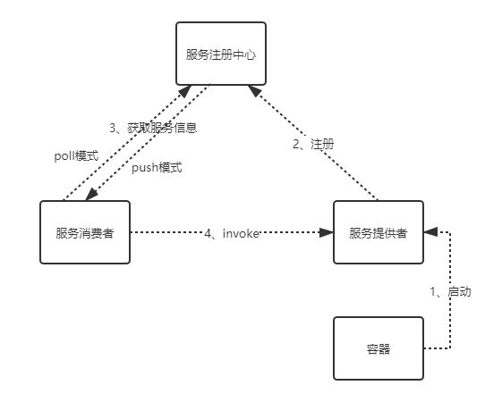
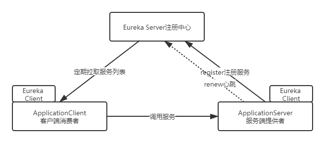
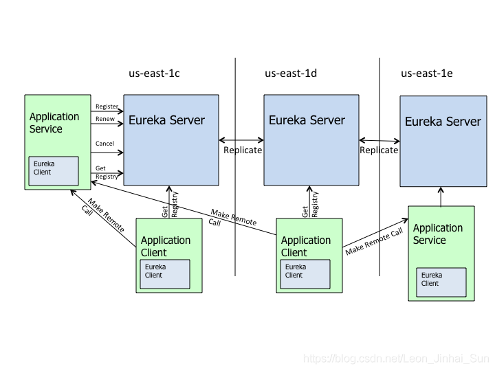
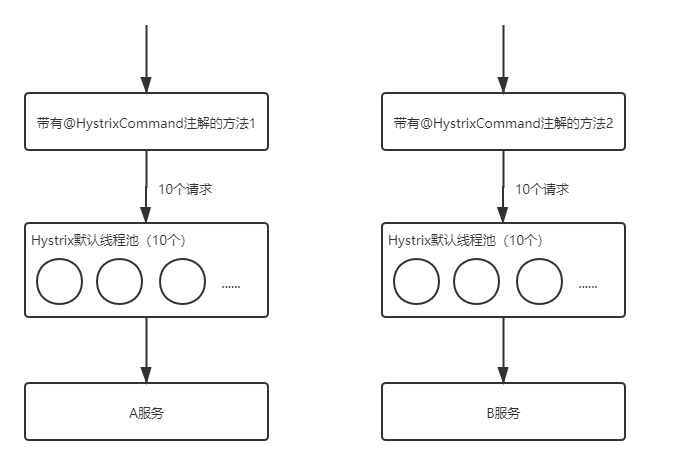
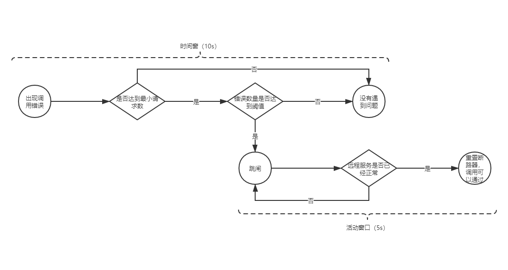

------

# SpringCloud核心组件原理及实战（上）

## 1 Eureka服务注册中⼼

### 1.1 关于服务注册中⼼

- 服务注册中⼼本质上是为了解耦服务提供者和服务消费者

- 对于任何⼀个微服务，原则上都应存在或者⽀持多个提供者，这是由微服务的分布式属性决定的

- ⼀个微服务的提供者的数量和分布往往是动态变化的，也是⽆法预先确定的

#### 1.1.1 服务注册中⼼⼀般原理

- 

- 分布式微服务架构中，服务注册中⼼⽤于存储服务提供者地址信息、服务发布相关的属性信息，消费者通过主动查询和被动通知的⽅式获取服务提供者的地址信息，⽽不再需要通过硬编码⽅式得到提供者的地址信息

#### 1.1.2 主流服务中⼼对⽐

- | 组件名 | 语⾔ | CAP | 对外暴露接⼝ |
  | :-----| :---- | :---- | :---- |
  | Eureka | Java | AP | HTTP |
  | Consul | Go | CP | HTTP/DNS |
  | Zookeeper | Java | CP | 客户端 |
  | Nacos | Java | ⽀持AP/CP切换 | HTTP |

- CAP

    - P：分区容错性（⼀定的要满⾜的）
    
    - C：数据⼀致性
    
    - A：⾼可⽤

- CAP不可能同时满⾜三个，要么是AP，要么是CP

### 1.2 服务注册中⼼组件 Eureka

- 

- 

    - 图中us-east-1c、us-east-1d，us-east-1e代表不同的区也就是不同的机房
    
    - 图中每⼀个Eureka Server都是⼀个集群
    
    - 图中Application Service作为服务提供者向Eureka Server中注册服务，Eureka Server接受到注册事件会在集群和分区中进⾏数据同步，ApplicationClient作为消费端（服务消费者）可以从Eureka Server中获取到服务注册信息，进⾏服务调⽤
    
    - 微服务启动后，会周期性地向Eureka Server发送⼼跳（默认周期为30秒）以续约⾃⼰的信息
    
    - Eureka Server在⼀定时间内没有接收到某个微服务节点的⼼跳，EurekaServer将会注销该微服务节点（默认90秒）
    
    - 每个Eureka Server同时也是Eureka Client，多个Eureka Server之间通过复制的⽅式完成服务注册列表的同步
    
    - Eureka Client会缓存Eureka Server中的信息。即使所有的Eureka Server节点都宕掉，服务消费者依然可以使⽤缓存中的信息找到服务提供者

- Eureka通过⼼跳检测、健康检查和客户端缓存等机制，提⾼系统的灵活性、可伸缩性和可⽤性

### 1.3 Eureka细节详解

#### 1.3.1 Eureka元数据详解

- 标准元数据：主机名、IP地址、端⼝号等信息，这些信息都会被发布在服务注册表中，⽤于服务之间的调⽤

- ⾃定义元数据：可以使⽤eureka.instance.metadata-map配置，符合KEY/VALUE的存储格式。这 些元数据可以在远程客户端中访问

#### 1.3.2 Eureka客户端详解

- 服务注册

    - 服务在启动时会向注册中⼼发起注册请求，携带服务元数据信息
    
    - Eureka注册中⼼会把服务的信息保存在Map中
    
- 服务续约

    - 服务每隔30秒会向注册中⼼续约(⼼跳)⼀次（也称为报活），如果没有续约，租约在90秒后到期，然后服务会被失效，称之为⼼跳检测

- 获取服务列表

    - 每隔30秒服务会从注册中⼼中拉取⼀份服务列表

#### 1.3.3 Eureka服务端详解

- 服务下线

    - 当服务正常关闭操作时，会发送服务下线的REST请求给EurekaServer
    
    - 服务中⼼接受到请求后，将该服务置为下线状态

- 失效剔除

    - Eureka Server会定时（间隔值是eureka.server.eviction-interval-timer-in-ms，默认60s）进⾏检查，如果发现实例在在⼀定时间（此值由客户端设置的eureka.instance.lease-expiration-duration-in-seconds定义，默认值为90s）内没有收到⼼跳，则会注销此实例

- ⾃我保护

    - 如果在15分钟内超过85%的客户端节点都没有正常的⼼跳，那么Eureka就认为客户端与注册中⼼出现了⽹络故障，Eureka Server⾃动进⼊⾃我保护机制
    
    - 默认情况下，如果Eureka Server在⼀定时间内（默认90秒）没有接收到某个微服务实例的⼼跳，Eureka Server将会移除该实例。但是当⽹络分区故障发⽣时，微服务与Eureka Server之间⽆法正常通信，⽽微服务本身是正常运⾏的，此时不应该移除这个微服务，所以引⼊了⾃我保护机制
    
    - 当处于⾃我保护模式时
    
        - 不会剔除任何服务实例（可能是服务提供者和EurekaServer之间⽹络问题），保证了⼤多数服务依然可⽤
        
        - Eureka Server仍然能够接受新服务的注册和查询请求，但是不会被同步到其它节点上，保证当前节点依然可⽤，当⽹络稳定时，当前Eureka Server新的注册信息会被同步到其它节点中。
        
        - 在Eureka Server⼯程中通过eureka.server.enable-self-preservation配置可⽤关停⾃我保护，默认值是打开

## 2 Ribbon负载均衡

### 2.1 关于负载均衡

- 负载均衡⼀般分为服务器端负载均衡和客户端负载均衡

- 服务器端负载均衡，⽐如Nginx、F5这些，请求到达服务器之后由这些负载均衡器根据⼀定的算法将请求路由到⽬标服务器处理

- 客户端负载均衡，⽐如我们要说的Ribbon，服务消费者客户端会有⼀个服务器地址列表，调⽤⽅在请求前通过⼀定的负载均衡算法选择⼀个服务器进⾏访问，负载均衡算法的执⾏是在请求客户端进⾏

### 2.2 Ribbon负载均衡策略

- Ribbon内置了多种负载均衡策略，内部负责复杂均衡的顶级接⼝为com.netflix.loadbalancer.IRule

- | 负载均衡策略 | 描述 |
  | :-----| :---- |
  | RoundRobinRule：轮询策略 | 默认超过10次获取到的server都不可⽤，会返回⼀个空的server |
  | RandomRule：随机策略 | 如果随机到的server为null或者不可⽤的话，会while不停的循环选取 |
  | RetryRule：重试策略 | ⼀定时限内循环重试。默认继承RoundRobinRule，也⽀持⾃定义注⼊，RetryRule会在每次选取之后，对选举的server进⾏判断，是否为null，是否alive，并且在500ms内会不停的选取判断。⽽RoundRobinRule失效的策略是超过10次，RandomRule是没有失效时间的概念，只要serverList没都挂。 |
  | BestAvailableRule：最⼩连接数策略 | 遍历serverList，选取出可⽤的且连接数最⼩的⼀个server。该算法⾥⾯有⼀个LoadBalancerStats的成员变量，会存储所有server的运⾏状况和连接数。如果选取到的server为null，那么会调⽤RoundRobinRule重新选取。 |
  | AvailabilityFilteringRule：可⽤过滤策略 | 扩展了轮询策略，会先通过默认的轮询选取⼀个server，再去判断该server是否超时可⽤，当前连接数是否超限，都成功再返回。 |
  | ZoneAvoidanceRule：区域权衡策略（默认策略） | 扩展了轮询策略，继承了2个过滤器：ZoneAvoidancePredicate和AvailabilityPredicate，除了过滤超时和链接数过多的server，还会过滤掉不符合要求的zone区域⾥⾯的所有节点，AWS --ZONE 在⼀个区域/机房内的服务实例中轮询 |

### 2.3 Ribbon核⼼源码剖析

- Ribbon给restTemplate添加了⼀个拦截器，根据负载均衡策略选取服务器

- 负载均衡管理器LoadBalance组件

    - IRule：是在选择实例的时候的负载均衡策略对象
    
    - IPing：是⽤来向服务发起⼼跳检测的，通过⼼跳检测来判断该服务是否可⽤
    
    - ServerListFilter：根据⼀些规则过滤传⼊的服务实例列表
    
    - ServerListUpdater：定义了⼀系列的对服务列表的更新操作

## 3 Hystrix熔断器

### 3.1 微服务中的雪崩效应

- 扇⼊：代表着该微服务被调⽤的次数，扇⼊⼤，说明该模块复⽤性好

- 扇出：该微服务调⽤其他微服务的个数，扇出⼤，说明业务逻辑复杂

- 在微服务架构中，⼀个应⽤可能会有多个微服务组成，微服务之间的数据交互通过远程过程调⽤完成。这就带来⼀个问题，假设微服务A调⽤微服务B和微服务C，微服务B和微服务C⼜调⽤其它的微服务，这就是所谓的“扇出”。如果扇出的链路上某个微服务的调⽤响应时间过⻓或者不可⽤，对微服务A的调⽤就会占⽤越来越多的系统资源，进⽽引起系统崩溃，所谓的“雪崩效应”

- 下游微服务响应时间过⻓，⼤量请求阻塞，⼤量线程不会释放，会导致服务器资源耗尽，最终导致上游服务甚⾄整个系统瘫痪

### 3.2 雪崩效应解决⽅案

- 服务熔断

    - 熔断机制是应对雪崩效应的⼀种微服务链路保护机制
    
    - 当扇出链路的某个微服务不可⽤或者响应时间太⻓时，熔断该节点微服务的调⽤，进⾏服务的降级，快速返回错误的响应信息。当检测到该节点微服务调⽤响应正常后，恢复调⽤链路

- 服务降级

    - 服务降级⼀般是从整体考虑，就是当某个服务熔断之后，服务器将不再被调⽤，此刻客户端可以⾃⼰准备⼀个本地的fallback回调，返回⼀个缺省值

- 服务限流

    - 合服务限流来限制某些场景的并发/请求量，⽐如秒杀业务
    
    - 限制总并发数（⽐如数据库连接池、线程池）
    
    - 限制瞬时并发数（如nginx限制瞬时并发连接数）
    
    - 限制时间窗⼝内的平均速率（如Guava的RateLimiter、nginx的limit_req模块，限制每秒的平均速率）
    
    - 限制远程接⼝调⽤速率、限制MQ的消费速率等

### 3.3 Hystrix简介

- Hystrix是由Netflix开源的⼀个延迟和容错库，⽤于隔离访问远程系统、服务或者第三⽅库，防⽌级联失败，从⽽提升系统的可⽤性与容错性

    - 包裹请求：使⽤HystrixCommand包裹对依赖的调⽤逻辑
    
    - 跳闸机制：当某服务的错误率超过⼀定的阈值时，Hystrix可以跳闸，停⽌请求该服务⼀段时间
    
    - 资源隔离：Hystrix为每个依赖都维护了⼀个⼩型的线程池（舱壁模式或者信号量）。如果该线程池已满，发往该依赖的请求就被⽴即拒绝，⽽不是排队等待，从⽽加速失败判定
    
    - 监控：Hystrix可以近乎实时地监控运⾏指标和配置的变化，例如成功、失败、超时、以及被拒绝 的请求等
    
    - 回退机制：当请求失败、超时、被拒绝，或当断路器打开时，执⾏回退逻辑。回退逻辑由开发⼈员 ⾃⾏提供，例如返回⼀个缺省值
    
    - ⾃我修复：断路器打开⼀段时间后，会⾃动进⼊“半开”状态

### 3.4 Hystrix舱壁模式（线程池隔离策略）

- 如果不进⾏任何设置，所有熔断⽅法使⽤⼀个Hystrix线程池（10个线程），那么这样的话会导致问题，如果⽅法A的请求把10个线程都⽤了，⽅法2请求处理的时候压根都没法去访问B，因为没有线程可⽤，并不是B服务不可⽤

- 单独的为每⼀个控制⽅法创建⼀个线程池的⽅式，这种模式叫做“舱壁模式"，也是线程隔离的⼿段

- 

### 3.5 Hystrix⼯作流程与⾼级应⽤

- 

- 当调⽤出现问题时，开启⼀个时间窗（10s）

- 在这个时间窗内，统计调⽤次数是否达到最⼩请求数？

    - 如果没有达到，则重置统计信息，回到第1步

    - 如果达到了，则统计失败的请求数占所有请求数的百分⽐，是否达到阈值？

        - 如果达到，则跳闸（不再请求对应服务）

        - 如果没有达到，则重置统计信息，回到第1步

- 如果跳闸，则会开启⼀个活动窗⼝（默认5s），每隔5s，Hystrix会让⼀个请求通过，到达那个问题服务，看是否调⽤成功，如果成功，重置断路器回到第1步，如果失败，回到第3步

### 3.6 Hystrix Dashboard断路监控仪表盘

- 借助SpringBoot的actuator（健康监控）

### 3.7 Hystrix Turbine聚合监控

- 把相关微服务的监控数据聚合在⼀起进⾏聚合监控

## 4 Feign远程调⽤组件

### 4.1 Feign简介

- Feign是Netflix开发的⼀个轻量级RESTful的HTTP服务客户端（⽤它来发起请求，远程调⽤的），是以Java接⼝注解的⽅式调⽤Http请求，⽽不⽤像Java中通过封装HTTP请求报⽂的⽅式直接调⽤

- 封装了Http调⽤流程，更符合⾯向接⼝化的编程习惯，类似于Dubbo的服务调⽤

### 4.2 Feign对负载均衡的⽀持

- Feign 本身已经集成了Ribbon依赖和⾃动配置

- Feign默认的请求处理超时时⻓1s，如果配置Ribbon的超时，则会以Ribbon的为准

### 4.3 Feign对熔断器的⽀持

- 开启Hystrix之后，Feign中的⽅法都会被进⾏⼀个管理了，⼀旦出现问题就进⼊对应的回退逻辑处理

- 针对超时这⼀点，当前有两个超时时间设置（Feign/hystrix），熔断的时候是根据这两个时间的最⼩值来进⾏的，即处理时⻓超过最短的那个超时时间了就熔断进⼊回退降级逻辑

### 4.4 Feign对请求压缩和响应压缩的⽀持

- Feign ⽀持对请求和响应进⾏GZIP压缩，以减少通信过程中的性能损耗

### 4.5 Feign的⽇志级别配置

- Feign是http请求客户端，类似于浏览器，在请求和接收响应的时候，可以打印出⽐较详细的⼀些⽇志信息（响应头，状态码等等）

- 默认情况下Feign的⽇志没有开启

## 5 GateWay⽹关组件

### 5.1 GateWay简介