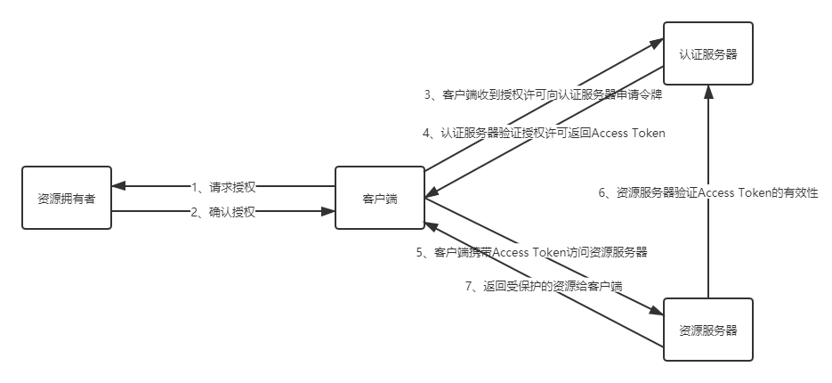

------


# SpringCloud高级实战

## 1 微服务监控之分布式链路追踪技术 Sleuth + Zipkin

### 1.1 分布式链路追踪技术核⼼思想

- 本质：记录⽇志

- Trace：服务追踪的追踪单元是从客户发起请求（request）抵达被追踪系统的边界开始，到被追踪系统向客户返回响应（response）为⽌的过程

- Trace ID：为了实现请求跟踪，当请求发送到分布式系统的⼊⼝端点时，只需要服务跟踪框架为该请求创建⼀个唯⼀的跟踪标识Trace ID，同时在分布式系统内部流转的时候，框架失踪保持该唯⼀标识，直到返回给请求⽅

    - ⼀个Trace由⼀个或者多个Span组成，每⼀个Span都有⼀个SpanId，Span中会记录TraceId，同时还有⼀个叫做ParentId，指向了另外⼀个Span的SpanId，表明⽗⼦关系，其实本质表达了依赖关系

- Span可以认为是⼀个⽇志数据结构，在⼀些特殊的时机点会记录了⼀些⽇志信息，⽐如有时间戳、spanId、TraceId，parentIde等，Span中也抽象出了另外⼀个概念，叫做事件，核⼼事件如下

    - CS ：client send/start 客户端/消费者发出⼀个请求，描述的是⼀个span开始
    
    - SR: server received/start 服务端/⽣产者接收请求 SR-CS属于请求发送的⽹络延迟
    
    - SS: server send/finish 服务端/⽣产者发送应答 SS-SR属于服务端消耗时间
    
    - CR：client received/finished 客户端/消费者接收应答 CR-SS表示回复需要的时间(响应的⽹络延迟)

- Span ID：为了统计各处理单元的时间延迟，当请求到达各个服务组件时，也是通过⼀个唯⼀标识Span ID来标记它的开始，具体过程以及结束。对每⼀个Span来说，必须有开始和结束两个节点，通过记录开始Span和结束Span的时间戳，就能统计出该Span的时间延迟，除了时间戳记录之外，它还可以包含⼀些其他元数据，⽐如时间名称、请求信息等

### 1.2 Sleuth + Zipkin

- Spring Cloud Sleuth （追踪服务框架）可以追踪服务之间的调⽤，Sleuth可以记录⼀个服务请求经过哪些服务、服务处理时⻓等。把 Sleuth 的数据信息发送给 Zipkin 进⾏聚合，利⽤ Zipkin 存储并展示数据

    - 耗时分析：通过 Sleuth 了解采样请求的耗时，分析服务性能问题（哪些服务调⽤⽐较耗时）
    
    - 链路优化：发现频繁调⽤的服务，针对性优化等

- Sleuth就是通过记录⽇志的⽅式来记录踪迹数据的

## 2 微服务统⼀认证⽅案 Spring Cloud OAuth2 + JWT

### 2.1 微服务架构下统⼀认证思路

- 基于Session的认证⽅式

    - 在分布式的环境下，基于session的认证会出现⼀个问题，每个应⽤服务都需要在session中存储⽤户身份信息，通过负载均衡将本地的请求分配到另⼀个应⽤服务需要将session信息带过去，否则会重新认证。我们可以使⽤Session共享、Session黏贴等⽅案
    
    - Session⽅案也有缺点，⽐如基于cookie，移动端不能有效使⽤等

- 基于token的认证⽅式
  
    - 基于token的认证⽅式，服务端不⽤存储认证数据，易维护扩展性强， 客户端可以把token 存在任意地⽅，并且可以实现web和app统⼀认证机制。其缺点也很明显，token由于⾃包含信息，因此⼀般数据量较⼤，⽽且每次请求 都需要传递，因此⽐较占带宽。另外，token的签名验签操作也会给cpu带来额外的处理负担

### 2.2 OAuth2开放授权协议/标准

#### 2.2.1 OAuth2介绍

- OAuth（开放授权）是⼀个开放协议/标准，允许⽤户授权第三⽅应⽤访问他们存储在另外的服务提供者上的信息，⽽不需要将⽤户名和密码提供给第三⽅应⽤或分享他们数据的所有内容

- OAuth2是OAuth协议的延续版本，但不向后兼容OAuth1即完全废⽌了OAuth1。

#### 2.2.2 OAuth2协议⻆⾊和流程

- 

#### 2.2.3 什么情况下需要使⽤OAuth2？

- 第三⽅授权登录的场景：⽐如，我们经常登录⼀些⽹站或者应⽤的时候，可以选择使⽤第三⽅授权登录的⽅式

- 单点登录的场景：如果项⽬中有很多微服务或者公司内部有很多服务，可以专⻔做⼀个认证中⼼（充当认证平台⻆⾊），所有的服务都要到这个认证中⼼做认证，只做⼀次登录，就可以在多个授权范围内的服务中⾃由串⾏

#### 2.2.4 OAuth2的颁发Token授权⽅式

- 授权码（authorization-code）：第三方登录使用

- 密码式（password）：提供⽤户名+密码换取token令牌

- 隐藏式（implicit）

- 客户端凭证（client credentials）

### 2.3 Spring Cloud OAuth2 + JWT 实现

#### 2.3.1 Spring Cloud OAuth2介绍

- Spring Cloud OAuth2 是 Spring Cloud 体系对OAuth2协议的实现，可以⽤来做多个微服务的统⼀认证（验证身份合法性）授权（验证权限）。通过向OAuth2服务（统⼀认证授权服务）发送某个类型的grant_type进⾏集中认证和授权，从⽽获得access_token（访问令牌），⽽这个token是受其他微服务信任的。

- 注意：使⽤OAuth2解决问题的本质是，引⼊了⼀个认证授权层，认证授权层连接了资源的拥有者，在授权层⾥⾯，资源的拥有者可以给第三⽅应⽤授权去访问我们的某些受保护资源。

#### 2.3.2 搭建认证服务器（Authorization Server）

- 认证服务器（Authorization Server），负责颁发token

- 继承AuthorizationServerConfigurerAdapter类，实现三个configure⽅法

    - configure(ClientDetailsServiceConfigurer clients)：⽤来配置客户端详情服务（ClientDetailsService），客户端详情信息在这⾥进⾏初始化，你能够把客户端详情信息写死在这⾥或者是通过数据库来存储调取详情信息
    
    - configure(AuthorizationServerEndpointsConfigurer endpoints)：⽤来配置令牌（token）的访问端点和令牌服务(token services)
    
    - configure(AuthorizationServerSecurityConfigurer oauthServer)：⽤来配置令牌端点的安全约束

- TokenStore

    - InMemoryTokenStore
    
    - JdbcTokenStore
    
    - JwtTokenStore

#### 2.3.3 JWT改造统⼀认证授权中⼼的令牌存储机制

- 问题：如果资源服务器有很多，资源服务器和认证服务器频繁交互，那么认证服务器压⼒会很⼤

- 解决办法：采⽤JWT格式令牌，⽤户认证通过会得到⼀个JWT令牌，JWT令牌中已经包括了⽤户相关的信 息，客户端只需要携带JWT访问资源服务，资源服务根据事先约定的算法⾃⾏完成令牌校验，⽆需每次都请求认证 服务完成授权

- JSON Web Token（JWT）是⼀个开放的⾏业标准（RFC 7519），它定义了⼀种简介的、⾃包含的协议格式，⽤于 在通信双⽅传递json对象，传递的信息经过数字签名可以被验证和信任。JWT可以使⽤HMAC算法或使⽤RSA的公 钥/私钥对来签名，防⽌被篡改

- JWT令牌由三部分组成，每部分中间使⽤点（.）分隔，⽐如：xxxxx.yyyyy.zzzzz

    - Header：头部包括令牌的类型（即JWT）及使⽤的哈希算法（如HMAC SHA256或RSA），例如
    
        - ```
          {
             "alg": "HS256",
             "typ": "JWT"
          }
          ```
    
        - 将上边的内容使⽤Base64Url编码，得到⼀个字符串就是JWT令牌的第⼀部分
    
    - Payload：负载，内容也是⼀个json对象，是存放有效信息的地⽅，可以存放jwt提供的现成字段，⽐ 如：iss（签发者）,exp（过期时间戳）, sub（⾯向的⽤户）等，也可⾃定义字段。 此部分不建议存放敏感信息，因为此部分可以解码还原原始内容。 最后将第⼆部分负载使⽤Base64Url编码，得到⼀个字符串就是JWT令牌的第⼆部分
    
        - ```
          {
             "sub": "1234567890",
             "name": "John Doe",
             "iat": 1516239022
          }
          ```
    
    - Signature：签名，此部分⽤于防⽌jwt内容被篡改。 这个部分使⽤base64url将前两部分进⾏编码，编码后使⽤点（.）连接组成字符串，最后使⽤header中声明 签名算法进⾏签名
    
        - ```
          HMACSHA256(
           base64UrlEncode(header) + "." +
           base64UrlEncode(payload),
           secret)
          ```
        
        - base64UrlEncode(header)：jwt令牌的第⼀部分。
        
        - base64UrlEncode(payload)：jwt令牌的第⼆部分。
        
        - secret：签名所使⽤的密钥。