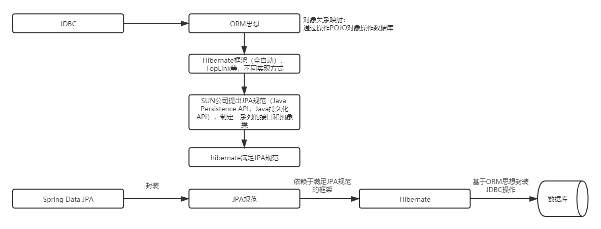

------

# SpringData高级应用及其源码剖析

## 1 SpringDataJPA

### 1.1 SpringDataJPA&JPA规范&Hibernate

- 

## 2 源码分析

### 2.1 原理

- 开发Dao接口（ResumeDao），实现对象通过动态代理完成的（增强）

- resumeDao是一个代理对象，这个代理对象的类型是SimpleJpaRepository，是由JdkDynamicAopProxy生成并增强的

### 2.2 SimpleJpaRepository的产生过程

- AbstractApplicationContext#refresh#finishBeanFactoryInitialization方法产生代理对象

- resumeDao的RootBeanDefinition对象是JpaRepositoryFactoryBean类型

    - 配置文件中<jpa:repository basePackage/>标签扫描的接口，在进行BeanDefinition注册时，class会被固定的指定为JpaRepositoryFactoryBean

- JdkDynamicAopProxy会生成代理对象SimpleJpaRepository，而该对象的增强逻辑在JdkDynamicAopProxy类的invoke方法中

### 2.3 SimpleJpaRepository

- SimpleJpaRepository类实现了JpaRepository接口和JpaSpecificationExecutor接口

- SimpleJpaRepository类中方法实现调用了Jpa原生API
