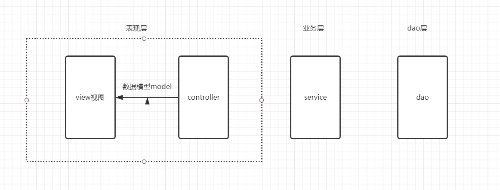
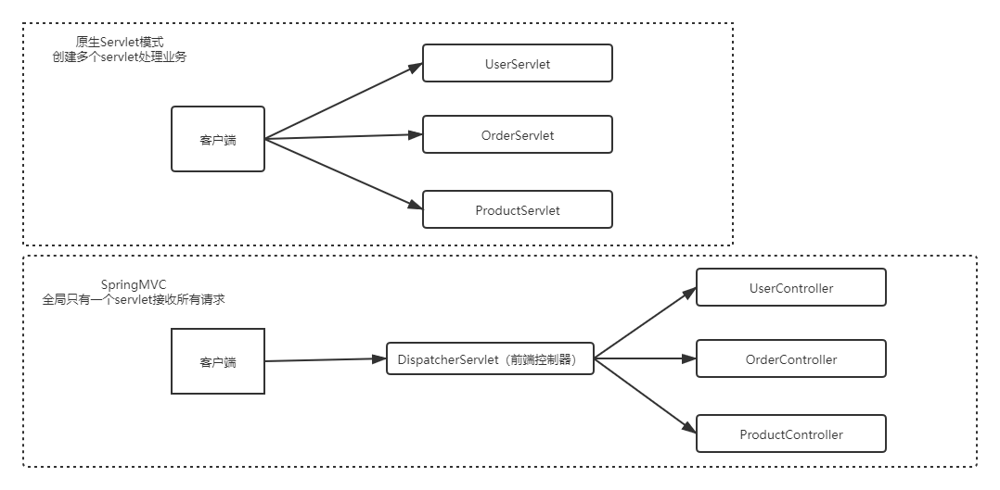
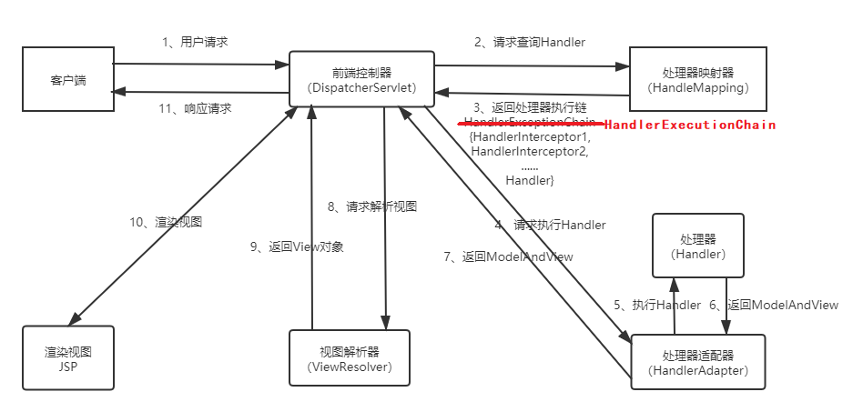
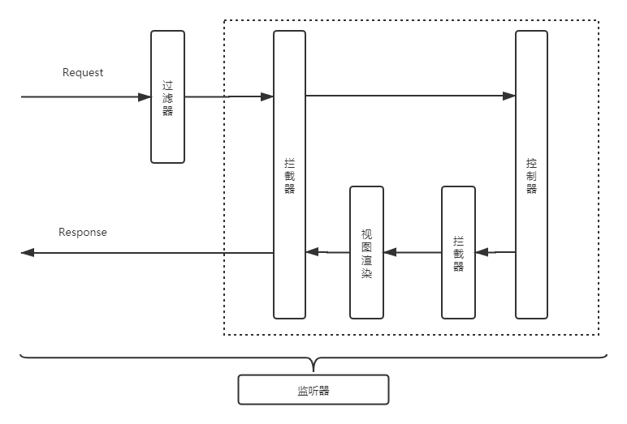

------

# SpringMVC基础回顾及高级应用

## 1 SpringMVC基础回顾

### 1.1 经典三层及MVC架构

- 经典三层

    - 

- MVC

    - M：Model模型（数据模型【pojo、vo、po】+业务模型（业务逻辑））
    
    - V：View视图（jsp、html）
    
    - C：Controller控制器（servlet）
    
- SpringMVC：应用于表现层的框架

### 1.2 SpringMVC与原生Servlet模式区别

- 

### 1.3 SpringMVC请求处理流程

- 

### 1.4 url-pattern

- 带后缀(`*.action`、`*.do`)：拦截某种格式的请求

- `/`：不会拦截jsp，但是会拦截html等静态资源

    - 为什么拦截静态资源

        - tomcat容器有web.xml（父），项目中也有web.xml（子），是继承关系
        
        - 父web.xml中有DefaultServlet，url-pattern为`/`，处理静态资源
        
        - 子web.xml中配置`/`将会复写父web.xml中的配置，因此配置`/`会拦截静态资源
        
    - 为什么不拦截jsp
    
        - 因为父web.xml中有一个JSPServlet，这个Servlet拦截jsp，项目中没有复写该配置，因此SpringMVC不拦截jsp，jsp处理交给tomcat
        
    - 如何解决拦截静态资源
    
        - 配置`<mvc:default-servlet-handler/>`标签：添加该标签，会在SpringMVC上下文中定义一个DefaultServletHttpRequestHandler对象，该对象会对进入DispatcherServlet的url进行筛选，若是静态资源，则交由web应用服务器默认的DefaultServlet处理，否则由SpringMVC处理。缺点是只能放在webapp根目录下
        
        - 配置`<mvc:resource location="" mapping=""/>`标签：SpringMVC处理静态资源

- `/*`：拦截所有，包括jsp

### 1.5 数据输出机制

- SpringMVC在handler方法上传入Model、Map和ModelMap参数、并向参数中保存数据（放入请求域），都可以在页面中获取到

- Model、Map和ModelMap的关系

    - 运行时具体数据类型都是BindingAwareModelMap，相当于给BindingAwareModelMap中保存的数据都会放在请求域中
    
    - Map：JDK接口
    
    - Model：Spring接口
    
    - ModelMap：Spring类，实现Map接口
    
    - BindingAwareModelMap：继承了ExtendedModelMap，ExtendedModelMap继承了ModelMap，并实现了Model接口

### 1.6 Rest风格请求

- Rest（Representational State Transfer）：资源表现层状态转移，描述了⼀个架构样式的⽹络系统，⽐如web 应⽤程序。

- 示例

    - rest是一个url请求风格
    
    - 原有url设计
    
        - `http:localhost:8080/user/queryById.action?id=3`
        
        - url定义了动作（操作），参数具体锁定操作的某条数据
        
    - rest风格
    
        - rest认为互联网中的所有东西都是资源，资源都会有唯一的uri标识
        
        - `http:localhost:8080/user/3` (代表id为3的用户记录)
        
        - 根据请求方式不同，代表不同的操作
        
            - get：查询，获取资源
            
            - post：增加，新建资源
            
            - put：更新
            
            - delete：删除资源
            
        - rest风格的直观体验：参数传递方式的变化，参数可以在uri中
        
- 特性

    - 资源：⽹络上的⼀个实体，或者说是⽹络上的⼀个具体信息
    
    - 表现层：把资源具体呈现出来的形，⽐如，⽂本可以⽤txt格式表现，也可以⽤HTML格式、XML格式、JSON格式表现，甚⾄可以采⽤⼆进制格式
    
    - 状态转移：每发出⼀个请求，就代表了客户端和服务器的⼀次交互过程

## 2 SpringMVC高级应用

### 2.1 监听器、过滤器和拦截器对比

- 从配置的⻆度：Servlet、Filter、Listener是配置在web.xml中的，⽽Interceptor是配置在表现层框架配置⽂件中的

- Servlet：处理Request请求和Response响应

- 过滤器（Filter）：对Request请求起到过滤的作⽤，作⽤在Servlet之前，如果配置为/*可以对所有的资源访问（servlet、js/css静态资源等）进⾏过滤处理

- 监听器（Listener）：实现了javax.servlet.ServletContextListener接⼝的服务器端组件，随Web应⽤的启动⽽启动，只初始化⼀次，然后会⼀直运⾏监视，随Web应⽤的停⽌⽽销毁

    - 做⼀些初始化⼯作，web应⽤中spring容器启动ContextLoaderListener
    
    - 监听web中的特定事件，⽐如HttpSession，ServletRequest的创建和销毁；变量的创建、销毁和修改等。可以在某些动作前后增加处理，实现监控，⽐如统计在线⼈数，利⽤HttpSessionListener等
    
- 拦截器（Interceptor）：是SpringMVC、Struts等表现层框架⾃⼰的，不会拦截jsp/html/css/image的访问等，只会拦截访问的控制器⽅法（Handler）

    - 在Handler业务逻辑执⾏之前拦截⼀次
    
    - 在Handler逻辑执⾏完毕但未跳转⻚⾯之前拦截⼀次
    
    - 在跳转⻚⾯之后拦截⼀次
    
    - 