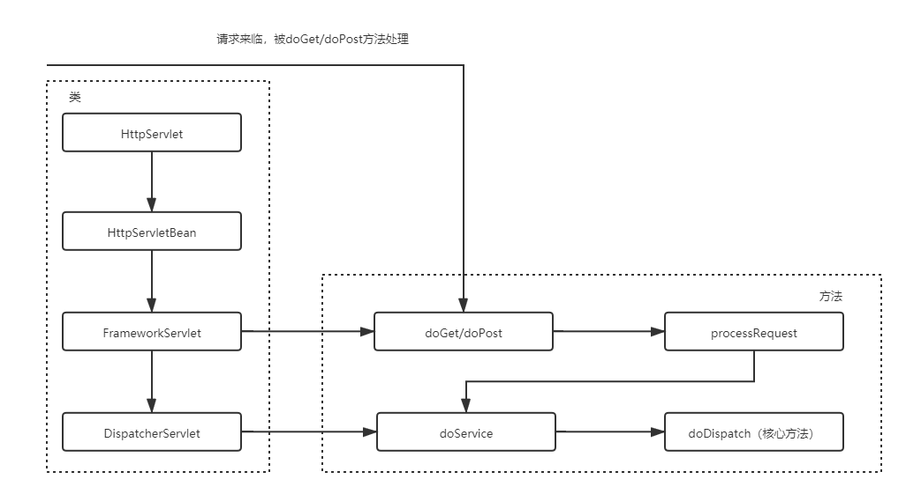
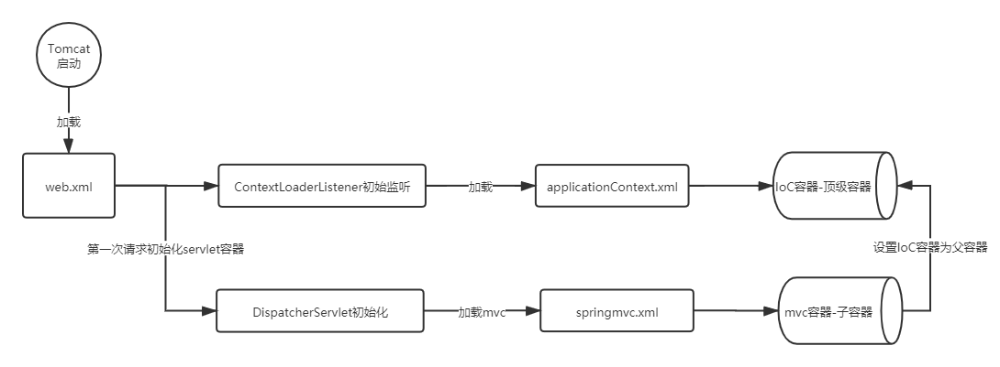

------

# SpringMVC源码剖析及SSM整合

## 1 SpringMVC源码剖析

### 1.1 DispatcherServlet继承结构

- 

### 1.2 doDispatch方法核心步骤

- 调⽤getHandler()获取到能够处理当前请求的执⾏链HandlerExecutionChain（Handler+拦截器）

- 调⽤getHandlerAdapter()获取能够执⾏Handler的适配器

- 适配器调⽤Handler执⾏ha.handle()（总会返回⼀个ModelAndView对象）

- 调⽤processDispatchResult()⽅法完成视图渲染跳转

### 1.3 getHandler⽅法

- 遍历两个HandlerMapping，试图获取能够处理当前请求的执⾏链

    - BeanNameUrlHandlerMapping
                
    - RequestMappingHandlerMapping（常用）

### 1.4 getHandlerAdapter⽅法

- 遍历三个HandlerAdapter，看哪个Adapter⽀持处理当前Handler

    - HttpRequestHandlerAdapter
            
    - SimpleControllerHandlerAdapter
    
    - RequestMappingHandlerAdapter（常用）

### 1.5 九大组件

- 组件

    - multipartResolver：多部件解析器
    
    - localeResolver：区域化、国际化解析器
    
    - themeResolver：主题解析器
    
    - handlerMappings：处理器映射器
    
    - handlerAdapters：处理器适配器
    
    - handlerExceptionResolvers：异常解析器
    
    - viewNameTranslator：默认视图名转换器
    
    - flashMapManager：flash属性管理组件
    
    - viewResolvers：视图解析器

- 上述九大组件都定义了接口，接口定义了规范

- 初始化：Spring容器启动时在核心方法AbstractApplicationContext#refresh方法中调用了onRefresh()方法，该方法由子类DispatcherServlet实现，初始化九大组件

    - initHandlerMappings
        
        - 按照HandlerMapping.class类型或固定名称id在IoC容器中查找所有HandlerMapping
        
        - 为空则根据默认策略实例化生成HandlerMapping
        
            - BeanNameUrlHandlerMapping
            
            - RequestMappingHandlerMapping（常用）
            
    - initHandlerAdapters
            
        - 按照HandlerAdapter.class类型或固定名称id在IoC容器中查找所有HandlerAdapter
        
        - 为空则根据默认策略实例化生成HandlerAdapter
        
            - HttpRequestHandlerAdapter
            
            - SimpleControllerHandlerAdapter
            
            - RequestMappingHandlerAdapter（常用）
            
    - initMultipartResolver
    
        - 按照固定名称id（multipartResolver）在IoC容器中查找

## 2 SSM整合

### 2.1 Spring容器和SpringMVC容器

- Spring容器和SpringMVC容器是有层次的（父子容器）

- Spring容器：Service对象和Dao对象

- SpringMVC容器：Controller对象，可以引用Spring容器中的对象

- 