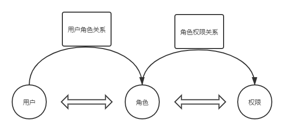

------

# SpringSecurity授权原理与实战

## 1 授权简介

### 1.1 授权原理

- 

## 2 授权

### 2.1 内置权限表达式

- | 表达式 | 说明 |
  | :-----| :---- |
  | permitAll | 指定任何人都允许访问 |
  | denyAll | 指定任何人都不允许访问 |
  | anonymous | 指定匿名用户允许访问 |
  | rememberMe | 指定已记住的用户允许访问 |
  | authenticated | 指定任何经过身份验证的用户都允许访问，不包含anonymous |
  | fullyAuthenticated | 指定由经过身份验证的用户允许访问，不包含anonymous和rememberMe |
  | hasRole(role) | 指定需要特定的角色的用户允许访问, 会自动在角色前面插入'ROLE_' |
  | hasAnyRole([role1,role2]) | 指定需要任意一个角色的用户允许访问, 会自动在角色前面插入'ROLE_' |
  | hasAuthority(authority) | 说明指定需要特定的权限的用户允许访问 |
  | hasAnyAuthority([authority,authority]) | 指定需要任意一个权限的用户允许访问 |
  | hasIpAddress(ip) | 指定需要特定的IP地址可以访问 |

### 2.2 Method安全表达式

- @ProAuthorize：注解适合进入方法前的权限验证

- @PostAuthorize：在方法执行后再进行权限验证，适合验证带有返回值的权限，Spring EL提供返回对象能够在表达式语言中获取到返回对象的returnObject

- @PreFilter：可以用来对集合类型的参数进行过滤, 将不符合条件的元素剔除集合

- @PostFilter：可以用来对集合类型的返回值进行过滤, 将不符合条件的元素剔除集合

## 3 基于数据库的RBAC数据模型的权限控制

### 3.1 权限控制模型

- 自主访问控制（DAC: Discretionary Access Control）

- 强制访问控制（MAC: Mandatory Access Control）

- 基于属性的权限验证（ABAC: Attribute-Based AccessControl）

- 基于角色的权限控制（RBAC: Role-Based Access Control）

### 3.2 RBAC权限模型简介

- RBAC权限模型（Role-Based Access Control）即：基于角色的权限控制

    - 用户：系统接口及访问的操作者
    
    - 权限：能够访问某接口或者做某操作的授权资格
    
    - 角色：具有一类相同操作权限的总称

### 3.3 RBAC图示

- 

