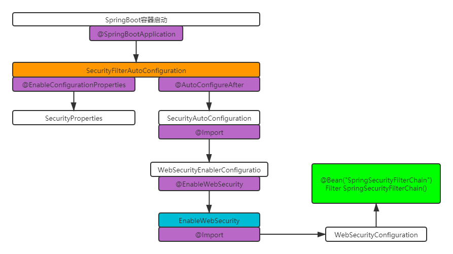
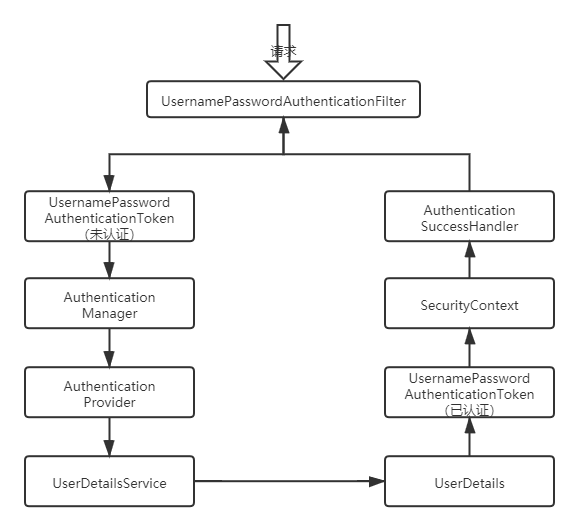
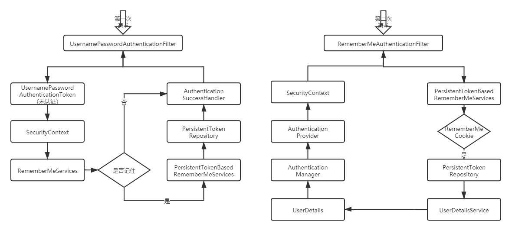
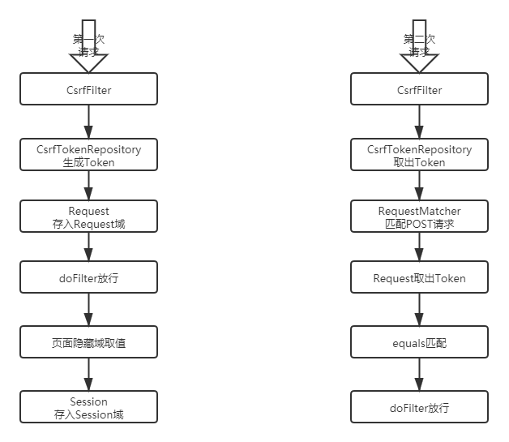
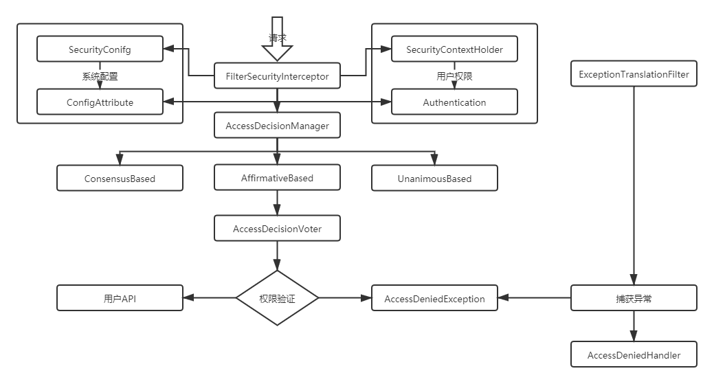

------

# SpringSecurity源码剖析

## 1 过滤器链加载源码剖析

### 1.1 图示

- 

## 2 认证流程源码剖析

### 2.1 图示

- 

## 3 RememberMe源码剖析

### 3.1 图示

- 

## 4 CSRF源码剖析

### 4.1 图示

- 

## 5 授权流程源码剖析

### 5.1 图示

- 

    - AffirmativeBased（基于肯定）：一票通过权
    
    - ConsensusBased（基于共识）：赞成票多于反对票则表示通过,反对票多于赞成票则将抛出AccessDeniedException
    
    - UnanimousBased（基于一致）：一票否决权