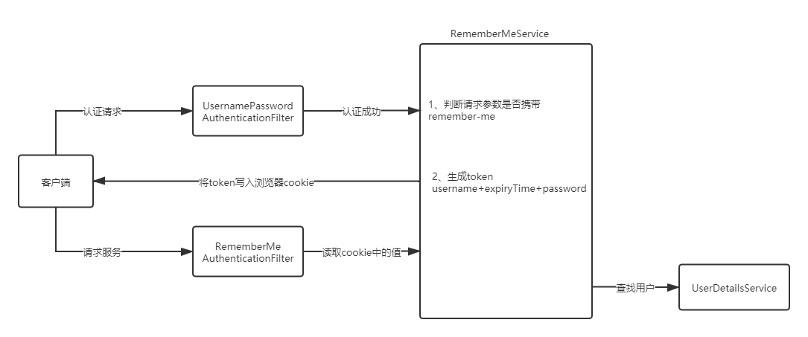
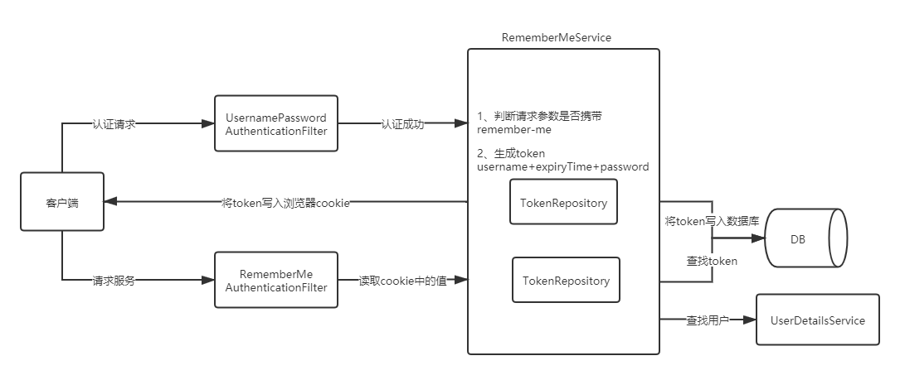
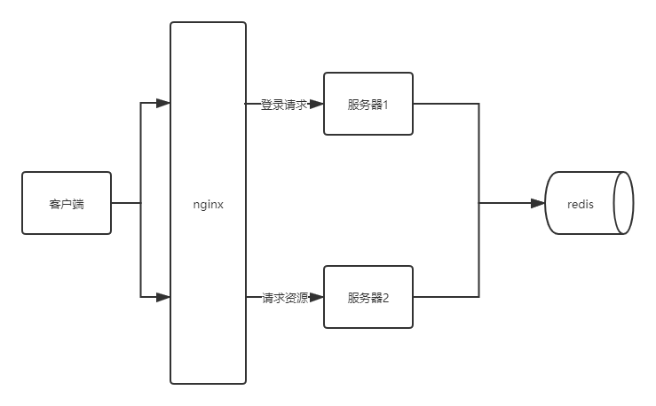
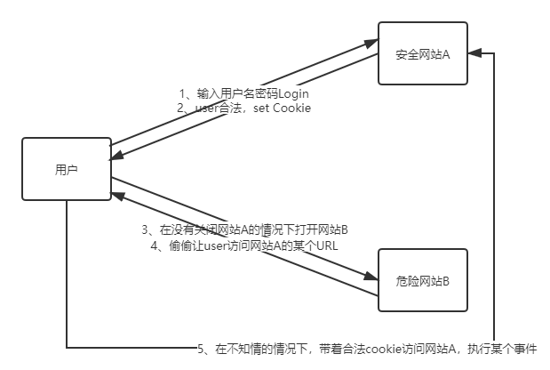

------

# SpringSecurity认证原理与实战

## 1 SpringSecurity认证原理与两种认证方式

### 1.1 过滤器链

- SpringSecurity功能的实现主要是由一系列过滤器相互配合完成，也称之为过滤器链

- Spring Security默认加载15个过滤器, 但是随着配置可以增加或者删除一些过滤器

- 过滤器：

    - org.springframework.security.web.context.request.async.WebAsyncManagerIntegrationFilter
    
        - 根据请求封装获取WebAsyncManager，从WebAsyncManager获取/注册的安全上下文可调用处理拦截器
    
    - org.springframework.security.web.context.SecurityContextPersistenceFilter

        - SecurityContextPersistenceFilter主要是使用SecurityContextRepository在session中保存或更新一个SecurityContext，并将SecurityContext给以后的过滤器使用，来为后续filter建立所需的上下文。SecurityContext中存储了当前用户的认证以及权限信息
    
    - org.springframework.security.web.header.HeaderWriterFilter
    
        - 向请求的Header中添加相应的信息,可在http标签内部使用security:headers来控制
    
    - org.springframework.security.web.csrf.CsrfFilter

        - csrf又称跨域请求伪造，SpringSecurity会对所有post请求验证是否包含系统生成的csrf的token信息，如果不包含，则报错。起到防止csrf攻击的效果
        
    - org.springframework.security.web.authentication.logout.LogoutFilter
    
        - 匹配URL为/logout的请求，实现用户退出,清除认证信息
        
    - org.springframework.security.web.authentication.UsernamePasswordAuthenticationFilter

        - 表单认证操作全靠这个过滤器，默认匹配URL为/login且必须为POST请求
    
    - org.springframework.security.web.authentication.ui.DefaultLoginPageGeneratingFilter
    
        - 如果没有在配置文件中指定认证页面，则由该过滤器生成一个默认认证页面
    
    - org.springframework.security.web.authentication.ui.DefaultLogoutPageGeneratingFilter
    
        - 由此过滤器可以生产一个默认的退出登录页面
        
    - org.springframework.security.web.authentication.www.BasicAuthenticationFilter
    
        - 此过滤器会自动解析HTTP请求中头部名字为Authentication，且以Basic开头的头信息
    
    - org.springframework.security.web.savedrequest.RequestCacheAwareFilter
    
        - 通过HttpSessionRequestCache内部维护了一个RequestCache，用于缓存HttpServletRequest

    - org.springframework.security.web.servletapi.SecurityContextHolderAwareRequestFilter
    
        - 针对ServletRequest进行了一次包装，使得request具有更加丰富的API
        
    - org.springframework.security.web.authentication.AnonymousAuthenticationFilter

        - 当SecurityContextHolder中认证信息为空，则会创建一个匿名用户存入到SecurityContextHolder中。spring security为了兼容未登录的访问，也走了一套认证流程，只不过是一个匿名的身份
        
    - org.springframework.security.web.session.SessionManagementFilter
    
        - securityContextRepository限制同一用户开启多个会话的数量
    
    - org.springframework.security.web.access.ExceptionTranslationFilter
    
        - 异常转换过滤器位于整个springSecurityFilterChain的后方，用来转换整个链路中出现的异常
    
    - org.springframework.security.web.access.intercept.FilterSecurityInterceptor
    
        - 获取所配置资源访问的授权信息，根据SecurityContextHolder中存储的用户信息来决定其是否有权限

### 1.2 认证方式

- HttpBasic

    - HttpBasic登录验证模式是SpringSecurity实现登录验证最简单的一种方式
    
    - HttpBasic模式要求传输的用户名密码使用Base64模式进行加密，Base64的加密算法是可逆的

- formLogin

    - SpringSecurity默认
    
    - SpringBoot2.0以上版本（依赖Security 5.X版本）默认会生成一个登录页面
    
    - 支持自定义登录页面

## 2 表单认证

### 2.1 安全构建器HttpSecurity和WebSecurity的区别

- WebSecurity不仅通过HttpSecurity定义某些请求的安全控制，也通过其他方式定义其他某些请求可以忽略安全控制

- HttpSecurity仅用于定义需要安全控制的请求(当然HttpSecurity也可以指定某些请求不需要安全控制)

- 可以认为HttpSecurity是 ebSecurity 一部分，WebSecurity包含HttpSecurity的更大的一个概念

- 构建目标不同

    - WebSecurity构建目标是整个SpringSecurity安全过滤器FilterChainProxy
    
    - HttpSecurity的构建目标仅仅是FilterChainProxy中的一个SecurityFilterChain

### 2.2 基于数据库实现认证功能

- 实现security的UserDetailsService接口, 重写这个接口里面loadUserByUsername方法

### 2.3 密码加密认证

- 使用明文：`{noop}password`

- 密码加密：

    - PasswordEncoderFactories：密码器工厂

    - PasswordEncoder：密码编码和验证匹配的工具接口，PasswordEncoder
    
    - BCrypt加密算法：
    
        - SpringSecurity提供了BCryptPasswordEncoder类，实现Spring的PasswordEncoder接口使用BCrypt强哈希方法来加密密码。BCrypt强哈希方法每次加密的结果都不一样，所以更加的安全
        
        - BCrypt加密后的字符串形如：`$2a$10$wouq9P/HNgvYj2jKtUN8rOJJNRVCWvn1XoWy55N3sCkEHZPo3lyWq`
        
            > $是分割符，无意义；2a是bcrypt加密版本号；10是const的值，即生成salt的迭代次数，默认值是10，推荐值12；而后的前22位是salt值；再然后的字符串就是密码的密文
    
    - 使用：`{bcrypt}password`

### 2.4 获取当前登录用户

- 在传统web系统中, 将登录成功的用户放入session中, 在需要的时候可以从session中获取用户

- SecurityContextHolder：保留系统当前的安全上下文SecurityContext，其中就包括当前使用系统的用户的信息

- SecurityContext：安全上下文，获取当前经过身份验证的主体或身份验证请求令牌

### 2.5 Remember Me

- 用户在下一次登录时直接登录，避免再次输入用户名以及密码去登录

- 简单Token生成方法

    - 

    - Token=MD5(username+分隔符+expiryTime+分隔符+password)
    
    - 这种方式不推荐使用，有严重的安全问题，就是密码信息在前端浏览器cookie中存放，如果cookie被盗取很容易破解

- 持久化Token生成方法

    - 
    
    - 存入数据库Token包含：
    
        - token: 随机生成策略,每次访问都会重新生成
        
        - series: 登录序列号，随机生成策略。用户输入用户名和密码登录时，该值重新生成。使用remember-me功能，该值保持不变

        - expiryTime: token过期时间
        
    - CookieValue=encode(series+token) 

### 2.6 自定义登录成功处理和失败处理

- 自定义成功处理：实现AuthenticationSuccessHandler接口，并重写onAuthenticationSuccess()方法

- 自定义失败处理：实现AuthenticationFailureHandler接口，并重写onAuthenticationFailure()方法

### 2.7 退出登录

- org.springframework.security.web.authentication.logout.LogoutFilter

    - 匹配URL为/logout的请求，实现用户退出，清除认证信息

## 3 图形验证码验证

### 3.1 实现步骤

- 根据随机数生成验证码图片

- 将验证码图片显示到登录页面

- 认证流程中加入验证码校验

## 4 Session管理

### 4.1 会话超时

- 配置session会话超时时间，默认为30分钟，但是SpringBoot中的会话超时时间至少为60秒，当session超时后, 默认跳转到登录页面

- 当session超时后, 默认跳转到登录页面

### 4.2 并发控制

- 设置最大会话数量

    - 并发控制即同一个账号同时在线个数，同一个账号同时在线个数如果设置为1表示，该账号在同一时间内只能有一个有效的登录，如果同一个账号又在其它地方登录，那么就将上次登录的会话过期，即后面的登录会踢掉前面的登录

- 阻止用户第二次登录

### 4.3 集群Session

- 

## 5 CSRF

### 5.1 什么是CSRF

- CSRF（Cross-site request forgery），中文名称：跨站请求伪造

### 5.2 CSRF原理

- 

### 5.3 CSRF防御策略

- 验证 HTTP Referer 字段

    - 根据HTTP协议，在HTTP头中有一个字段叫Referer，它记录了该HTTP请求的来源地址。在通常情况下，访问一个安全受限页面的请求来自于同一个网站，在后台请求验证其Referer值，如果是以自身安全网站开头的域名，则说明该请求是是合法的。如果Referer是其他网站的话，则有可能是黑客的CSRF攻击，拒绝该请求。
    
- 在请求地址中添加Token并验证

    - CSRF攻击之所以能够成功，是因为黑客可以完全伪造用户的请求，该请求中所有的用户验证信息都是存在于cookie中，因此黑客可以在不知道这些验证信息的情况下直接利用用户自己的cookie来通过安全验证。要抵御CSRF，关键在于在请求中放入黑客所不能伪造的信息，并且该信息不存在于cookie之中。可以在HTTP请求中以参数的形式加入一个随机产生的token，并在服务器端建立一个拦截器来验证这个token，如果请求中没有token或者token内容不正确，则认为可能是CSRF攻击而拒绝该请求。

- 在HTTP头中自定义属性并验证

    - 这种方法也是使用token并进行验证，和上一种方法不同的是，这里并不是把token以参数的形式置于HTTP请求之中，而是把它放到HTTP头中自定义的属性里。

### 5.4 security中的CSRF防御机制

- org.springframework.security.web.csrf.CsrfFilter

    - CSRF又称跨站请求伪造，SpringSecurity会对所有post请求验证是否包含系统生成的CSRF的Token信息，如果不包含，则报错。起到防止CSRF攻击的效果。(1. 生成token 2.验证token)

## 6 跨域与CORS

### 6.1 跨域

- 跨域实质上是浏览器的一种保护处理。如果产生了跨域，服务器在返回结果时就会被浏览器拦截（注意：此时请求是可以正常发起的，只是浏览器对其进行了拦截），导致响应的内容不可用

- 同源不会产生跨域（协议、域名、端口号相同）

### 6.2 解决方案

- JSONP

    - 浏览器允许一些带src属性的标签跨域，也就是在某些标签的src属性上写url地址是不会产生跨域问题

- CORS解决跨域
        
    - CORS是一个W3C标准，全称是"跨域资源共享"（Cross-origin resource sharing）。CORS需要浏览器和服务器同时支持。目前，所有浏览器都支持该功能，IE浏览器不能低于IE10。浏览器在发起真正的请求之前，会发起一个OPTIONS类型的预检请求，用于请求服务器是否允许跨域，在得到许可的情况下才会发起请求