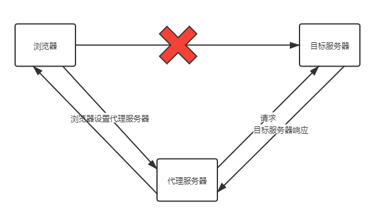
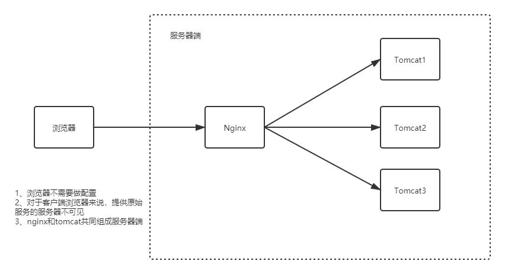
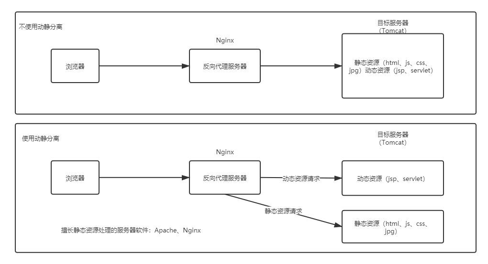
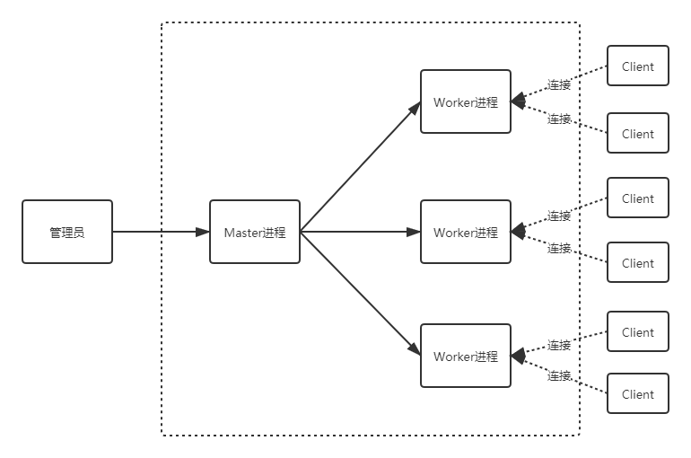

------

# Nginx原理深入剖析

## 1 Nginx基础回顾

### 1.1 Nginx是什么

- Nginx 是⼀个⾼性能的HTTP和反向代理web服务器，核⼼特点是占有内存少，并发能⼒强

### 1.2 Nginx ⼜能做什么事情（应⽤场景）

- Http服务器（Web服务器）

    - 性能⾮常⾼，⾮常注重效率，能够经受⾼负载的考验
    
    - ⽀持50000个并发连接数，不仅如此，CPU和内存的占⽤也⾮常的低，10000个没有活动的连接才占⽤2.5M的内存

- 反向代理服务器

    - 正向代理
    
        - 在浏览器中配置代理服务器的相关信息，通过代理服务器访问⽬标⽹站，代理服务器收到⽬标⽹站的响应之后，会把响应信息返回给浏览器客户端
        
        - 
    
    - 反向代理
    
        - 浏览器客户端发送请求到反向代理服务器（⽐如Nginx），由反向代理服务器选择原始服务器提供服务获取结果响应，最终再返回给客户端浏览器
        
        - 

- 负载均衡服务器

    - 负载均衡，当⼀个请求到来的时候，Nginx反向代理服务器根据请求去找到⼀个原始服务器来处理当前请求，那么这叫做反向代理。那么，如果⽬标服务器有多台，找哪⼀个⽬标服务器来处理当前请求呢，这样⼀个寻找确定的过程就叫做负载均衡
    
    - 负载均衡就是为了解决⾼负载的问题

- 动静分离

    - 

### 1.3 Nginx的特点

- 跨平台：Nginx可以在⼤多数类unix操作系统上编译运⾏，⽽且也有windows版本

- Nginx的上⼿⾮常容易，配置也⽐较简单

- ⾼并发，性能好

- 稳定性也特别好，宕机概率很低

### 1.4 Nginx主要命令

- ./nginx 启动nginx

- ./nginx -s stop 终⽌nginx（当然也可以找到nginx进程号，然后使⽤kill -9 杀掉nginx进程）

- ./nginx -s reload (重新加载nginx.conf配置⽂件)

## 2 Nginx核⼼配置⽂件解读

### 2.1 核心配置文件

- Nginx的核⼼配置⽂件conf/nginx.conf包含三块内容：全局块、events块、http块

- 全局块

    - 从配置⽂件开始到events块之间的内容，此处的配置影响nginx服务器整体的运⾏，⽐如worker进程的数量、错误⽇志的位置等

- events块

    - events块主要影响nginx服务器与⽤户的⽹络连接，⽐如worker_connections 1024，标识每个
      workderprocess⽀持的最⼤连接数为1024

- http块

    - http块是配置最频繁的部分，虚拟主机的配置，监听端⼝的配置，请求转发、反向代理、负载均衡等

## 3 Nginx负载均衡

### 3.1 负载均衡策略

- 轮询：默认策略，每个请求按时间顺序逐⼀分配到不同的服务器，如果某⼀个服务器下线，能⾃动剔除

- weight：weight代表权重，默认每⼀个负载的服务器都为1，权重越⾼那么被分配的请求越多（⽤于服务器性能不均衡的场景）

- weight：每个请求按照ip的hash结果分配，每⼀个客户端的请求会固定分配到同⼀个⽬标服务器处理，可以解决session问题

## 4 Nginx底层进程机制剖析

### 4.1 进程机制

- Nginx启动后，以daemon多进程⽅式在后台运⾏，包括⼀个Master进程和多个Worker进程

- master进程

    - 主要是管理worker进程，⽐如：
    
        - 接收外界信号向各worker进程发送信号(./nginx -s reload)
        
        - 监控worker进程的运⾏状态，当worker进程异常退出后Master进程会⾃动重新启动新的worker进程等
    
    - worker进程
    
        - worker进程具体处理⽹络请求。多个worker进程之间是对等的，他们同等竞争来⾃客户端的请求，各进程互相之间是独⽴的。⼀个请求，只可能在⼀个worker进程中处理，⼀个worker进程，不可能处理其它进程的请求。worker进程的个数是可以设置的，⼀般设置与机器cpu核数⼀致

### 4.2 Nginx进程模型

- 

### 4.3 以./nginx -s reload 来说明nginx信号处理这部分

- master进程对配置⽂件进⾏语法检查

- 尝试配置（⽐如修改了监听端⼝，那就尝试分配新的监听端⼝）

- 尝试成功则使⽤新的配置，新建worker进程

- 新建成功，给旧的worker进程发送关闭消息

- 旧的worker进程收到信号会继续服务，直到把当前进程接收到的请求处理完毕后关闭

- 所以reload之后worker进程pid是发⽣了变化的

### 4.4 worker进程处理请求部分的说明

- master进程创建之后，会建⽴好需要监听的的socket，然后从master进程再fork出多个worker进程。所以，所有worker进程的监听描述符listenfd在新连接到来时都变得可读

- nginx使⽤互斥锁来保证只有⼀个workder进程能够处理请求，拿到互斥锁的那个进程注册listenfd读事件，在读事件⾥调⽤accept接受该连接，然后解析、处理、返回客户端

### 4.5 nginx多进程模型好处

- 每个worker进程都是独⽴的，不需要加锁，节省开销

- 每个worker进程都是独⽴的，互不影响，⼀个异常结束，其他的照样能提供服务

- 多进程模型为reload热部署机制提供了支撑