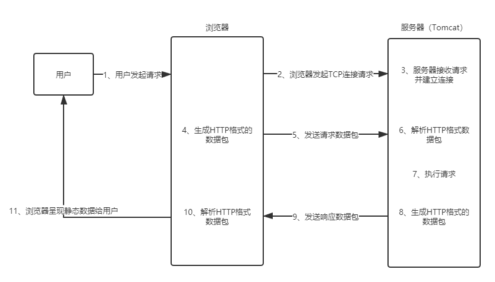
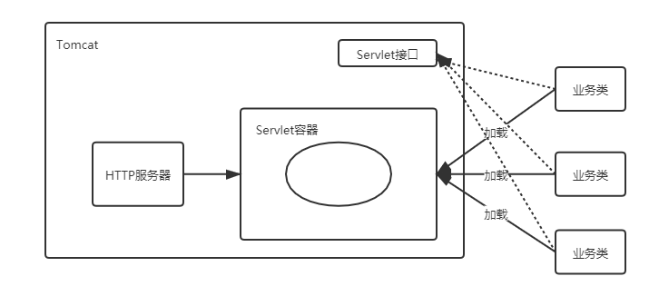
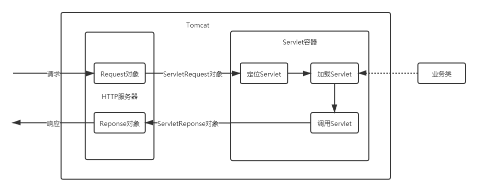
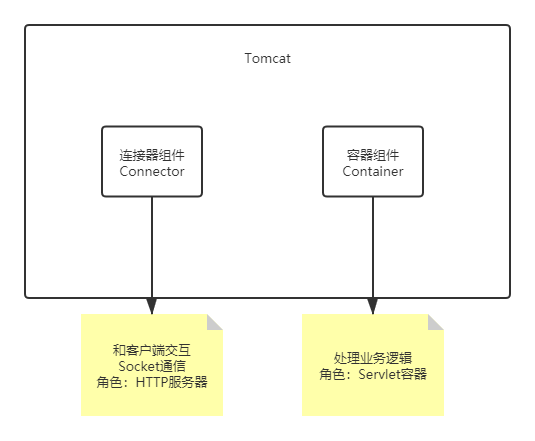
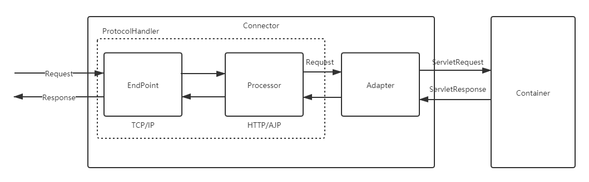
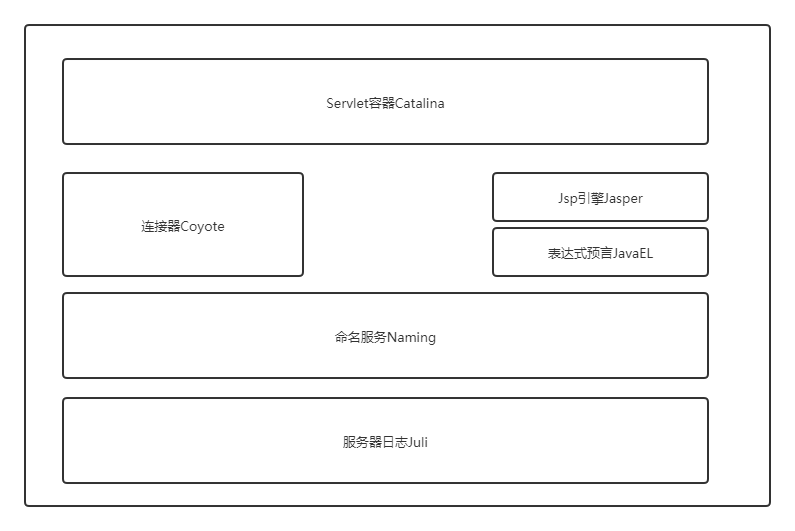
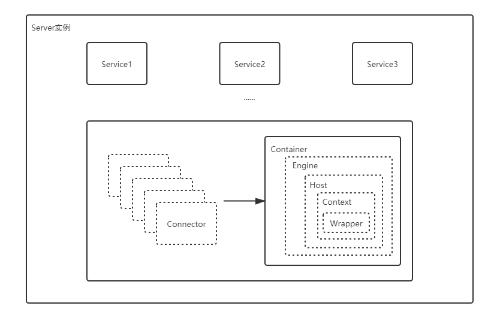

------

# Tomcat高级使用及其原理剖析

## 1 Tomcat系统架构与原理剖析

### 1.1 浏览器访问服务器的过程

- 

- 浏览器访问服务器使⽤的是Http协议，Http是应⽤层协议，⽤于定义数据通信的格式，具体的数据传输使⽤的是TCP/IP协议

### 1.2 Tomcat请求处理大致过程

- Tomcat是⼀个Http服务器（能够接收并且处理http请求，所以tomcat是⼀个http服务器）

- 

- HTTP服务器接收到请求之后把请求交给Servlet容器来处理，Servlet 容器通过Servlet接⼝调⽤业务类。Servlet接⼝和Servlet容器这⼀整套内容叫作Servlet规范。

- Tomcat既按照Servlet规范的要求去实现了Servlet容器，同时它也具有HTTP服务器的功能

    - Tomcat是⼀个Http服务器
    
    - Tomcat是⼀个Servlet容器

### 1.3 Tomcat Servlet容器处理流程

- HTTP服务器会把请求信息使⽤ServletRequest对象封装起来

- 进⼀步去调⽤Servlet容器中某个具体的Servlet

- Servlet容器拿到请求后，根据URL和Servlet的映射关系，找到相应的Servlet

- 如果Servlet还没有被加载，就⽤反射机制创建这个Servlet，并调⽤Servlet的init⽅法来完成初始化

- 接着调⽤这个具体Servlet的service⽅法来处理请求，请求处理结果使⽤ServletResponse对象封装

- 把ServletResponse对象返回给HTTP服务器，HTTP服务器会把响应发送给客户端

- 

### 1.4 Tomcat系统总体架构

- 

- Tomcat设计了两个核⼼组件连接器（Connector）和容器（Container）来完成Tomcat的两⼤核⼼功能

    - 连接器，负责对外交流：处理Socket连接，负责⽹络字节流与Request和Response对象的转化
    
    - 容器，负责内部处理：加载和管理Servlet，以及具体处理Request请求

## 2 Tomcat连接器组件Coyote

### 2.1 Coyote简介

- Coyote是Tomcat中连接器的组件名称, 是对外的接⼝。客户端通过Coyote与服务器建⽴连接、发送请求并接受响应

    - Coyote封装了底层的⽹络通信（Socket请求及响应处理）
    
    - Coyote使Catalina容器（容器组件）与具体的请求协议及IO操作⽅式完全解耦
    
    - Coyote将Socket输⼊转换封装为Request对象，进⼀步封装成ServletRequest对象后交由Catalina容器进⾏处理，处理请求完成后, Catalina将ServletResponse对象封装成Coyote提供的Response对象将结果写⼊输出流
    
    - Coyote负责的是具体协议（应⽤层）和IO（传输层）相关内容

- Coyote支持的协议：HTTP/1.1（默认）、AJP、HTTP/2

- Coyote支持的IO模型：NIO、NIO2、APR

### 2.2 Coyote内部组件及流程

- 

- | 组件 | 作用描述 |
  | :-----| :---- |
  | EndPoint | EndPoint是Coyote 通信端点，即通信监听的接⼝，是具体Socket接收和发送处理器，是对传输层的抽象，因此EndPoint⽤来实现TCP/IP协议的 |
  | Processor | Processor是Coyote协议处理接⼝，如果说EndPoint是⽤来实现TCP/IP协议的，那么Processor⽤来实现HTTP协议，Processor接收来⾃EndPoint的Socket，读取字节流解析成Tomcat Request和Response对象，并通过Adapter将其提交到容器处理，Processor是对应⽤层协议的抽象 |
  | ProtocolHandler | Coyote协议接⼝，通过Endpoint和Processor，实现针对具体协议的处理能⼒。Tomcat 按照协议和I/O 提供了6个实现类 ： AjpNioProtocol ，AjpAprProtocol，AjpNio2Protocol，Http11NioProtocol ，Http11Nio2Protocol，Http11AprProtocol |
  | Adapter | 由于协议不同，客户端发过来的请求信息也不尽相同，Tomcat定义了⾃⼰的Request类来封装这些请求信息。ProtocolHandler接⼝负责解析请求并⽣成Tomcat Request类。但是这个Request对象不是标准的ServletRequest，不能⽤Tomcat Request作为参数来调⽤容器。Tomcat设计者的解决⽅案是引⼊CoyoteAdapter，这是适配器模式的经典运⽤，连接器调⽤CoyoteAdapter的Sevice⽅法，传⼊的是Tomcat Request对象，CoyoteAdapter负责将Tomcat Request转成ServletRequest，再调⽤容器 |

## 3 Tomcat Servlet容器Catalina

### 3.1 Tomcat模块分层结构图及Catalina位置

- Tomcat是⼀个由⼀系列可配置（conf/server.xml）的组件构成的Web容器，⽽Catalina是Tomcat的Servlet容器

- Tomcat本质上就是⼀款Servlet容器，因为Catalina才是Tomcat核⼼，其他模块都是为Catalina提供⽀撑的。⽐如：通过Coyote模块提供链接通信，Jasper模块提供JSP引擎，Naming提供JNDI服务，Juli提供⽇志服务

- 

### 3.2 Servlet容器Catalina的结构

- 

- 整个Tomcat就是⼀个Catalina实例，Tomcat启动的时候会初始化这个实例，Catalina实例通过加载server.xml完成其他实例的创建，创建并管理⼀个Server，Server创建并管理多个服务，每个服务⼜可以有多个Connector和⼀个Container

- Catalina：负责解析Tomcat的配置⽂件（server.xml）, 以此来创建服务器Server组件并进⾏管理

- Server：服务器表示整个Catalina Servlet容器以及其它组件，负责组装并启动Servlet引擎，Tomcat连接器。Server通过实现Lifecycle接⼝，提供了⼀种优雅的启动和关闭整个系统的⽅式

- Service：服务是Server内部的组件，⼀个Server包含多个Service。它将若⼲个Connector组件绑定到⼀个Container

- Container：容器，负责处理⽤户的servlet请求，并返回对象给web⽤户的模块

### 3.3 Container组件的具体结构

- Engine：表示整个Catalina的Servlet引擎，⽤来管理多个虚拟站点，⼀个Service最多只能有⼀个Engine，但是⼀个引擎可包含多个Host

- Host：代表⼀个虚拟主机，或者说⼀个站点，可以给Tomcat配置多个虚拟主机地址，⽽⼀个虚拟主机下可包含多个Context

- Context：表示⼀个Web应⽤程序，⼀个Web应⽤可包含多个Wrapper

- Wrapper：表示⼀个Servlet，Wrapper作为容器中的最底层，不能包含⼦容器