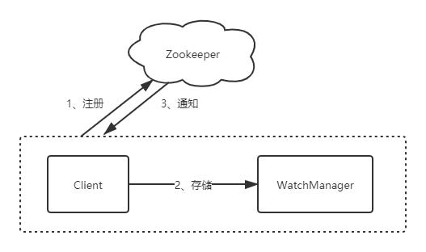

------

# Zookeeper环境搭建和基本使用

## 1 Zookeeper简介

### 1.1 基本概念

- Zookeeper是⼀个开源的分布式协调服务，其设计⽬标是将那些复杂的且容易出错的分布式⼀致性服务封装起来，构成⼀个⾼效可靠的原语集，并以⼀些简单的接⼝提供给⽤户使⽤。zookeeper是⼀个典型的分布式数据⼀致性的解决⽅案，分布式应⽤程序可以基于它实现诸如数据订阅/发布、负载均衡、命名服务、集群管理、分布式锁和分布式队列等功能

- 集群⻆⾊：Zookeeper引⼊了Leader、Follower、Observer三种⻆⾊。Zookeeper集群中的所有机器通过Leader选举来选定⼀台被称为Leader的机器，Leader服务器为客户端提供读和写服务，除Leader外，其他机器包括Follower和Observer，Follower和Observer都能提供读服务，唯⼀的区别在于Observer不参与Leader选举过程，不参与写操作的过半写成功策略，因此Observer可以在不影响写性能的情况下提升集群的性能

- 会话（session）：Session指客户端会话，⼀个客户端连接是指客户端和服务端之间的⼀个TCP⻓连接，Zookeeper对外的服务端⼝默认为2181，客户端启动的时候，⾸先会与服务器建⽴⼀个TCP连接，从第⼀次连接建⽴开始，客户端会话的⽣命周期也开始了，通过这个连接，客户端能够⼼跳检测与服务器保持有效的会话，也能够向Zookeeper服务器发送请求并接受响应，同时还能够通过该连接接受来⾃服务器的Watch事件通知

- 数据节点（Znode）：在ZooKeeper中，节点分为两类，第⼀类同样是指构成集群的机器，称之为机器节点；第⼆类则是指数据模型中的数据单元，称之为数据节点——ZNode。ZooKeeper将所有数据存储在内存中，数据模型是⼀棵树（ZNode Tree），由斜杠（/）进⾏分割的路径，就是⼀个Znode。每个ZNode上都会保存⾃⼰的数据内容，同时还会保存⼀系列属性信息

- 版本：对于每个ZNode，Zookeeper都会为其维护⼀个叫作Stat的数据结构，Stat记录了这个ZNode的三个数据版本，分别是version（当前ZNode的版本）、cversion（当前ZNode⼦节点的版本）、aversion（当前ZNode的ACL版本）

- Watcher（事件监听器）：Zookeeper允许⽤户在指定节点上注册⼀些Watcher，并且在⼀些特定事件触发的时候，Zookeeper服务端会将事件通知到感兴趣的客户端，该机制是Zookeeper实现分布式协调服务的重要特性

- ACL：Zookeeper采⽤ACL（Access Control Lists）策略来进⾏权限控制

    - CREATE：创建⼦节点的权限
    
    -  READ：获取节点数据和⼦节点列表的权限
    
    - WRITE：更新节点数据的权限
    
    - DELETE：删除⼦节点的权限
    
    - ADMIN：设置节点ACL的权限

## 2 Zookeeper基本使⽤

### 2.1 ZooKeeper系统模型

- ZNode的类型

    - 持久节点：指节点被创建后会⼀直存在服务器，直到删除操作主动清除
    
    - 持久顺序节点：就是有顺序的持久节点，节点特性和持久节点是⼀样的，只是额外特性表现在顺序上。顺序特性实质是在创建节点的时候，会在节点名后⾯加上⼀个数字后缀，来表示其顺序
    
    - 临时节点：就是会被⾃动清理掉的节点，它的⽣命周期和客户端会话绑在⼀起，客户端会话结束，节点会被删除掉。与持久性节点不同的是，临时节点不能创建⼦节点
    
    - 临时顺序节点：就是有顺序的临时节点，和持久顺序节点相同，在其创建的时候会在名字后⾯加上数字后缀

- 事务ID

    - 在ZooKeeper中，事务是指能够改变ZooKeeper服务器状态的操作，也称之为事务操作或更新操作，⼀般包括数据节点创建与删除、数据节点内容更新等操作。对于每⼀个事务请求，ZooKeeper都会为其分配⼀个全局唯⼀的事务ID，⽤ ZXID 来表示，通常是⼀个 64 位的数字。每⼀个 ZXID 对应⼀次更新操作，从这些ZXID中可以间接地识别出ZooKeeper处理这些更新操作请求的全局顺序

- ZNode的状态信息

    - cZxid 就是 Create ZXID，表示节点被创建时的事务ID
    
    - ctime 就是 Create Time，表示节点创建时间
    
    - mZxid 就是 Modified ZXID，表示节点最后⼀次被修改时的事务ID
    
    - mtime 就是 Modified Time，表示节点最后⼀次被修改的时间
    
    - pZxid 表示该节点的⼦节点列表最后⼀次被修改时的事务 ID。只有⼦节点列表变更才会更新 pZxid，⼦节点内容变更不会更新
    
    - cversion 表示⼦节点的版本号
    
    - dataVersion 表示内容版本号
    
    - aclVersion 标识acl版本
    
    - ephemeralOwner 表示创建该临时节点时的会话 sessionID，如果是持久性节点那么值为 0
    
    - dataLength 表示数据⻓度
    
    - numChildren 表示直系⼦节点数

- Watcher--数据变更通知

    - Zookeeper使⽤Watcher机制实现分布式数据的发布/订阅功能
    
    - ZooKeeper 允许客户端向服务端注册⼀个 Watcher 监听，当服务端的⼀些指定事件触发了这个 Watcher，那么就会向指定客户端发送⼀个事件通知来实现分布式的通知功能
    
    - Zookeeper的Watcher机制主要包括客户端线程、客户端WatcherManager、Zookeeper服务器三部分
    
    - 具体⼯作流程为：客户端在向Zookeeper服务器注册的同时，会将Watcher对象存储在客户端的WatcherManager当中。当Zookeeper服务器触发Watcher事件后，会向客户端发送通知，客户端线程从WatcherManager中取出对应的Watcher对象来执⾏回调逻辑
    
    - 

- ACL--保障数据的安全

    - ACL机制：权限模式（Scheme）、授权对象（ID）、权限（Permission），通常使⽤"scheme: id : permission"来标识⼀个有效的ACL信息
    
    - 权限模式：Scheme
    
        - IP：IP模式就是通过IP地址粒度来进⾏权限控制，如"ip:192.168.0.110"表示权限控制针对该IP地址，同时IP模式可以⽀持按照⽹段⽅式进⾏配置，如"ip:192.168.0.1/24"表示针对192.168.0.*这个⽹段进⾏权限控制
        
        - Digest：Digest是最常⽤的权限控制模式，要更符合我们对权限控制的认识，其使⽤"username:password"形式的权限标识来进⾏权限配置，便于区分不同应⽤来进⾏权限控制。当通过“username:password”形式配置了权限标识后，Zookeeper会先后对其进⾏SHA-1加密和BASE64编码
        
        - World：World是⼀种最开放的权限控制模式，这种权限控制⽅式⼏乎没有任何作⽤，数据节点的访问权限对所有⽤户开放，即所有⽤户都可以在不进⾏任何权限校验的情况下操作ZooKeeper上的数据。另外，World模式也可以看作是⼀种特殊的Digest模式，它只有⼀个权限标识，即“world：anyone”
        
        - Super：Super模式，顾名思义就是超级⽤户的意思，也是⼀种特殊的Digest模式。在Super模式下，超级⽤户可以对任意ZooKeeper上的数据节点进⾏任何操作
     
    - 授权对象：ID
     
        - | 授权模式 | 授权对象 |
          | :-----| :---- |
          | IP | 通常是⼀个IP地址或IP段：例如：192.168.10.110 或192.168.10.1/24 |
          | Digest | ⾃定义，通常是username:BASE64(SHA-1(username:password))例如：zm:sdfndsllndlksfn7c= |
          | World | 只有⼀个ID ：anyone |
          | Super | 超级⽤户 |
    
    - 权限
    
        - CREATE（C）：数据节点的创建权限，允许授权对象在该数据节点下创建⼦节点
      
        - DELETE（D）：⼦节点的删除权限，允许授权对象删除该数据节点的⼦节点
         
        - READ（R）：数据节点的读取权限，允许授权对象访问该数据节点并读取其数据内容或⼦节点列表等
         
        - WRITE（W）：数据节点的更新权限，允许授权对象对该数据节点进⾏更新操作
         
        - ADMIN（A）：数据节点的管理权限，允许授权对象对该数据节点进⾏ ACL 相关的设置操作