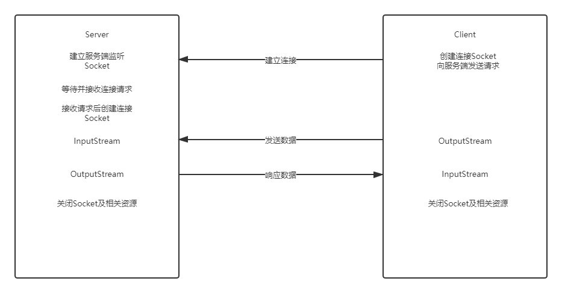
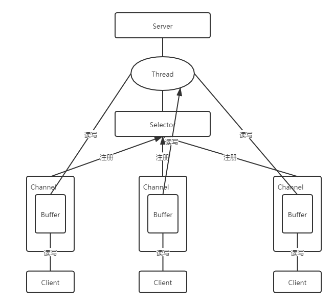
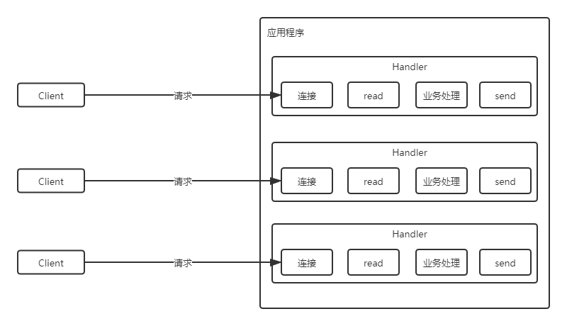
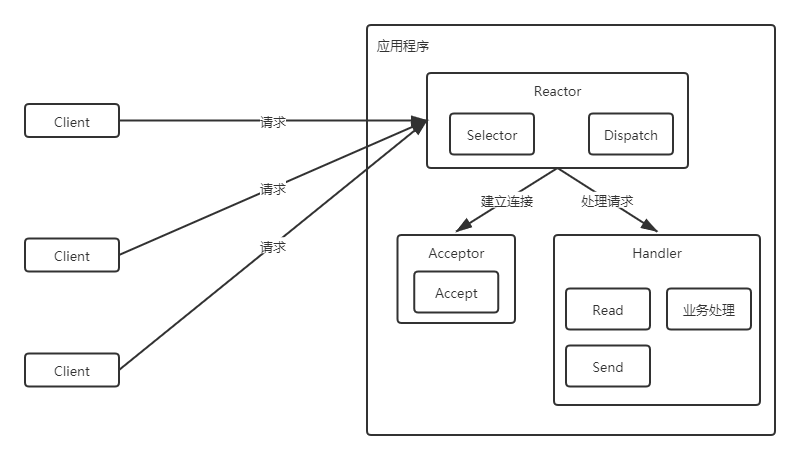
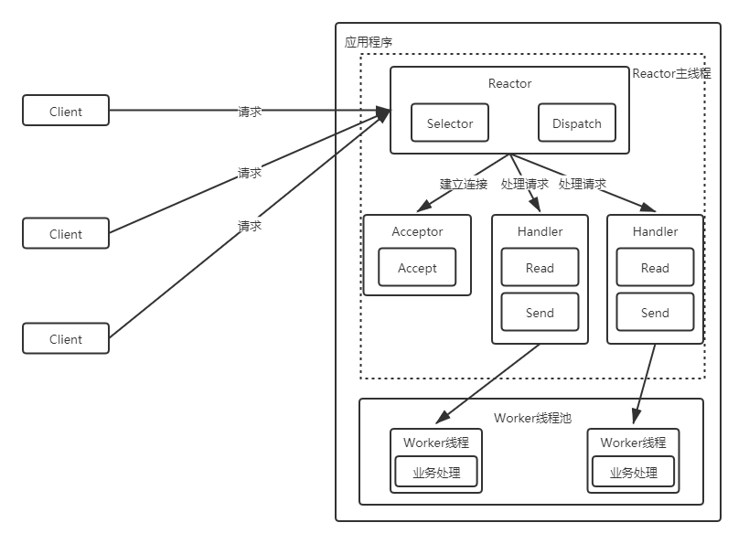
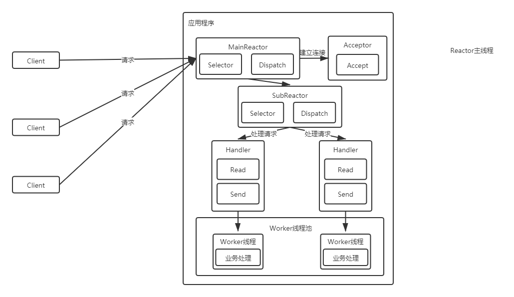
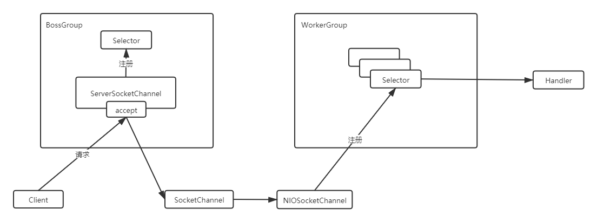
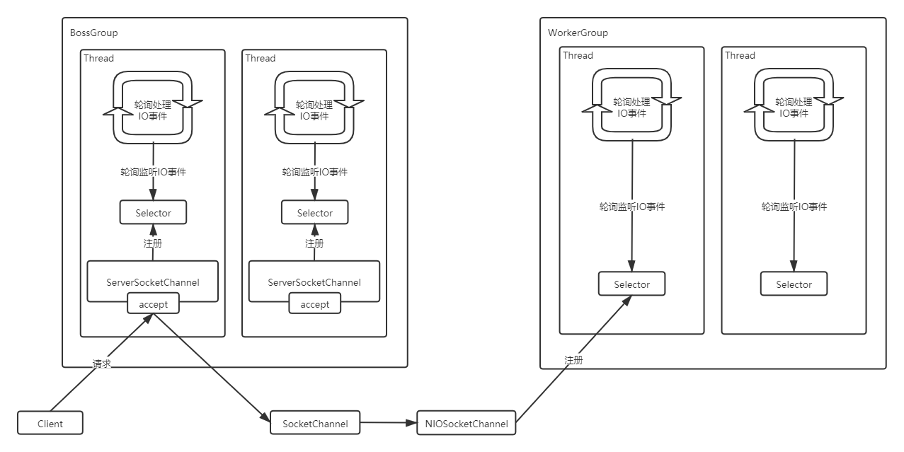
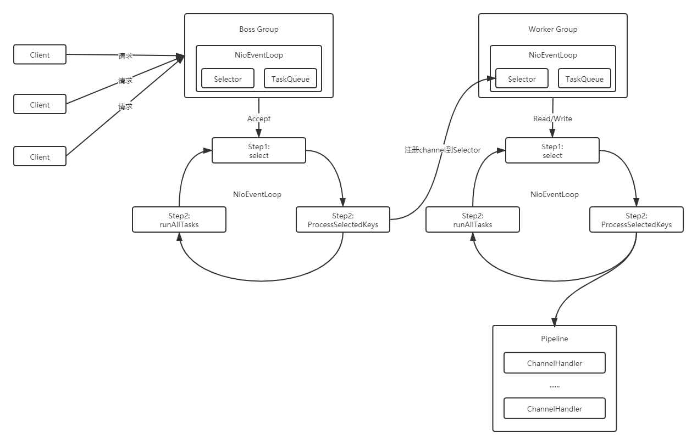

------

# RPC架构设计

## 1 Socket回顾与IO模型

### 1.1 Socket网络编程回顾

-  Socket概述

    - Socket，套接字就是两台主机之间逻辑连接的端点。TCP/IP协议是传输层协议，主要解决数据如何在网络中传输，而HTTP是应用层协议，主要解决如何包装数据。Socket是通信的基石，是支持TCP/IP协议的网络通信的基本操作单元。它是网络通信过程中端点的抽象表示，包含进行网络通信必须的五种信息：连接使用的协议、本地主机的IP地址、本地进程的协议端口、远程主机的IP地址、远程进程的协议端口。

- Socket通信流程

    - Socket编程主要涉及到客户端和服务端两个方面，首先是在服务器端创建一个服务器套接字（ServerSocket），并把它附加到一个端口上，服务器从这个端口监听连接。端口号的范围是0到65536，但是0到1024是为特权服务保留的端口号，可以选择任意一个当前没有被其他进程使用的端口。
      
    - 客户端请求与服务器进行连接的时候，根据服务器的域名或者IP地址，加上端口号，打开一个套接字。当服务器接受连接后，服务器和客户端之间的通信就像输入输出流一样进行操作。

    - 

### 1.2 I/O模型

- I/O模型说明：
    
    - Java共支持3种网络编程模型/IO模式：BIO(同步并阻塞)、NIO(同步非阻塞)、AIO(异步非阻塞)
    
    - 阻塞与非阻塞：
    
        - 主要指的是访问IO的线程是否会阻塞（或处于等待）
        
    - 同步和异步：
    
        - 主要是指的数据的请求方式

- BIO(同步并阻塞)：

    - Java BIO就是传统的socket编程

    - BIO(blocking I/O)：同步阻塞，服务器实现模式为一个连接一个线程，即客户端有连接请求时服务器端就需要启动一个线程进行处理，如果这个连接不做任何事情会造成不必要的线程开销，可以通过线程池机制改善(实现多个客户连接服务器)。

    - BIO问题分析：
    
        - 每个请求都需要创建独立的线程，与对应的客户端进行数据 Read，业务处理，数据 Write
        
        - 并发数较大时，需要创建大量线程来处理连接，系统资源占用较大
        
        - 连接建立后，如果当前线程暂时没有数据可读，则线程就阻塞在 Read 操作上，造成线程资源浪费

- NIO(同步非阻塞)：

    - 同步非阻塞，服务器实现模式为一个线程处理多个请求(连接)，即客户端发送的连接请求都会注册到多路复用器上，多路复用器轮询到连接有 I/O 请求就进行处理

- AIO(异步非阻塞)：

    - AIO引入异步通道的概念，采用了Proactor模式，简化了程序编写，有效的请求才启动线程，它的特点是先由操作系统完成后才通知服务端程序启动线程去处理，一般适用于连接数较多且连接时间较长的应用
    
    - Proactor模式是一个消息异步通知的设计模式，Proactor通知的不是就绪事件，而是操作完成事件，这也就是操作系统异步 IO 的主要模型
    
- BIO、NIO、AIO 适用场景分析：

    - BIO(同步并阻塞) 方式适用于连接数目比较小且固定的架构，这种方式对服务器资源要求比较高，并发局限于应用中，JDK1.4以前的唯一选择，但程序简单易理解
    
    - NIO(同步非阻塞) 方式适用于连接数目多且连接比较短（轻操作）的架构，比如聊天服务器，弹幕系统，服务器间通讯等。编程比较复杂，JDK1.4 开始支持
    
    - AIO(异步非阻塞) 方式使用于连接数目多且连接比较长（重操作）的架构，比如相册服务器，充分调用 OS 参与并发操作， 编程比较复杂，JDK7 开始支持。

## 2 NIO编程

### 2.1 NIO介绍

- 从 JDK1.4 开始，Java提供了一系列改进的输入/输出的新特性，被统称为NIO(即New IO)，是同步非阻塞的

    - NIO 有三大核心部分：Channel(通道)，Buffer(缓冲区), Selector(选择器)

    - NIO是面向缓冲区编程的。数据读取到一个缓冲区中，需要时可在缓冲区中前后移动，这就增加了处理过程中的灵活性，使用它可以提供非阻塞式的高伸缩性网络
    
    - Java NIO 的非阻塞模式，使一个线程从某通道发送请求或者读取数据，但是它仅能得到目前可用的数据，如果目前没有数据可用时，就什么都不会获取，而不是保持线程阻塞，所以直至数据变的可以读取之前，该线程可以继续做其他的事情。 非阻塞写也是如此，一个线程请求写入一些数据到某通道，但不需要等待它完全写入，这个线程同时可以去做别的事情

### 2.2 NIO和 BIO的比较

- BIO以流的方式处理数据，而NIO以缓冲区的方式处理数据,缓冲区I/O的效率比流I/O高很多

- BIO 是阻塞的，NIO则是非阻塞的

- BIO基于字节流和字符流进行操作，而NIO基于Channel(通道)和Buffer(缓冲区)进行操作，数据总是从通道读取到缓冲区中，或者从缓冲区写入到通道中。Selector(选择器)用于监听多个通道的事件（比如：连接请求， 数据到达等），因此使用单个线程就可以监听多个客户端通道

### 2.3 NIO三大核心原理示意图

- 

- 每个 channel 都会对应一个 Buffer

- Selector 对应一个线程， 一个线程对应多个 channel(连接)

- 每个 channel 都注册到 Selector选择器上

- Selector不断轮询查看Channel上的事件, 事件是通道Channel非常重要的概念

- Selector 会根据不同的事件，完成不同的处理操作

- Buffer 就是一个内存块 ， 底层是有一个数组

- 数据的读取写入是通过 Buffer, 这个和 BIO , BIO 中要么是输入流，或者是输出流, 不能双向，但是NIO 的 Buffer 是可以读也可以写 , channel 是双向的

### 2.4 缓冲区（Buffer）

- 缓冲区（Buffer）：缓冲区本质上是一个可以读写数据的内存块，可以理解成是一个数组，该对象提供了一组方法，可以更轻松地使用内存块，，缓冲区对象内置了一些机制，能够跟踪和记录缓冲区的状态变化情况。Channel 提供从网络读取数据的渠道，但是读取或写入的数据都必须经由 Buffer

### 2.5 通道（Channel）

- 通道可以读也可以写，流一般来说是单向的（只能读或者写，所以之前我们用流进行IO操作的时候需要分别创建一个输入流和一个输出流）

- 通道可以异步读写

- 通道总是基于缓冲区Buffer来读写

### 2.6 选择器（Selector）

- Selector 能够检测多个注册的服务端通道上是否有事件发生，如果有事件发生，便获取事件然后针对每个事件进行相应的处理。这样就可以只用一个单线程去管理多个通道，也就是管理多个连接和请求

- 在这种没有选择器的情况下，对应每个连接对应一个处理线程。但是连接并不能马上就会发送信息，所以还会产生资源浪

- 只有在通道真正有读写事件发生时，才会进行读写，就大大地减少了系统开销，并且不必为每个连接都创建一个线程，不用去维护多个线程, 避免了多线程之间的上下文切换导致的开销

## 3 Netty核心原理

### 3.1 Netty介绍

- 原生NIO存在的问题：

    - 开发难度高
    
    - Epoll Bug：
    
        - 在NIO中通过Selector的轮询当前是否有IO事件，根据JDK NIO api描述，Selector的select方法会一直阻塞，直到IO事件达到或超时，但是在Linux平台上这里有时会出现问题，在某些场景下select方法会直接返回，即使没有超时并且也没有IO事件到达，这就是著名的epollbug，这是一个比较严重的bug，它会导致线程陷入死循环，会让CPU飙到100%，极大地影响系统的可靠性，到目前为止，JDK都没有完全解决这个问题

- 概述：

    - Netty 是由 JBOSS 提供的一个 Java 开源框架。Netty 提供异步的、基于事件驱动的网络应用程序框架，用以快速开发高性能、高可靠性的网络 IO 程序
    
    - Netty 的强大之处：零拷贝、可拓展事件模型；支持 TCP、UDP、HTTP、WebSocket 等协议；提供安全传输、压缩、大文件传输、编解码支持等等

- 优点：

    - 设计优雅，提供阻塞和非阻塞的 Socket；提供灵活可拓展的事件模型；提供高度可定制的线程模型。
    
    - 具备更高的性能和更大的吞吐量，使用零拷贝技术最小化不必要的内存复制，减少资源的消耗。
    
    - 提供安全传输特性。
    
    - 支持多种主流协议；预置多种编解码功能，支持用户开发私有协议

### 3.2 线程模型

- 线程模型：
    
    - 传统阻塞 I/O 服务模型
    
    - Reactor 模型：
    
        - 单 Reactor 单线程
        
        - 单 Reactor 多线程
        
        - 主从 Reactor 多线程
        
- 传统阻塞 I/O 服务模型

    - 
    
    - 存在问题:
      
        - 当并发数很大，就会创建大量的线程，占用很大系统资源
    
        - 连接创建后，如果当前线程暂时没有数据可读，该线程会阻塞在 read 操作，造成线程资源浪费

- Reactor模型

    - Reactor 模式，通过一个或多个输入同时传递给服务处理器的模式, 服务器端程序处理传入的多个请求,并将它们同步分派到相应的处理线程， 因此 Reactor 模式也叫 Dispatcher模式. Reactor 模式使用IO 复用监听事件, 收到事件后，分发给某个线程(进程), 这点就是网络服务器高并发处理关键
    
    - 单Reactor单线程：
    
        - 
        
        - Selector是可以实现应用程序通过一个阻塞对象监听多路连接请求
        
        - Reactor 对象通过 Selector监控客户端请求事件，收到事件后通过 Dispatch 进行分发
        
        - 是建立连接请求事件，则由 Acceptor 通过 Accept 处理连接请求，然后创建一个 Handler 对象处理连接完成后的后续业务处理
        
        - Handler 会完成 Read→业务处理→Send 的完整业务流程
        
        - 优点：
        
            > 模型简单，没有多线程、进程通信、竞争的问题，全部都在一个线程中完成
            
        - 缺点：
        
            > 性能问题: 只有一个线程，无法完全发挥多核 CPU 的性能。Handler 在处理某个连接上的业务时，整个进程无法处理其他连接事件，很容易导致性能瓶颈  
            可靠性问题: 线程意外终止或者进入死循环，会导致整个系统通信模块不可用，不能接收和处理外部消息，造成节点故障
    
    - 单Reactor多线程：
    
        - 
        
        - Reactor 对象通过 selector 监控客户端请求事件, 收到事件后，通过 dispatch 进行分发
        
        - 如果建立连接请求, 则右 Acceptor 通过accept 处理连接请求
        
        - 如果不是连接请求，则由 reactor 分发调用连接对应的 handler 来处理
        
        - handler 只负责响应事件，不做具体的业务处理, 通过 read 读取数据后，会分发给后面的
        
        - worker 线程池的某个线程处理业务
        
        - worker 线程池会分配独立线程完成真正的业务，并将结果返回给 handler
        
        - handler 收到响应后，通过 send 将结果返回给 client
        
        - 优点：可以充分的利用多核 cpu 的处理能力
        
        - 缺点：多线程数据共享和访问比较复杂， reactor 处理所有的事件的监听和响应，在单线程运行， 在高并发场景容易出现性能瓶颈
        
    - 主从Reactor多线程
    
        - 
        
        - Reactor 主线程 MainReactor 对象通过 select 监听客户端连接事件，收到事件后，通过Acceptor 处理客户端连接事件
        
        - 当 Acceptor 处理完客户端连接事件之后（与客户端建立好 Socket 连接），MainReactor 将连接分配给 SubReactor。（即：MainReactor 只负责监听客户端连接请求，和客户端建立连接之后将连接交由 SubReactor 监听后面的 IO 事件。)
        
        - SubReactor 将连接加入到自己的连接队列进行监听，并创建 Handler 对各种事件进行处理
        
        - 当连接上有新事件发生的时候，SubReactor 就会调用对应的 Handler 处理
        
        - Handler 通过 read 从连接上读取请求数据，将请求数据分发给 Worker 线程池进行业务处理
        
        - Worker 线程池会分配独立线程来完成真正的业务处理，并将处理结果返回给 Handler。
        
        - Handler 通过 send 向客户端发送响应数据
        
        - 一个 MainReactor 可以对应多个 SubReactor，即一个 MainReactor 线程可以对应多个SubReactor 线程
        
        - 优点：
        
            > MainReactor 线程与 SubReactor 线程的数据交互简单职责明确，MainReactor 线程只需要接收新连接，SubReactor 线程完成后续的业务处理  
            MainReactor 线程与 SubReactor 线程的数据交互简单， MainReactor 线程只需要把新连接传给 SubReactor 线程，SubReactor 线程无需返回数据  
            多个 SubReactor 线程能够应对更高的并发请求  
        
        - 缺点:
            > 这种模式的缺点是编程复杂度较高。但是由于其优点明显，在许多项目中被广泛使用，包括Nginx、Memcached、Netty 等。这种模式也被叫做服务器的 1+M+N 线程模式，即使用该模式开发的服务器包含一个（或多个，1 只是表示相对较少）连接建立线程+M 个 IO 线程+N 个业务处理线程。这是业界成熟的服务器程序设计模式。

- Netty线程模型

    - Netty 的设计主要基于主从 Reactor 多线程模式，并做了一定的改进
    
    - 简单版Netty模型
    
        - 
        
        - BossGroup 线程维护 Selector，ServerSocketChannel 注册到这个 Selector 上，只关注连接建立请求事件（主 Reactor）
        
        - 当接收到来自客户端的连接建立请求事件的时候，通过 ServerSocketChannel.accept 方法获得对应的 SocketChannel，并封装成 NioSocketChannel 注册到 WorkerGroup 线程中的Selector，每个 Selector 运行在一个线程中（从 Reactor）
        
        - 当 WorkerGroup 线程中的 Selector 监听到自己感兴趣的 IO 事件后，就调用 Handler 进行处理
    
    - 进阶版Netty模型
    
        - 
        
        - 有两组线程池：BossGroup 和 WorkerGroup，BossGroup 中的线程专门负责和客户端建立连接，WorkerGroup 中的线程专门负责处理连接上的读写
        
        - BossGroup 和 WorkerGroup 含有多个不断循环的执行事件处理的线程，每个线程都包含一个 Selector，用于监听注册在其上的 Channel
        
        - 每个 BossGroup 中的线程循环执行以下三个步骤：
        
            > 轮训注册在其上的 ServerSocketChannel 的 accept 事件（OP_ACCEPT 事件）  
            处理 accept 事件，与客户端建立连接，生成一个 NioSocketChannel，并将其注册到  
            WorkerGroup 中某个线程上的 Selector 上再去以此循环处理任务队列中的下一个事件
        
        - 每个 WorkerGroup 中的线程循环执行以下三个步骤：
        
            > 轮训注册在其上的 NioSocketChannel 的 read/write 事件（OP_READ/OP_WRITE 事件）  
            在对应的 NioSocketChannel 上处理 read/write 事件  
            再去以此循环处理任务队列中的下一个事件

    - 详细版Netty模型
    
        - 
        
        - Netty 抽象出两组线程池：BossGroup 和 WorkerGroup，也可以叫做BossNioEventLoopGroup 和 WorkerNioEventLoopGroup。每个线程池中都有NioEventLoop 线程。BossGroup 中的线程专门负责和客户端建立连接，WorkerGroup 中的线程专门负责处理连接上的读写。BossGroup 和 WorkerGroup 的类型都是NioEventLoopGroup
        
        - NioEventLoopGroup 相当于一个事件循环组，这个组中含有多个事件循环，每个事件循环就是一个 NioEventLoop
        
        - NioEventLoop 表示一个不断循环的执行事件处理的线程，每个 NioEventLoop 都包含一个Selector，用于监听注册在其上的 Socket 网络连接（Channel）
          
        - NioEventLoopGroup 可以含有多个线程，即可以含有多个 NioEventLoop
        
        - 每个 BossNioEventLoop 中循环执行以下三个步骤：
        
            > select：轮训注册在其上的 ServerSocketChannel 的 accept 事件（OP_ACCEPT 事件）  
            processSelectedKeys：处理 accept 事件，与客户端建立连接，生成一个NioSocketChannel，并将其注册到某个 WorkerNioEventLoop 上的 Selector 上  
            runAllTasks：再去以此循环处理任务队列中的其他任务
        
        - 每个 WorkerNioEventLoop 中循环执行以下三个步骤：
        
            > select：轮训注册在其上的 NioSocketChannel 的 read/write 事件（OP_READ/OP_WRITE 事件）  
            processSelectedKeys：在对应的 NioSocketChannel 上处理 read/write 事件  
            runAllTasks：再去以此循环处理任务队列中的其他任务

        - 在以上两个processSelectedKeys步骤中，会使用 Pipeline（管道），Pipeline 中引用了Channel，即通过 Pipeline 可以获取到对应的 Channel，Pipeline 中维护了很多的处理器（拦截处理器、过滤处理器、自定义处理器等）。

- 核心API介绍

    - ChannelHandler及其实现类
    
        - Netty开发中需要自定义一个 Handler 类去实现 ChannelHandle接口或其子接口或其实现类，然后通过重写相应方法实现业务逻辑
        
    - ChannelPipeline
    
        - ChannelPipeline 是一个 Handler 的集合，它负责处理和拦截 inbound 或者 outbound 的事件和操作，相当于一个贯穿 Netty 的责任链
        
        - 如果客户端和服务器的Handler是一样的，消息从客户端到服务端或者反过来，每个Inbound类型或Outbound类型的Handler只会经过一次，混合类型的Handler（实现了Inbound和Outbound的Handler）会经过两次。准确的说ChannelPipeline中是一个ChannelHandlerContext,每个上下文对象中有ChannelHandler. InboundHandler是按照Pipleline的加载顺序的顺序执行, OutboundHandler是按照Pipeline的加载顺序，逆序执行
    
    - ChannelHandlerContext
    
        - 事件处理器上下文对象，Pipeline 链中的实际处理节点。每个处理节点ChannelHandlerContext 中包含一个具体的事件处理器 ChannelHandler，同时ChannelHandlerContext 中也绑定了对应的 ChannelPipeline和 Channel 的信息，方便对ChannelHandler 进行调用。
    
    - ChannelOption
    
        - Netty 在创建 Channel 实例后,一般都需要设置 ChannelOption 参数。ChannelOption 是 Socket 的标准参数，而非 Netty 独创的。常
    
    - ChannelFuture
    
        - 表示 Channel 中异步 I/O 操作的结果，在 Netty 中所有的 I/O 操作都是异步的，I/O 的调用会直接返回，调用者并不能立刻获得结果，但是可以通过 ChannelFuture 来获取 I/O 操作 的处理状态
        
    - EventLoopGroup和实现类NioEventLoopGroup
    
        - EventLoopGroup 是一组 EventLoop 的抽象，Netty 为了更好的利用多核 CPU 资源，一般 会有多个EventLoop 同时工作，每个 EventLoop 维护着一个 Selector 实例
        
        - 在 Netty 服务器端编程中，一般都需要提供两个 EventLoopGroup，例如：BossEventLoopGroup 和 WorkerEventLoopGroup。 通常一个服务端口即一个 ServerSocketChannel对应一个Selector 和一个EventLoop线程。 BossEventLoop 负责接收客户端的连接并将SocketChannel 交给 WorkerEventLoopGroup 来进行 IO 处理。BossEventLoop 不断轮询 Selector 将连接事件分离出来，然后将接收到的 SocketChannel 交给 WorkerEventLoopGroup，WorkerEventLoopGroup 会选择其中一个 EventLoopGroup 来将这个 SocketChannel 注册到其维护的 Selector 并对其后续的 IO 事件进行处理
    
    - ServerBootstrap和Bootstrap
    
        - ServerBootstrap 是 Netty 中的服务器端启动助手，通过它可以完成服务器端的各种配置；Bootstrap 是 Netty 中的客户端启动助手，通过它可以完成客户端的各种配置
    
    - Unpooled类
    
        - 这是 Netty 提供的一个专门用来操作缓冲区的工具类

- Netty异步模型

    - 异步的概念和同步相对。当一个异步过程调用发出后，调用者不能立刻得到结果。实际处理这个调用的组件在完成后，通过状态、通知和回调来通知调用者
    
    - Future：表示异步的执行结果, 可以通过它提供的方法来检测执行是否完成，ChannelFuture 是它的一个子接口. ChannelFuture 是一个接口，可以添加监听器，当监听的事件发生时，就会通知到监听器
    
    - Future-Listener：给Future添加监听器,监听操作结果

## 4 Netty高级应用

### 4.1 Netty编解码器

- Java的编解码

    - 编码（Encode）称为序列化，它将对象序列化为字节数组，用于网络传输、数据持久化或者其它用途
    
    - 解码（Decode）称为反序列化，它把从网络、磁盘等读取的字节数组还原成原始对象（通常是原始对象的拷贝），以方便后续的业务逻辑操作
    
    - Java序列化缺点：1.无法跨语言。 2.序列化后码流太大。3.序列化性能太低

- Netty编解码器

    - 在网络应用中需要实现某种编解码器，将原始字节数据与自定义的消息对象进行互相转换。网络中都是以字节码的数据形式来传输数据的，服务器编码数据后发送到客户端，客户端需要对数据进行解码
    
    - 解码器：负责将消息从字节或其他序列形式转成指定的消息对象
    
    - 编码器：将消息对象转成字节或其他序列形式在网络上传输
    
    - Netty 的编（解）码器实现了 ChannelHandlerAdapter，也是一种特殊的 ChannelHandler，所以依赖于 ChannelPipeline，可以将多个编（解）码器链接在一起，以实现复杂的转换逻辑。
    
    - Netty里面的编解码： 解码器：负责处理“入站 InboundHandler”数据。 编码器：负责“出站OutboundHandler” 数据

- 基于Netty的Http服务器开发

    - Netty的HTTP协议栈无论在性能还是可靠性上，都表现优异，非常适合在非Web容器的场景下应用，相比于传统的Tomcat、Jetty等Web容器，它更加轻量和小巧，灵活性和定制性也更好

- 基于Netty的WebSocket开发网页版聊天室

    - WebSocket简介
    
        - WebSocket是一种在单个TCP连接上进行全双工通信的协议。WebSocket使得客户端和服务器之间的数据交换变得更加简单，允许服务端主动向客户端推送数据。在WebSocket API中，客户端和服务器只需要完成一次握手，两者之间就直接可以创建持久性的连接，并进行双向数据传输
        
    - WebSocket和HTTP的区别
    
        - http协议是用在应用层的协议，他是基于tcp协议的，http协议建立连接也必须要有三次握手才能发送信息。 http连接分为短连接，长连接，短连接是每次请求都要三次握手才能发送自己的信息。即每一个request对应一个response。长连接是在一定的期限内保持连接。保持TCP连接不断开。客户端与服务器通信，必须要有客户端先发起, 然后服务器返回结果。客户端是主动的，服务器是被动的。 客户端要想实时获取服务端消息就得不断发送长连接到服务端.
        
        - WebSocket实现了多路复用，是全双工通信。在webSocket协议下服务端和客户端可以同时发送信息。 建立了WebSocket连接之后, 服务端可以主动发送信息到客户端。而且信息当中不必在带有head的部分信息了与http的长链接通信来说，这种方式，不仅能降低服务器的压力。而且信息当中也减少了部分多余的信息

- Netty中粘包和拆包的解决方案

    - 粘包和拆包简介
    
        - 粘包和拆包是TCP网络编程中不可避免的，无论是服务端还是客户端，当读取或者发送消息的时候，都需要考虑TCP底层的粘包/拆包机制
        
        - TCP是个“流”协议，所谓流，就是没有界限的一串数据。TCP底层并不了解上层业务数据的具体含义，它会根据TCP缓冲区的实际情况进行包的划分，所以在业务上认为，一个完整的包可能会被TCP拆分成多个包进行发送，也有可能把多个小的包封装成一个大的数据包发送，这就是所谓的TCP粘包和拆包问题
        
    - TCP粘包和拆包产生的原因
    
        - 数据从发送方到接收方需要经过操作系统的缓冲区，而造成粘包和拆包的主要原因就在这个缓冲区上。粘包可以理解为缓冲区数据堆积，导致多个请求数据粘在一起，而拆包可以理解为发送的数据大于缓冲区，进行拆分处理
    
    - 粘包和拆包的解决方法
    
        - 消息长度固定，累计读取到长度和为定长LEN的报文后，就认为读取到了一个完整的信息
        
        - 将换行符作为消息结束符
        
        - 将特殊的分隔符作为消息的结束标志，回车换行符就是一种特殊的结束分隔符
        
        - 通过在消息头中定义长度字段来标识消息的总长度

## 5 Netty核心源码剖析

## 6 自定义RPC框架

### 6.1 分布式架构网络通信

- 什么是RPC

    - RPC全称为remote procedure call，即远程过程调用。借助RPC可以做到像本地调用一样调用远程服务，是一种进程间的通信方式
    
    - RPC并不是一个具体的技术，而是指整个网络远程调用过程
    
    - RPC架构
    
        - 客户端(Client)，服务的调用方
        
        - 客户端存根(Client Stub)，存放服务端的地址消息，再将客户端的请求参数打包成网络消息，然后通过网络远程发送给服务方
        
        - 服务端(Server)，真正的服务提供者
        
        - 服务端存根(Server Stub)，接收客户端发送过来的消息，将消息解包，并调用本地的方法
    
    - RPC过程
    
        - 客户端（client）以本地调用方式（即以接口的方式）调用服务
        
        - 客户端存根（client stub）接收到调用后，负责将方法、参数等组装成能够进行网络传输的消息体（将消息体对象序列化为二进制）
          
        - 客户端通过socket将消息发送到服务端
        
        - 服务端存根( server stub）收到消息后进行解码（将消息对象反序列化）
        
        - 服务端存根( server stub）根据解码结果调用本地的服务
        
        - 服务处理
        
        - 本地服务执行并将结果返回给服务端存根( server stub）
        
        - 服务端存根( server stub）将返回结果打包成消息（将结果消息对象序列化）
        
        - 服务端（server）通过socket将消息发送到客户端
        
        - 客户端存根（client stub）接收到结果消息，并进行解码（将结果消息发序列化）
        
        - 客户端（client）得到最终结果
    
    - 无论是何种类型的数据，最终都需要转换成二进制流在网络上进行传输，数据的发送方需要将对象转换为二进制流，而数据的接收方则需要把二进制流再恢复为对象
    
    - 对于RPC框架而言，核心模块就是通讯和序列化

- RMI

    - Java RMI，即远程方法调用(Remote Method Invocation)，一种用于实现远程过程调用(RPCRemoteprocedure call)的Java API， 能直接传输序列化后的Java对象。它的实现依赖于Java虚拟机，因此它仅支持从一个JVM到另一个JVM的调用
    
        - 客户端从远程服务器的注册表中查询并获取远程对象引用
        
        - 桩对象与远程对象具有相同的接口和方法列表，当客户端调用远程对象时，实际上是由相应的桩对象代理完成的
          
        - 远程引用层在将桩的本地引用转换为服务器上对象的远程引用后，再将调用传递给传输层(Transport)，由传输层通过TCP协议发送调用
        
        - 在服务器端，传输层监听入站连接，它一旦接收到客户端远程调用后，就将这个引用转发给其上层的远程引用层；服务器端的远程引用层将客户端发送的远程应用转换为本地虚拟机的引用后，再将请求传递给骨架(Skeleton)；骨架读取参数，又将请求传递给服务器，最后由服务器进行实际的方法调用
        
        - 如果远程方法调用后有返回值，则服务器将这些结果又沿着“骨架->远程引用层->传输层”向下传递
        
        - 客户端的传输层接收到返回值后，又沿着“传输层->远程引用层->桩”向上传递，然后由桩来反序列化这些返回值，并将最终的结果传递给客户端程序