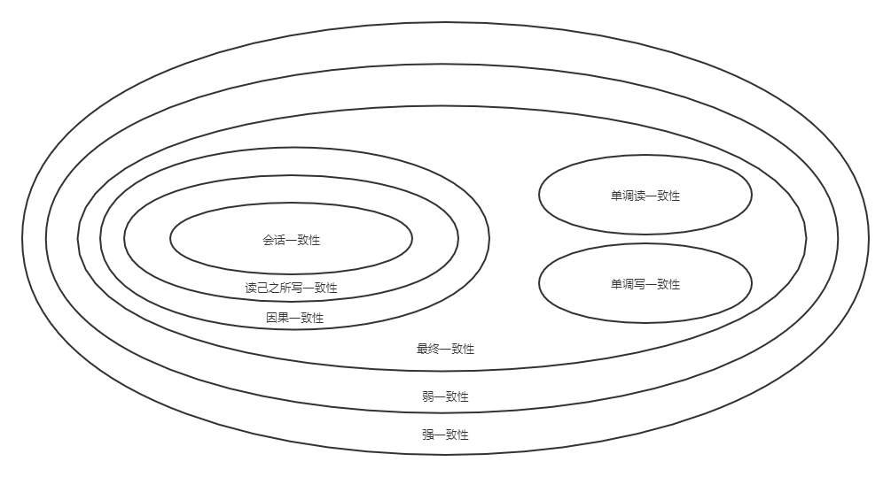
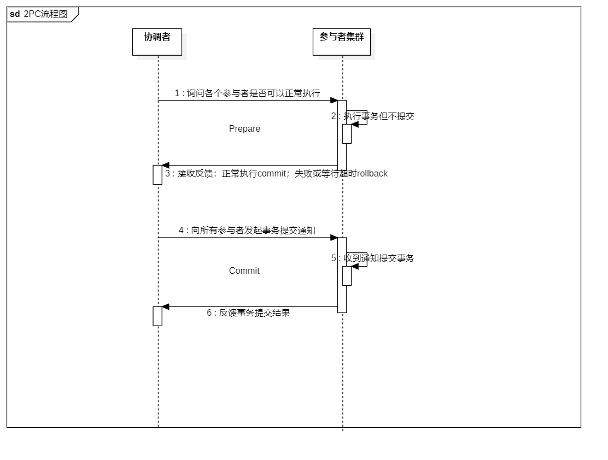
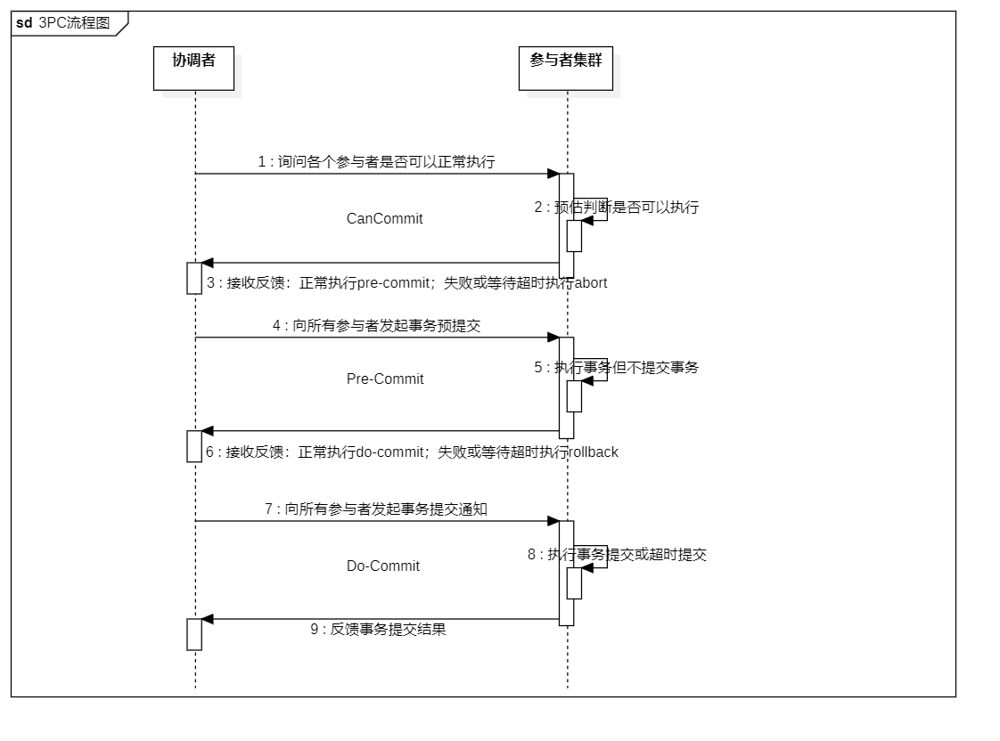
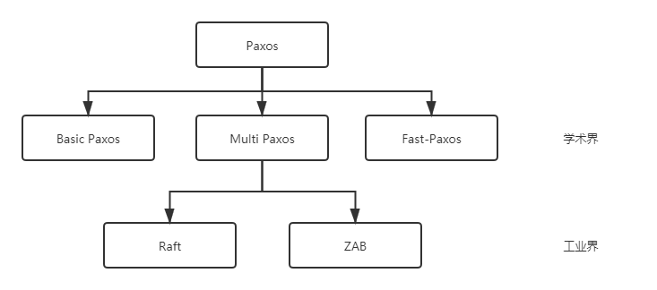

------

# 分布式架构设计理论

## 1 分布式架构介绍

### 1.1 什么是分布式系统

- 分布式系统是一个硬件或软件组件分布在不同的网络计算机上，彼此之间仅仅通过消息传递进行通信和协调的系统

- 通俗的理解，所谓分布式系统，就是一个业务拆分成多个子业务，分布在不同的服务器节点，共同构成的系统称为分布式系统，同一个分布式系统中的服务器节点在空间部署上是可以随意分布的，这些服务器可能放在不同的机柜中，也可能在不同的机房中，甚至分布在不同的城市

###  1.2 分布式与集群的区别

- 集群：多个服务器做同一个事情

- 分布式：多个服务器做不同的事情

### 1.3 分布式系统特性

- 分布性：空间中随机分布。这些计算机可以分布在不同的机房，不同的城市，甚至不同的国家

- 对等性：分布式系统中的计算机没有主/从之分，组成分布式系统的所有节点都是对等的

- 并发性：同一个分布式系统的多个节点，可能会并发地操作一些共享的资源，诸如数据库或分布式存储

- 缺乏全局时钟：既然各个计算机之间是依赖于交换信息来进行相互通信，很难定义两件事件的先后顺序，缺乏全局始终控制序列

- 故障总会发生：组成分布式的计算机，都有可能在某一时刻突然间崩掉。分的计算机越多，可能崩掉一个的几率就越大。如果再考虑到设计程序时的异常故障，也会加大故障的概率

- 处理单点故障：单点SPoF（Single Point of Failure）：某个角色或者功能只有某一台计算机在支撑，在这台计算机上出现的故障是单点故障

### 1.4 分布式系统面临的问题

- 通信异常：网络本身的不可靠性，因此每次网络通信都会伴随着网络不可用的风险（光纤、路由、DNS等硬件设备或系统的不可用），都会导致最终分布式系统无法顺利进行一次网络通信，另外，即使分布式系统各节点之间的网络通信能够正常执行，其延时也会大于单机操作，存在巨大的延时差别，也会影响消息的收发过程，因此消息丢失和消息延迟变的非常普遍

- 网络分区：网络之间出现了网络不连通，但各个子网络的内部网络是正常的，从而导致整个系统的网络环境被切分成了若干个孤立的区域，分布式系统就会出现局部小集群，在极端情况下，这些小集群会独立完成原本需要整个分布式系统才能完成的功能，包括数据的事务处理，这就对分布式一致性提出非常大的挑战

- 节点故障：节点故障是分布式系统下另一个比较常见的问题，指的是组成分布式系统的服务器节点出现的宕机或"僵死"现象，根据经验来说，每个节点都有可能出现故障，并且经常发生

- 三态：分布式系统每一次请求与响应存在特有的“三态”概念，即成功、失败和超时

- 重发：分布式系统在发生调用的时候可能会出现 失败 超时 的情况. 这个时候需要重新发起调用

- 幂等：一次和多次请求某一个资源对于资源本身应该具有同样的结果（网络超时等问题除外）。也就是说，其任意多次执行对资源本身所产生的影响均与一次执行的影响相同

## 2 分布式理论

### 2.1 数据一致性

- 分布式数据一致性：指的是数据在多份副本中存储时，各副本中的数据是一致的

- 副本一致性：分布式系统当中，数据往往会有多个副本。多个副本就需要保证数据的一致性。这就带来了同步的问题，因为网络延迟等因素, 几乎没有办法保证可以同时更新所有机器当中的包括备份所有数据. 就会有数据不一致的情况

- 一致性分类：

    - 强一致性：要求系统写入什么，读出来的也会是什么，用户体验好，但实现起来往往对系统的性能影响大
    
    - 弱一致性：这种一致性级别约束了系统在写入成功后，不承诺立即可以读到写入的值，也不承诺多久之后数据能够达到一致，但会尽可能地保证到某个时间级别（比如秒级别）后，数据能够达到一致状态
    
    - 最终一致性：最终一致性也是弱一致性的一种，它无法保证数据更新后，所有后续的访问都能看到最新数值，而是需要一个时间，在这个时间之后可以保证这一点（就是在一段时间后，节点间的数据会最终达到一致状态），而在这个时间内，数据也许是不一致的，这个系统无法保证强一致性的时间片段被称为「不一致窗口」。不一致窗口的时间长短取决于很多因素，比如备份数据的个数、网络传输延迟速度、系统负载等
    
        - 因果一致性：如果进程A通知进程B它已更新了一个数据项，那么进程B的后续访问将返回更新后的值。与进程A无因果关系的进程C的访问遵守一般的最终一致性规则
        
        - 读己之所写一致性：当进程A自己更新一个数据项之后，它总是访问到更新过的值，绝不会看到旧值。这是因果一致性模型的一个特例
        
        - 会话一致性：把访问存储系统的进程放到会话的上下文中。只要会话还存在，系统就保证“读己之所写”一致性。如果由于某些失败情形令会话终止，就要建立新的会话，而且系统的保证不会延续到新的会话
        
        - 单调读一致性：如果一个进程已经读取到一个特定值，那么该进程不会读取到该值以前的任何值
        
        - 单调写一致性：系统保证对同一个进程的写操作串行化
    
    - 一致性模型图
    
        - 

### 2.2 CAP定理

- | 选项 | 具体意义 |
  | :-----| :---- |
  | 一致性（Consistency） | 所有节点访问时都是同一份最新的数据副本 |
  | 可用性（Availability） | 每次请求都能获取到非错的响应，但是不保证获取的数据为最新数据 |
  | 分区容错性（Partition tolerance） | 分布式系统在遇到任何网络分区故障的时候，仍然能够对外提供满足一致性和可用性的服务，除非整个网络环境都发生了故障 |

### 2.3 BASE理论

- Base 理论是对 CAP 中一致性和可用性权衡的结果，其来源于对大型互联网分布式实践的总结，是基于 CAP 定理逐步演化而来的。其核心思想是： 既是无法做到强一致性（Strong consistency），但每个应用都可以根据自身的业务特点，采用适当的方式来使系统达到最终一致性（Eventual consistency）

- Basically Available(基本可用)：假设系统，出现了不可预知的故障，但还是能用

    - 响应时间上的损失：正常情况下的搜索引擎 0.5 秒即返回给用户结果，而基本可用的搜索引擎可以在 1 秒返回结果。
    
    - 功能上的损失：在一个电商网站上，正常情况下，用户可以顺利完成每一笔订单，但是到了大促期间，为了保护购物系统的稳定性，部分消费者可能会被引导到一个降级页面

- Soft state（软状态）：允许系统中的数据存在中间状态，并认为该状态不会影响系统的整体可用性，即允许系统在多个不同节点的数据副本存在数据延时

- Eventually consistent（最终一致性）：分布式系统在某个时间期限过后，应当保证所有副本保持数据一致性。从而达到数据的最终一致性。这个时间期限取决于网络延时，系统负载，数据复制方案设计等等因素

## 3 分布式一致性协议

### 3.1 两阶段提交协议(2PC)

- 两阶段提交协议

    - 两阶段提交协议，简称2PC(2 Prepare Commit)，是比较常用的解决分布式事务问题的方式，要么所有参与进程都提交事务，要么都取消事务，即实现ACID中的原子性(A)的常用手段
    
    - 

- 2PC优点缺点

    - 优点
      
        - 原理简单
    
    - 缺点
     
        - 同步阻塞：在二阶段提交的执行过程中，所有参与该事务操作的逻辑都处于阻塞状态，即当参与者占有公共资源时，其他节点访问公共资源会处于阻塞状态
        
        - 单点问题：若协调器出现问题，那么整个二阶段提交流程将无法运转，若协调者是在阶段二中出现问题时，那么其他参与者将会一直处于锁定事务资源的状态中，而无法继续完成事务操作
        
        - 数据不一致：在阶段二中，执行事务提交的时候，当协调者向所有的参与者发送Commit请求之后，发生了局部网络异常或者是协调者在尚未发送完Commit请求之前自身发生了崩溃，导致最终只有部分参与者收到了Commit请求，于是会出现数据不一致的现象。
        
        - 太过保守：在进行事务提交询问的过程中，参与者出现故障而导致协调者始终无法获取到所有参与者的响应信息的话，此时协调者只能依靠自身的超时机制来判断是否需要中断事务，这样的策略过于保守，即没有完善的容错机制，任意一个结点的失败都会导致整个事务的失败。

### 3.2 三阶段提交协议(3PC)

- 三阶段提交协议

    - 3PC，全称 “three phase commit”，是 2PC 的改进版，将 2PC 的 “提交事务请求” 过程一分为二，共形成了由CanCommit、PreCommit和doCommit三个阶段组成的事务处理协议
    
    - 
    
    - 三阶段提交升级点（基于二阶段）：
    
        - 三阶段提交协议引入了超时机制。
    
        - 在第一阶段和第二阶段中，引入了一个准备阶段。保证了在最后提交阶段之前各参与节点的状态是一致的

- 三个阶段详解

    - 第一阶段（CanCommit 阶段）：协调者向参与者发送commit请求，参与者如果可以提交就返回Yes响应，否则返回No响应
    
        - 事务询问：协调者向参与者发送CanCommit请求。询问是否可以执行事务提交操作。然后开始等待参与者的响应
        
        - 响应反馈：参与者接到CanCommit请求之后，正常情况下， 如果其自身认为可以顺利执行事务，则返回Yes响应，并进入预备状态。 否则 反馈No
    
    - 第二阶段（PreCommit 阶段)：协调者根据参与者的反应情况来决定是否可以执行事务的PreCommit操作
    
        - Yes
        
            > 发送预提交请求：协调者向参与者发送PreCommit请求，并进入Prepared阶段  
            事务预提交: 参与者接收到PreCommit请求后，会执行事务操作，并将undo和redo信息记录到事务日志中  
            响应反馈: 如果参与者成功的执行了事务操作，则返回ACK响应，同时开始等待最终指令
        
        - No
        
            > 假如有任何一个参与者向协调者发送了No响应，或者等待超时之后，协调者都没有接到参与者的响应，那么就执行事务的中断。则有：  
            发送中断请求： 协调者向所有参与者发送abort请求  
            中断事务: 参与者收到来自协调者的abort请求之后（或超时之后，仍未收到协调者的请求），执行事务的中断
    
    - 第三阶段（doCommit 阶段）：该阶段进行真正的事务提交，也可以分为执行提交和中断事务两种情况
    
        - 执行成功
        
            > 发送提交请求: 协调者接收到参与者发送的ACK响应，那么它将从预提交状态进入到提交状态。 并向所有参与者发送doCommit请求  
            事务提交: 参与者接收到doCommit请求之后，执行正式的事务提交。 并在完成事务提交之后释放所有事务资源  
            响应反馈: 事务提交完之后，向协调者发送ACK响应  
            完成事务: 协调者接收到所有参与者的ACK响应之后，完成事务
        
        - 中断事务
        
            > 发送中断请求: 协调者向所有参与者发送abort请求
            事务回滚: 参与者接收到abort请求之后，利用其在阶段二记录的undo信息来执行事务的回滚操作， 并在完成回滚之后释放所有的事务资源  
            反馈结果: 参与者完成事务回滚之后，向协调者发送ACK消息  
            中断事务: 协调者接收到所有参与者反馈的ACK消息之后，执行事务的中断
    
    - 注意：一旦进入阶段三，可能会出现 2 种故障：如果出现了任一一种情况，最终都会导致参与者无法收到 doCommit 请求或者 abort 请求，针对这种情况，参与者都会在等待超时之后，继续进行事务提交
    
        - 协调者出现问题
        
        - 协调者和参与者之间的网络故障

- 2PC对比3PC

    - 首先对于协调者和参与者都设置了超时机制（在2PC中，只有协调者拥有超时机制，即如果在一定时间内没有收到参与者的消息则默认失败）,主要是避免了参与者在长时间无法与协调者节点通讯（协调者挂掉了）的情况下，无法释放资源的问题，因为参与者自身拥有超时机制会在超时后，自动进行本地commit从而进行释放资源。而这种机制也侧面降低了整个事务的阻塞时间和范围
    
    - 通过CanCommit、PreCommit、DoCommit三个阶段的设计，相较于2PC而言，多设置了一个缓冲阶段保证了在最后提交阶段之前各参与节点的状态是一致的
    
    - PreCommit是一个缓冲，保证了在最后提交阶段之前各参与节点的状态是一致的
    
- 3PC协议并没有完全解决数据一致问题

### 3.3 NWR协议

- NWR是一种在分布式存储系统中用于控制一致性级别的一种策略。在亚马逊的云存储系统中，就应用NWR来控制一致性
    
    - N：在分布式存储系统中，有多少份备份数据
    
    - W：代表一次成功的更新操作要求至少有w份数据写入成功
    
    - R： 代表一次成功的读数据操作要求至少有R份数据成功读取
    
- NWR值的不同组合会产生不同的一致性效果，当W+R>N的时候，整个系统对于客户端来讲能保证强一致性

    - 以常见的N=3、W=2、R=2为例：
    
        - N=3，表示，任何一个对象都必须有三个副本
        
        - W=2表示，对数据的修改操作只需要在3个副本中的2个上面完成就返回
        
        - R=2表示，从三个对象中要读取到2个数据对象，才能返回

### 3.4 Gossip协议

- Gossip 协议也叫 Epidemic 协议 （流行病协议）。原本用于分布式数据库中节点同步数据使用，后被广泛用于数据库复制、信息扩散、集群成员身份确认、故障探测等

- gossip 协议利用一种随机的方式将信息传播到整个网络中，并在一定时间内使得系统内的所有节点数据一致。Gossip 其实是一种去中心化思路的分布式协议，解决状态在集群中的传播和状态一致性的保证两个问题

- Gossip 协议的消息传播方式有两种：反熵传播 和 谣言传播

    - 反熵传播：是以固定的概率传播所有的数据。所有参与节点只有两种状态：Suspective(病原)、Infective(感染)。过程是种子节点会把所有的数据都跟其他节点共享，以便消除节点之间数据的任何不一致，它可以保证最终、完全的一致。缺点是消息数量非常庞大，且无限制；通常只用于新加入节点的数据初始化
    
    - 谣言传播：是以固定的概率仅传播新到达的数据。所有参与节点有三种状态：Suspective(病原)、Infective(感染)、Removed(愈除)。过程是消息只包含最新 update，谣言消息在某个时间点之后会被标记为 removed，并且不再被传播。缺点是系统有一定的概率会不一致，通常用于节点间数据增量同步

- Gossip 协议最终目的是将数据分发到网络中的每一个节点。根据不同的具体应用场景，网络中两个节点之间存在三种通信方式：推送模式、拉取模式、推/拉模式

    - Push：节点 A 将数据 (key,value,version) 及对应的版本号推送给 B 节点，B 节点更新 A 中比自己新的数据
    
    - Pull：A 仅将数据 key, version 推送给 B，B 将本地比 A 新的数据（Key, value, version）推送给 A，A 更新本地
    
    - Push/Pull：与 Pull 类似，只是多了一步，A 再将本地比 B 新的数据推送给 B，B 则更新本地

- 优缺点

    - Gossip 是一种去中心化的分布式协议，数据通过节点像病毒一样逐个传播。因为是指数级传播，整体传播速度非常快
    
    - 优点
    
        - 扩展性：允许节点的任意增加和减少，新增节点的状态 最终会与其他节点一致容错：任意节点的宕机和重启都不会影响 Gossip 消息的传播，具有天然的分布式系统容错特性
    
        - 去中心化：无需中心节点，所有节点都是对等的，任意节点无需知道整个网络状况，只要网络连通，任意节点可把消息散播到全网
        
        - 最终一致性：Gossip 协议实现信息指数级的快速传播，因此在有新信息需要传播时，消息可以快速地发送到全局节点，在有限的时间内能够做到所有节点都拥有最新的数据
    
    - 缺点
    
        - 消息延迟:节点随机向少数几个节点发送消息，消息最终是通过多个轮次的散播而到达全网；不可避免的造成消息延迟
    
        - 消息冗余:节点定期随机选择周围节点发送消息，而收到消息的节点也会重复该步骤；不可避免的引起同一节点消息多次接收，增加消息处理压力
    
    - Gossip 协议由于以上的优缺点，所以适合于 AP 场景的数据一致性处理，常见应用有：P2P 网络通信、Redis Cluster、Consul

### 3.5 Paxos协议

- Paxos协议其实说的就是Paxos算法, Paxos算法是基于消息传递且具有高度容错特性的一致性算法，是目前公认的解决分布式一致性问题最有效的算法之一

- 在常见的分布式系统中，总会发生诸如机器宕机或网络异常（包括消息的延迟、丢失、重复、乱序，还有网络分区）等情况。Paxos算法需要解决的问题就是如何在一个可能发生上述异常的分布式系统中，快速且正确地在集群内部对某个数据的值达成一致，并且保证不论发生以上任何异常，都不会破坏整个系统的一致性

- 解决2PC和3PC的存在的问题

    - 引入多个协调者
    
    - 引入主协调者，以主协调者的命令为基准

- 在引入多个协调者之后又引入主协调者.那么这个就是最简单的一种Paxos 算法

- 

### 3.6 Lease机制

- Lease机制，翻译过来即是租约机制，是一种在分布式系统常用的协议，是维护分布式系统数据一致性的一种常用工具

- Lease机制有以下几个特点：

    - Lease是颁发者对一段时间内数据一致性的承诺

    - 颁发者发出Lease后，不管是否被接收，只要Lease不过期，颁发者都会按照协议遵守承诺

    - Lease的持有者只能在Lease的有效期内使用承诺，一旦Lease超时，持有者需要放弃执行，重新申请Lease

- lease的容错

    - 主节点宕机：lease机制天生即可容忍网络、lease接收方的出错，时间即Lease剩余过期时长
    
    - 中心节点异常：颁发者宕机可能使得全部节点没有lease，系统处于不可用状态，解决的方法就是使用一个小集群而不是单一节点作为颁发者
    
    - 时差问题：中心节点与主节点之间的时钟可能也存在误差，只需要中心节点考虑时钟误差即可

## 4 分布式系统设计策略

### 4.1 心跳检测

- 以固定的频率向其他节点汇报当前节点状态的方式。收到心跳，一般可以认为一个节点和现在的网络是良好的。当然，心跳汇报时，一般也会携带一些附加的状态、元数据信息，以便管理

    - 周期检测心跳机制：Server端每间隔 t 秒向Node集群发起监测请求，设定超时时间，如果超过超时时间，则判断“死亡”，可以把该节点踢出集群
    
    - 累计失效检测机制：在周期检测心跳机制的基础上，统计一定周期内节点的返回情况（包括超时及正确返回），以此计算节点的“死亡”概率。另外，对于宣告“濒临死亡”的节点可以发起有限次数的重试，以作进一步判断。如果超过次数则可以把该节点踢出集群

### 4.2 高可用

- 系统高可用性的常用设计模式包括三种：主备（Master-SLave）、互备（Active-Active）和集群（Cluster）模式

    - 主备模式：主备模式就是Active-Standby模式，当主机宕机时，备机接管主机的一切工作，待主机恢复正常后，按使用者的设定以自动（热备）或手动（冷备）方式将服务切换到主机上运行。在数据库部分，习惯称之为MS模式。MS模式即Master/Slave模式，这在数据库高可用性方案中比较常用，如MySQL、Redis等就采用MS模式实现主从复制
      
    - 互备模式：互备模式指两台主机同时运行各自的服务工作且相互监测情况。在数据库高可用部分，常见的互备是MM模式。MM模式即Multi-Master模式，指一个系统存在多个master，每个master都具有read-write能力，会根据时间戳或业务逻辑合并版本
    
    - 集群模式：集群模式是指有多个节点在运行，同时可以通过主控节点分担服务请求。集群模式需要解决主控节点本身的高可用问题，一般采用主备模式

- 脑裂：在高可用（HA）系统中，当联系两个节点的"心跳线"断开时(即两个节点断开联系时)，本来为一个整体、动作协调的HA系统，就分裂成为两个独立的节点(即两个独立的个体)。由于相互失去了联系，都以为是对方出了故障，两个节点上的HA软件像"裂脑人"一样，"本能"地争抢"共享资源"、争起"应用服务"

    - 脑裂预防方案：
    
        - 添加冗余的心跳线（即冗余通信的方法）：同时用两条心跳线路 (即心跳线也HA)，这样一条线路坏了，另一个还是好的，依然能传送心跳消息，尽量减少"脑裂"现象的发生几率
        
        - 仲裁机制：当两个节点出现分歧时，由第3方的仲裁者决定听谁的。这个仲裁者，可能是一个锁服务，一个共享盘或者其它什么东西
        
        - Lease机制
        
        - 隔离(Fencing)机制
        
            > 共享存储fencing：确保只有一个Master往共享存储中写数据  
            客户端fencing：确保只有一个Master可以响应客户端的请求  
            Slave fencing：确保只有一个Master可以向Slave下发命令

### 4.3 容错性

- 容错顾名思义就是IT系统对于错误包容的能力

### 4.4 负载均衡

- 其关键在于使用多台集群服务器共同分担计算任务，把网络请求及计算分配到集群可用的不同服务器节点上，从而达到高可用性及较好的用户操作体验

- | 方式 | 说明 |
  | :-----| :---- |
  | 轮询 | 轮询默认方式，每个请求会按时间顺序逐一分配到不同的后端服务器 |
  | weight | 权重方式，在轮询策略的基础上指定轮询的几率，权重越大，接受请求越多 |
  | ip_hash | 依据ip分配方式，相同的客户端的请求一直发送到相同的服务器，以保证session会话 |
  | least_conn | 最少连接方式，把请求转发给连接数较少的后端服务器 |
  | fair（第三方） | 响应时间方式，按照服务器端的响应时间来分配请求，响应时间短的优先分配 |
  | url_hash（第三方） | 依据URL分配方式，按访问url的hash结果来分配请求，使每个url定向到同一个后端服务器 |

## 5 分布式架构服务调用

### 5.1 服务调用

- HTTP 应用协议的通信框架

    - HttpURLConnection
    
    - Apache Common HttpClient
    
    - OKhttp3
    
    - RestTemplate

- RPC 框架

    - Java RMI
    
    - Hessian
    
    - Dubbo
    
    - gRPC

### 5.2 跨域调用

- 在分布式系统中, 会有调用其他业务系统,导致出现跨域问题，跨域实质上是浏览器的一种保护处理

- 常见的解决方案

    - 使用jsonp解决网站跨域
    
    - 使用HttpClient内部转发
    
    - 使用设置响应头允许跨域
    
    - 基于Nginx搭建企业级API接口网关
    
    - 使用Zuul搭建微服务API接口网关

## 6 分布式服务治理

### 6.1 服务协调

- 分布式协调技术主要用来解决分布式环境当中多个进程之间的同步控制，让它们有序的去访问某种临界资源，防止造成"脏数据"的后果

- 分布式锁两种实现方式

    - 基于缓存（Redis等）实现分布式锁
    
        - 获取锁的时候，使用setnx加锁，并使用expire命令为锁添加一个超时时间，超过该时间则自动释放锁，锁的value值为一个随机生成的UUID, 释放锁的时候进行判断
        
        - 获取锁的时候还设置一个获取的超时时间，若超过这个时间则放弃获取锁
        
        - 释放锁的时候，通过UUID判断是不是该锁，若是该锁，则执行delete进行锁释放
    
    - ZooKeeper
    
        - 创建一个目录mylock
        
        - 线程A想获取锁就在mylock目录下创建临时顺序节点
        
        - 获取mylock目录下所有的子节点，然后获取比自己小的兄弟节点，如果不存在，则说明当前线程顺序号最小，获得锁
        
        - 线程B获取所有节点，判断自己不是最小节点，设置监听比自己次小的节点
        
        - 线程A处理完，删除自己的节点，线程B监听到变更事件，判断自己是不是最小的节点，如果是则获得锁

### 6.2 服务削峰

- 消息队列解决削峰

    - 用消息队列来缓冲瞬时流量，把同步的直接调用转换成异步的间接推送，中间通过一个队列在一端承接瞬时的流量洪峰，在另一端平滑地将消息推送出去
    
- 流量削峰漏斗：层层削峰

    - 分层过滤的核心思想
    
        - 通过在不同的层次尽可能地过滤掉无效请求
    
        - 通过CDN过滤掉大量的图片，静态资源的请求
        
        - 再通过类似Redis这样的分布式缓存过滤请求
    
    - 分层过滤的基本原则
    
        - 对写数据进行基于时间的合理分片，过滤掉过期的失效请求
    
        - 对写请求做限流保护，将超出系统承载能力的请求过滤掉
    
        - 涉及到的读数据不做强一致性校验，减少因为一致性校验产生瓶颈的问题
        
        - 对写数据进行强一致性校验，只保留最后有效的数据

### 6.3 服务降级

- 当服务器压力剧增的情况下，根据实际业务情况及流量，对一些服务和页面有策略的不处理或换种简单的方式处理，从而释放服务器资源以保证核心服务正常运作或高效运作

- 整个架构整体的负载超出了预设的上限阈值或即将到来的流量预计将会超过预设的阈值时，为了保证重要或基本的服务能正常运行，可以将一些 不重要 或 不紧急 的服务或任务进行服务的 延迟使用或 暂停使用

- 降级策略

    - 从分布式,微服务架构全局的视角来看，降级处理方案
    
        - 页面降级 —— 可视化界面禁用点击按钮、调整静态页面
        
        - 延迟服务 —— 如定时任务延迟处理、消息入MQ后延迟处理
        
        - 写降级 —— 直接禁止相关写操作的服务请求
        
        - 读降级 —— 直接禁止相关读的服务请求
        
        - 缓存降级 —— 使用缓存方式来降级部分读频繁的服务接口
    
    - 针对后端代码层面的降级处理策略
    
        - 抛异常
        
        - 返回NULL
        
        - 调用Mock数据
        
        - 调用Fallback处理逻辑

### 6.4 服务限流

- 限流的目的是通过对并发访问请求进行限速或者一个时间窗口内的的请求数量进行限速来保护系统，一旦达到限制速率则可以拒绝服务、排队或等待

- 限流算法

    - 限流算法-计数器(固定窗口)：计数器限制每一分钟或者每一秒钟内请求不能超过一定的次数，在下一秒钟计数器清零重新计算
    
    - 限流算法-计数器(滑动窗口)：滑动窗口其实是细分后的计数器，它将每个时间窗口又细分成若干个时间片段，每过一个时间片段，整个时间窗口就会往右移动一格
    
    - 限流算法-漏桶：漏桶算法类似一个限制出水速度的水桶，通过一个固定大小FIFO队列+定时取队列元素的方式实现，请求进入队列后会被匀速的取出处理（桶底部开口匀速出水），当队列被占满后后来的请求会直接拒绝（水倒的太快从桶中溢出来）
    
    - 限流算法-令牌桶：令牌桶算法是以一个恒定的速度往桶里放置令牌（如果桶里的令牌满了就废弃），每进来一个请求去桶里找令牌，有的话就拿走令牌继续处理，没有就拒绝请求

### 6.5 服务熔断

- 在互联网系统中，当下游服务因访问压力过大而响应变慢或失败，上游服务为了保护系统整体的可用性，可以暂时切断对下游服务的调用。这种牺牲局部，保全整体的措施就叫做熔断

- 熔断机制实现

    - Spring Cloud Hystrix
    
        - 熔断关闭状态（Closed）：服务没有故障时，熔断器所处的状态，对调用方的调用不做任何限制
        
        - 熔断开启状态（Open）：在固定时间内（Hystrix默认是10秒），接口调用出错比率达到一个阈值（Hystrix默认为50%），会进入熔断开启状态。进入熔断状态后， 后续对该服务接口的调用不再经过网络，直接执行本地的fallback方法
        
        - 半熔断状态（Half-Open）：在进入熔断开启状态一段时间之后（Hystrix默认是5秒），熔断器会进入半熔断状态。所谓半熔断就是尝试恢复服务调用，允许有限的流量调用该服务，并监控调用成功率。如果成功率达到预期，则说明服务已恢复，进入熔断关闭状态；如果成功率仍旧很低，则重新进入熔断开启状态
    
    - Sentinel
    
        - 通过并发线程数进行限制
        
        - 通过响应时间对资源进行降级
        
        - 系统负载保护

### 6.6 服务链路追踪

- 分布式链路追踪（Distributed Tracing），也叫 分布式链路跟踪，分布式跟踪，分布式追踪 等等. 其实就是将一次分布式请求还原成调用链路。显示的在后端查看一次分布式请求的调用情况，比如各个节点上的耗时、请求具体打到了哪台机器上、每个服务节点的请求状态等等

- 链路跟踪具备的功能

    - 故障快速定位
    
        - 通过调用链跟踪，一次请求的逻辑轨迹可以用完整清晰的展示出来。开发中可以在业务日志中添加调用链ID，可以通过调用链结合业务日志快速定位错误信息
    
    - 各个调用环节的性能分析
    
        - 在调用链的各个环节分别添加调用时延，可以分析系统的性能瓶颈，可以进行针对性的优化。通过分析各个环节的平均时延，QPS等信息，可以找到系统的薄弱环节，对一些模块做调整
    
    - 数据分析
    
        - 调用链绑定业务后查看具体每条业务数据对应的链路问题，可以得到用户的行为路径，经过了哪些服务器上的哪个服务，汇总分析应用在很多业务场景
    
    - 生成服务调用拓扑图
    
        - 通过可视化分布式系统的模块和他们之间的相互联系来理解系统拓扑。点击某个节点会展示这个模块的详情，比如它当前的状态和请求数量

- 链路跟踪Trace模型

    - | 术语 | 解释 |
      | :-----| :---- |
      | Trace | 一次完整的分布式调用跟踪链路 |
      | Span | 跟踪服务调用基本结构，表示跨服务的一次调用； 多span形成树形结构，组合成一次Trace追踪记录 |
      | Annotation | 在span中的标注点，记录整个span时间段内发生的事件： Cs CLIENT_SEND，客户端发起请求 Cr CLIENT_RECIEVE，客户端收到响应 Sr SERVER_RECIEVE，服务端收到请求 Ss SERVER_SEND，服务端发送结果 |
      | BinaryAnnotation | 可以认为是特殊的Annotation，用户自定义事件： Event 记录普通事件 Exception 记录异常事件 |

## 7 架构设计基本原则

### 7.1 开闭原则

- 开闭原则：软件实体应当对扩展开放，对修改关闭

- 开闭原则的含义是：当应用的需求改变时，在不修改软件实体的源代码或者二进制代码的前提下，可以扩展模块的功能，使其满足新的需求

- 可以通过“抽象约束、封装变化”来实现开闭原则，即通过接口或者抽象类为软件实体定义一个相对稳定的抽象层，而将相同的可变因素封装在相同的具体实现类中

### 7.2 单一职责原则

- 单一职责原则又称单一功能原则，这里的职责是指类变化的原因，单一职责原则规定一个类应该有且仅有一个引起它变化的原因，否则类应该被拆分

### 7.3 接口隔离原则

- 接口隔离原则要求程序员尽量将臃肿庞大的接口拆分成更小的和更具体的接口，让接口中只包含客户感兴趣的方法

- 接口隔离原则和单一职责都是为了提高类的内聚性、降低它们之间的耦合性，体现了封装的思想，但两者是不同的

    - 单一职责原则注重的是职责，而接口隔离原则注重的是对接口依赖的隔离
    
    - 单一职责原则主要是约束类，它针对的是程序中的实现和细节；接口隔离原则主要约束接口，主要针对抽象和程序整体框架的构建

### 7.4 里氏替换原则

- 子类可以扩展父类的功能，但不能改变父类原有的功能

### 7.5 依赖倒置原则

- 要面向接口编程，不要面向实现编程

### 7.6 迪米特法则

- 如果两个软件实体无须直接通信，那么就不应当发生直接的相互调用，可以通过第三方转发该调用。其目的是降低类之间的耦合度，提高模块的相对独立性

### 7.7 合成复用原则

- 合成复用原则（Composite Reuse Principle，CRP）又叫组合/聚合复用原则（Composition/Aggregate Reuse Principle，CARP）。它要求在软件复用时，要尽量先使用组合或者聚合等关联关系来实现，其次才考虑使用继承关系来实现