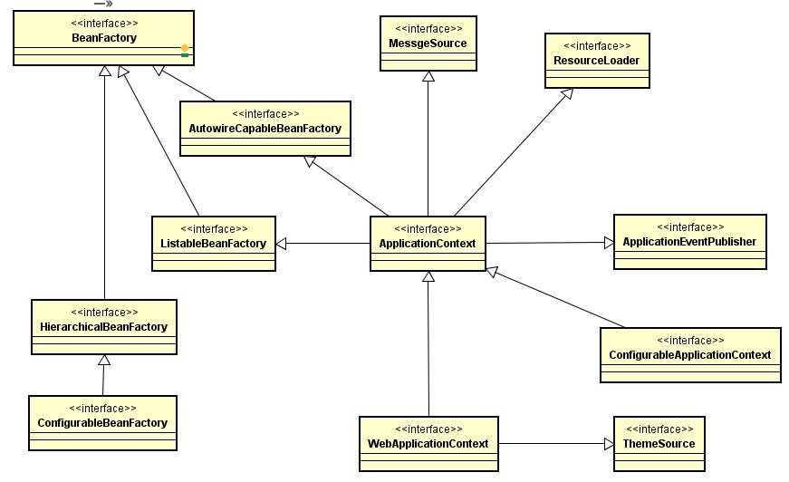
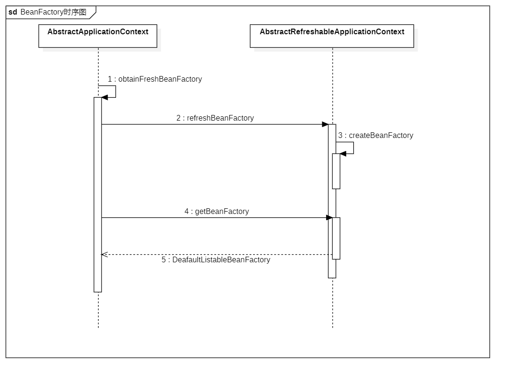
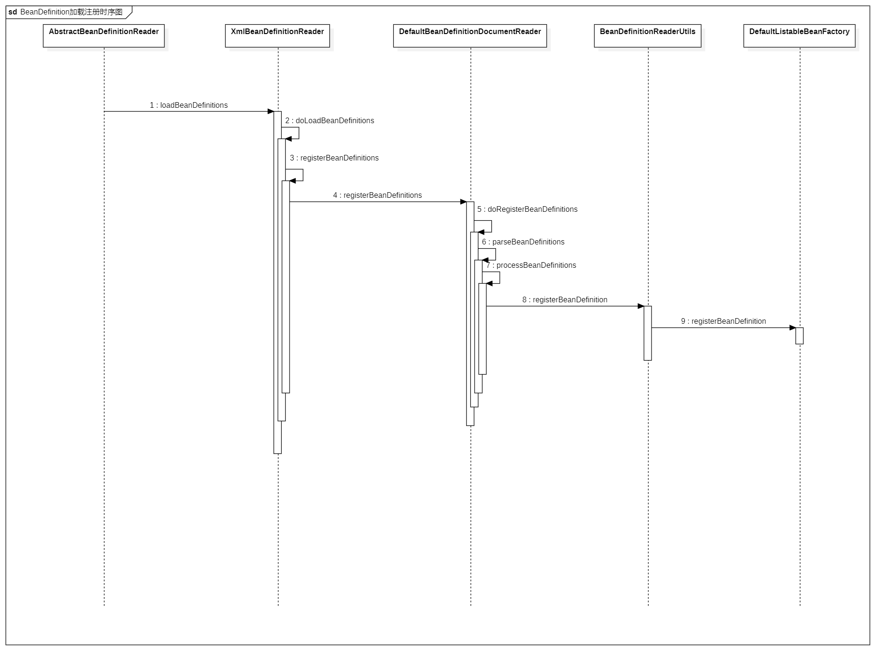
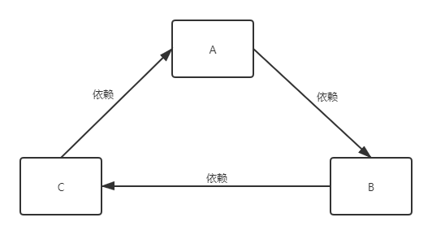
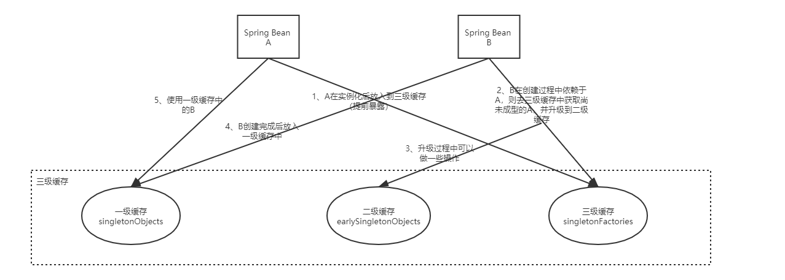

------


# Spring IoC高级应用与源码分析

## 1 Spring IoC基础知识

### 1.1 beans.xml与BeanFactory

- beans.xml：定义需要实例化对象的全限定类名以及类之间的依赖关系描述

- BeanFactory：通过反射来实例化对象并维护对象之间的依赖关系

### 1.2 BeanFactory容器继承体系




### 1.3 Spring框架的IoC实现

- 纯xml：bean信息全部配置在xml中

- xml+注解：部分bean使用xml配置，部分bean使用注解配置

- 纯注解：bean信息全部使用注解配置

### 1.4 不同实现下的IoC容器启动方式

- 纯xml、xml+注解

    - JavaSE：
        
        - ```ApplicationContext applicationContext = new ClassPathXmlApplicationContext("beans.xml");```
            
        - ```ApplicationContext applicationContext = new FileSystemXmlApplicationContext("c:/beans.xml");```

    - JavaWeb：
    
        - ContextLoaderListener(监听器加载xml)
        
- 纯注解

    - JavaSE：
    
        - ```ApplicationContext applicationContext = new AnnotationConfigApplicationContext(SpringConifg.class);```
        
    - JavaWeb:
    
        - ContextLoaderListener(监听器加载注解配置类)

### 1.5 BeanFactory和ApplicationContext的区别

- BeanFactory：Spring容器顶层接口，定义基础基础功能和基础规范

- ApplicationContext：BeanFactory的子接口，具备BeanFactory全部功能，并提供额外功能，如国际化支持和资源访问（xml、Java配置类）等

    - ClassPathXmlApplicationContext
    
    - FileSystemXmlApplicationContext
    
    - AnnotationConfigApplicationContext

### 1.6 Bean的创建方式

- 使用无参构造器（推荐）

- 静态方法

- 实例化方法

### 1.7SpringBean生命周期

- Spring容器启动时，读取配置文件，将每个Bean解析为BeanDefinition结构，封装Bean的配置信息

- 根据配置情况调用Bean构造方法或工厂方法实例化Bean

- 利用依赖注入完成Bean中属性的配置注入

- 如果Bean实现了BeanNameAware接口，则调用setBeanName方法获取Bean的Id

- 如果Bean实现了BeanFactoryAware接口，则调用setBeanFactory方法获取BeanFactory实例的引用

- 如果Bean实现了ApplicationContextAware接口，则调用setApplicationContext方法获取当前ApplicationContext实例的引用

- 如果BeanPostProcessor和Bean关联，则调用该接口的预处理方法setProcessBeforeInitialization对Bean加功操作
        
- @PostConstruct
       
- 如果Bean实现了InitializingBean接口，则调用afterPropertiesSet方法

- 如果在配置文件中通过init-method属性指定初始化方法，则调用该方法

- 如果BeanPostProcessor和Bean关联，则调用该接口的预处理方法setProcessAfterInitialization，此时Bean已经可以被应用系统使用了，Spring在此处获取代理对象

- 如果指定Bean的作用范围是singleton，则触发Spring对该Bean生命周期的管理；如果作用范围为prototype，则由调用者管理

- @PreDestroy

- 如果Bean实现了DisposableBean接口，则调用destroy方法销毁Bean

- 如果在配置文件中通过destroy-method属性指定销毁方法，则调用该方法

### 1.8 IoC容器认识

- Spring应用上下文，官方称为IoC容器

- 错误认识：

    - 容器只是存放Bean的Map
    
- 正确认识：

    - Map是IoC容器的一个成员，称为单例池（singletonObjects）
    
    - 容器是一组组件和过程的集合，包括BeanFactory、单例池、BeanPostProcessor等以及之间的协作流程

## 2 Spring IoC源码深度剖析

### 2.1 Spring Bean生命周期触发方法

- 构造器执行、初始化方法执行、Bean后置处理器before/after方法：`AbstractApplicationContext#refresh#finishBeanFactoryInitialization`

- Bean工厂后置处理器初始化、方法执行：`AbstractApplicationContext#refresh#invokeBeanFactoryPostProcessors`

- Bean后置处理器初始化：`AbstractApplicationContext#refresh#registerBeanPostProcessor`

### 2.2 refresh方法

- 刷新容器

- 步骤：

    - synchronized (this.startupShutdownMonitor)：加锁，refresh与close方法互斥，不能同时刷新和关闭容器
    
    - prepareRefresh：刷新前的预处理
    
        - 设置Spring容器的启动时间
        
        - 开启活跃状态，撤销关闭状态
        
        - 验证环境信息中必须存在的属性
        
    - <font color=red>obtainFreshBeanFactory（重要）</font>
    
        - 获取BeanFactory，默认实现是DefaultListableBeanFactory
        
        - 加载BeanDefinition并注册到BeanDefinitionRegister
        
    - prepareBeanFactory(beanFactory)：BeanFactory的预准备工作（BeanFactory进行一些设置，如context的类加载器）
    
    - postProcessBeanFactory(beanFactory)：BeanFactory准备完成后进行的后置处理
    
    - <font color=red>invokeBeanFactoryPostProcessors(beanFactory)（重要）</font>：实例化实现了BeanFactoryProcessor接口的Bean，并调用接口方法
    
    - <font color=red>registerBeanPostProcessor(beanFactory)（重要）</font>：注册BeanPostProcessor（Bean的后置处理器），在创建Bean的前后等执行
    
    - initMessageSource：国际化功能组件，消息绑定，消息解析
    
    - initApplicationEventMulticaster：初始化事件分发器
    
    - onRefresh：子类重写该方法，在容器刷新时自定义逻辑，如创建Tomcat、Jetty等WEB服务器
    
    - registerListeners：注册应用监听器，实现了ApplicationListener接口的监听器
    
    - <font color=red>finishBeanFactoryInitialization(beanFactory)（重要）</font>
    
        - 初始化所有剩下的非懒加载单例Bean
        
        - 初始化创建非懒加载方式的单例Bean实例（未设置属性）
        
        - 填充属性
        
        - 初始化方法调用（如afterPropertiesSet方法、init-method方法）
        
        - 调用BeanPostProcessor（后置处理器）对实例Bean进行后置处理
        
    - finishRefresh：完成context的刷新

### 2.3 BeanFactory获取子流程

- 对BeanFactory执行刷新操作，销毁并关闭以前的BeanFactory（如果有），并且为context舒适化一个新的BeanFactory

- 创建BeanFactory使用DefaultListableBeanFactory，提供集合形式的接口

- 自定义BeanFactory的一些属性（是否覆盖、是否允许循环依赖）

- 加载注册应用中的BeanDefinitions

- 返回BeanFactory

- 时序图：

    - 

### 2.4 BeanDefinition加载注册子流程

- 读取xml信息，将xml中信息保存在Document对象中

- 解析Document对象，封装BeanDefinition对象并注册(Map)

- 时序图：

    - 

### 2.5 Bean创建流程

- 从BeanDefinitions中获取所有Bean的Id

- 所有非延迟加载单例Bean的初始化

- 合并父子BeanDefinition对象

- 判断判断Bean是否抽象、单例和懒加载，非抽象、非懒加载并且单例的Bean才会创建

- 判断是否FactoryBean，如果是FactoryBean，则在获取该Bean的时候，Id前加`&`字符

- 实例化当前Bean

- 解析BeanName，如果`&`字符开头去掉`&`字符，如果是别名则获取正真的Id

- 从singletonObject中获取，如果有则直接返回

- 如果是prototype类型并且开启了循环依赖，则抛出异常

- 创建单例Bean

- Bean生命周期

### 2.6 循环依赖

- 循环依赖就是循环引用，两个或两个以上的Bean互相持有对方，最终形成闭环

    - 

- 解决方法是提前暴露对象

- Spring循环依赖场景：

    - 构造器的循环依赖（构造器注入）
    
    - Field属性注入（set注入）

- 循环依赖无法解决场景：

    - 单例Bean的构造器参数循环依赖
    
        - Bean实例化过程中需要调用构造方法，构造方法依赖的Bean不存在时不能实例化，也就没办法使用三级缓存，抛出异常
    
    - prototype原型Bean循环依赖
    
        - prototype原型Bean不在Spring容器中管理，抛出异常
        
- 循环依赖可以解决的场景：

    - 单例Bean通过set或者@Autowired循环依赖
    
    - 