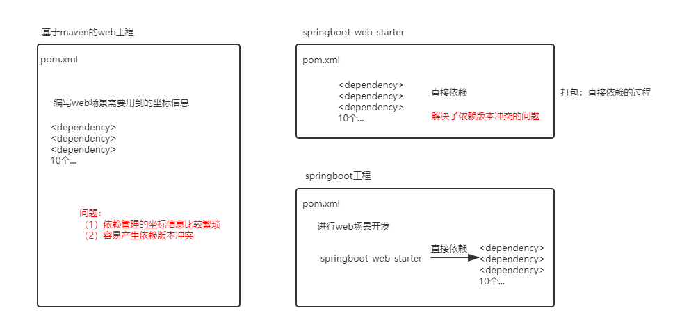

------

# SpringBoot基础回顾

## 1 SpringBoot应用回顾

### 1.1 约定优于配置

- 约定优于配置(Convention over Configuration)，又称按约定编程，是一种软件设计规范。

- 本质上是对系统、类库或框架中一些东西假定一个大众化合理的默认值(缺省值)。

- 简单来说就是假如所期待的配置与约定的配置一致，那么就可以不做任何配置，约定不符合期待时才需要对约定进行替换配置。

- 大大减少了配置项

### 1.2 什么是SpringBoot

- SpringBoot的设计是为了快捷创建独立的，基于生产级别的Spring应用程序，并且尽可能减少配置文件。

- 基于Spring4.0，可以完全舍弃所有xml配置文件。

- 继承了Spring框架原有的优秀特性，而且通过简化配置进一步的简化Spring应用的整个搭建和开发过程。

- SpringBoot通过集成大量框架使得依赖包版本冲突以及引用的不稳定性等问题得到了解决（起步依赖）。

### 1.3 SpringBoot主要特性

- SpringBoot Starter：将常用的依赖分组进行了整合，将其合并到一个依赖中，这样就可以一次性添加到项目的Maven或Gradle构建中；

    - 起步依赖：把具备某种功能的坐标打包到一起，并提供一些默认功能
    
    - 
  
- 使编码变得简单，SpringBoot采用JavaConfig的方式对Spring进行配置，并且提供了大量的注解，极大的提高了工作效率。

- 自动配置：SpringBoot的自动配置特性利用了Spring对条件化配置的支持，合理地推测应用所需的Bean并自动化配置；

    - SpringBoot在启动过程中，会自动的将一些配置类Bean进行创建，并添加到IoC容器中

- 使部署变得简单，SpringBoot内置了三种Servlet容器，Tomcat，Jetty，undertow。只需要一个Java的运行环境就可以运行SpringBoot的项目了，SpringBoot的项目可以打成一个jar包。

### 1.4 热部署原理分析

- 引入热部署插件后，插件会监控classpath下资源的变化，当改动相关代码后，编辑器自动触发编译替换历史class文件，classpath下资源发生了变化，会触发重启。

- 重启服务是通过两个classloader（类加载器）进行工作的。对于不变的资源（如第三方JAR包资源）是通过`base-classloader`加载的；对于自己开发的资源是由`restartClassLoader`加载的。

- 热部署插件启动快的原因：类加载采用两种类加载器，热部署重启只是重新加载开发人员编写的代码部分，由`restartClassLoader`加载，第三方JAR包不会重新加载。

- 热部署默认排除资源是依靠Spring自动配置实现的，在热部署JAR包META-INF/spring.factories文件中的自动配置代码类中已经设置好了默认排除的资源目录。

### 1.5 全局配置文件

- 全局配置文件能够对一些默认配置值进行修改及自定义配置。

- Spring Boot使用一个application.properties或者application.yaml的文件作为全局配置文件。

- 全局配置文件加载路径及顺序：

    - 根目录下的/config目录下的【配置文件】（file:./config/）
    
    - 根目录下的【配置文件】（file:./）
    
    - 类路径下的/config目录下的【配置文件】（classpath:/config/）
    
    - 类路径下的【配置文件】（classpath:/）

- 四个配置文件中配置相同属性，以最先加载的配置文件为准 ，不会覆盖配置。

- 四个配置文件中配置不同属性，四个配置文件都会被加载，互补设置。

- 同目录下既有application.yml也有application.properties，默认先读取application.properties。

- 如果配置文件名字不是application.properties或者application.yml，可以通过以下参数来指定配置文件的名字，myproject是配置文件名。

    - `$ java -jar myproject.jar --spring.config.name=myproject`
    
- 指定其他位置的配置文件生效，指定配置文件和默认加载的这些配置文件共同起作用形成互补配置。

    - `java -jar run-0.0.1-SNAPSHOT.jar --spring.config.location=D:/application.properties`

- 补充：

    - Spring Boot 2.4改进了处理application.properties和application.yml配置文件的方式
    
    - 2.4.0之前版本，优先级properties>yaml
      
    - 2.4.0的版本，优先级yaml>properties
      
    - 如果想继续使用Spring Boot 2.3的配置逻辑，也可以通过在application.properties或者application.yml配置文件中添加以下参数：

        - `spring.config.use-legacy-processing = true`

### 1.6 属性注入

- 属性注入常用注解：

    - @Configuration：声明一个类作为配置类
    
    - @Bean：声明在方法上，将方法的返回值加入Bean容器
      
    - @Value：属性注入
      
    - @ConfigurationProperties(prefix = "jdbc")：批量属性注入
      
    - @PropertySource("classpath:/jdbc.properties")指定外部属性文件，在类上添加

## 2 日志框架

### 2.1 日志框架设计

- 通常情况下，日志是由抽象层+实现层的组合搭建的

- | 日志-抽象层 | 日志-实现层 |
  | :-----| :---- |
  | JCL（Jakarta Commons Logging）、SLF4J（Simple Logging Facade For Java）、jboss-logging | jul（java.util.logging）、log4j、logback、log4j2 |

- 一般选择组合为SLF4J（抽象层）+logback（实现层）

- Spring框架选择使用了JCL作为默认日志输出，而Spring Boot默认选择了SLF4J结合LogBack

### 2.2 统一日志框架使用步骤

- 排除系统中的其他日志框架

- 使用中间包替换要替换的日志框架

- 导入选择的SLF4J实现

### 2.3 SLF4J日志级别（从小到大）

- trace<debug<info<warn<error

- 只会输出比当前级别更高级别的日志

- Spring Boot中，默认级别是info级别（root级别），输出info、warn、error级别的日志

### 2.4 SpringBoot默认日志格式

- `%d{yyyy-MM-dd HH:mm:ss.SSS} [%thread] %-5level %logger{50} - %msg%n`

    - `%d{yyyy-MM-dd HH:mm:ss.SSS}` 时间
    
    - `%thread` 线程名称
    
    - `%-5level` 日志级别从左显示5个字符宽度
    
    - `%logger{50}` 类名
    
    - `%msg%n` 日志信息加换行