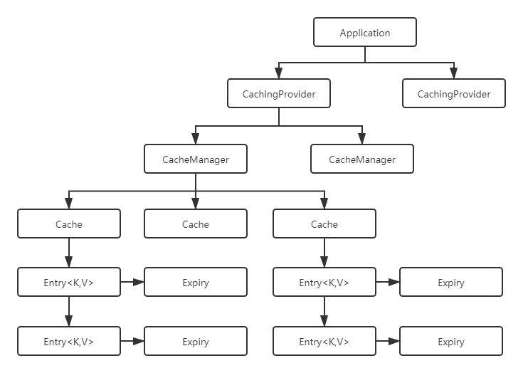

------

# SpringBoot缓存深入

## 1 JSR107

### 1.1 概念

- JSR（Java Specification Requests）：Java规范请求，是关于使用缓存的规范，提供了接口规范，没有具体实现

- 提供的了五个核心接口：CachingProvider、CacheManager、Cache、Entry和Expiry

### 1.2 核心接口

- CachingProvider（缓存提供者）：创建、配置、获取、管理和控制多个CacheManager

- CacheManager（缓存管理器）：创建、配置、获取、管理和控制多个唯一命名的Cache，Cache存在于CacheManager的上下文中。一个CacheManager仅对应一个CachingProvider

- Cache（缓存）：是由CacheManager管理的，CacheManager管理Cache的生命周期，Cache存在于CacheManager的上下文中，是一个类似map的数据结构，并临时存储以key为索引的值。一个Cache仅被一个CacheManager所拥有

- Entry（缓存键值对）：是一个存储在Cache中的key-value对

- Expiry（缓存时效）：每一个存储在Cache中的条目都有一个定义的有效期。一旦超过这个时间，条目就自动过期，过期后，条目将不可以访问、更新和删除操作。缓存有效期可以通过ExpiryPolicy设置

### 1.3 接口图示

- 

## 2 Spring的缓存抽象

### 2.1 缓存抽象定义

- Spring从3.1开始定义了`org.springframework.cache.Cache` 和`org.springframework.cache.CacheManager`接口来统一不同的缓存技术；并支持使用JavaCaching（JSR-107）注解简化我们进行缓存开发

- Spring Cache只负责维护抽象层，具体的实现由技术选型来决定。将缓存处理和缓存技术解除耦合

### 2.2 重要接口

- Cache：缓存抽象的规范接口，缓存实现有：RedisCache、EhCache、ConcurrentMapCache等

- CacheManager：缓存管理器，管理Cache的生命周期

## 3 Spring缓存使用

### 3.1 概念

- | 概念/注解 | 作用 |
  | :-----| :---- |
  | Cache  | 缓存接口，定义缓存操作。实现有：RedisCache、EhCacheCache、ConcurrentMapCache等 |
  | CacheManager | 缓存管理器，管理各种缓存(Cache)组件 |
  | @Cacheable | 主要针对方法配置，能够根据方法的请求参数对其结果进行缓存 |
  | @CacheEvict | 清空缓存 |
  | @CachePut | 保证方法被调用，又希望结果被缓存 |
  | @EnableCaching | 开启基于注解的缓存 |
  | keyGenerator | 缓存数据时key生成策略 |
  | serialize | 缓存数据时value序列化策略 |

- @Cacheable标注在方法上，表示该方法的结果需要被缓存起来，缓存的键由keyGenerator的策略决定，缓存的值的形式则由serialize序列化策略决定(序列化还是json格式)；标注上该注解之后，在缓存时效内再次调用该方法时将不会调用方法本身而是直接从缓存获取结果

- @CachePut也标注在方法上，和@Cacheable相似也会将方法的返回值缓存起来，不同的是标注@CachePut的方法每次都会被调用，而且每次都会将结果缓存起来，适用于对象的更新

### 3.2 @Cacheable注解

- 属性

    - | 属性名 | 描述 |
      | :-----| :---- |
      | cacheNames/value | 指定缓存的名字，缓存使用CacheManager管理多个缓存组件Cache，这些Cache组件就是根据这个名字进行区分的。对缓存的真正CRUD操作在Cache中定义，每个缓存组件Cache都有自己唯一的名字，通过cacheNames或者value属性指定，相当于是将缓存的键值对进行分组，缓存的名字是一个数组，也就是说可以将一个缓存键值对分到多个组里面 |
      | key | 缓存数据时的key的值，默认是使用方法参数的值，可以使用SpEL表达式计算key的值 |
      | keyGenerator | 缓存的生成策略，和key二选一，都是生成键的，keyGenerator可自定义 |
      | cacheManager | 指定缓存管理器(如ConcurrentHashMap、Redis等) |
      | cacheResolver | 和cacheManager功能一样，和cacheManager二选一 |
      | condition | 指定缓存的条件(满足什么条件时才缓存)，可用SpEL表达式(如#id>0，表示当入参id大于0时才缓存) |
      | unless| 否定缓存，即满足unless指定的条件时，方法的结果不进行缓存，使用unless时可以在调用的方法获取到结果之后再进行判断(如#result==null，表示如果结果为null时不缓存) |
      | sync | 是否使用异步模式进行缓存 |
        
        - ①既满足condition又满足unless条件的也不进行缓存
        
        - 使用异步模式进行缓存时(sync=true)，unless条件将不被支持

- SpEL表达式

    - | 名字 | 位置 | 描述 | 示例 |
      | :-----| :---- | :---- | :---- |
      | methodName | root object | 当前被调用的方法名 | #root.methodName |
      | method | root object | 指定缓存的名字 | 指定缓存的名字 |
      | target | root object | 当前被调用的目标对象 | #root.target |
      | targetClass | root object | targetClass | #root.targetClass |
      | args | root object | 当前被调用的方法的参数列表 | #root.args[0] |
      | caches | root object | 当前方法调用使用的缓存列表(如@Cacheable(value={“cache1”, “cache2”}))，则有两个cache | #root.caches[0].name |
      | argument name | evaluation context | 方法参数的名字，可以直接 #参数名，也可以使用#p0或#a0的形式，0代表参数的索引 | #iban、#a0、#p0 |
      | result | evaluation context | 方法执行后的返回值(仅当方法执行之后的判断有效，如"unless"，"cache put"的表达式，"cache evict"的表达式beforeInvocation=false) | #result |

## 4 @Cacheable源码分析

### 4.1 运行流程

- 方法运行之前，先去查询Cache(缓存组件)，按照cacheNames指定的名字获取(CacheManager先获取相应的缓存，第一次获取缓存如果没有Cache组件会自动创建)

- 去Cache中查找缓存的内容，使用的key默认就是方法的参数：

    - key默认是使用keyGenerator生成的，默认使用的是SimpleKeyGenerator
    
    - SimpleKeyGenerator生成key的默认策略：
    
        - 如果没有参数：key = new SimpleKey()
        
        - 如果有一个参数：key = 参数的值
        
        - 如果有多个参数：key = new SimpleKey(params)

- 没有查到缓存就调用目标方法

- 没有查到缓存就调用目标方法

### 4.2 核心

- 使用CacheManager(ConcurrentMapCacheManager)按照名字得到Cache(ConcurrentMapCache)组件

- key使用keyGenerator生成，默认使用SimpleKeyGenerator

## 5 @CachePut&@CacheEvict&@CacheConfig

### 5.1 @CachePut

- 说明：既调用方法，又更新缓存数据，一般用于更新操作，在更新缓存时一定要和想更新的缓存有相同的缓存名称和相同的key(可类比同一张表的同一条数据)

- 运行时机：

    - 先调用目标方法
    
    - 将目标方法的结果缓存起来

### 5.2 @CacheEvict

- 说明：缓存清除，清除缓存时要指明缓存的名字和key，相当于告诉数据库要删除哪个表中的哪条数据，key默认为参数的值

- 属性：
    
    - value/cacheNames：缓存的名字
    
    - key：缓存的键
    
    - allEntries：是否清除指定缓存中的所有键值对，默认为false，设置为true时会清除缓存中的所有键值对，与key属性二选一使用

    - beforeInvocation：在@CacheEvict注解的方法调用之前清除指定缓存，默认为false，即在方法调用之后清除缓存，设置为true时则会在方法调用之前清除缓存(在方法调用之前还是之后清除缓存的区别在于方法调用时是否会出现异常，若不出现异常，这两种设置没有区别，若出现异常，设置为在方法调用之后清除缓存将不起作用，因为方法调用失败了)

### 5.3 @CacheConfig

- 作用：标注在类上，抽取缓存相关注解的公共配置，可抽取的公共配置有缓存名字、主键生成器等(如注解中的属性所示)

## 6 基于Redis的缓存实现

### 6.1 SpringBoot默认序列化方式

- SpringBoot默认采用的是JDK的对象序列化方式

- 可以切换为使用JSON格式进行对象的序列化操作，这时需要自定义序列化规则