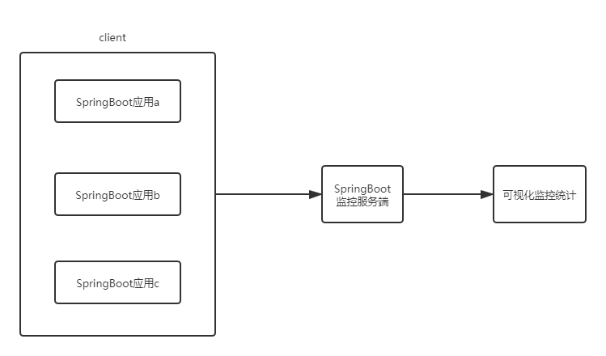

------

# SpringBoot部署与监控

## 1 SpringBoot项目部署

### 1.1 jar包和war包方式对比

- SpringBoot项目打包时能打成jar与war包

    - jar更加简单方便，使用`java -jar xx.jar`就可以启动
    
    - war包可以部署到tomcat的webapps中，随Tomcat的启动而启动

- 打jar包时不会把src/main/webapp 下的内容打到jar包里，打war包时会把src/main/webapp 下的内容打到war包里

- 提供rest服务的项目建议打包成jar文件，而有大量css、js、html，且需要经常改动的项目，打成war包去运行比较方便，因为改动静态资源可以直接覆盖

### 1.2 多环境部署

- 在项目运行中，包括多种环境，例如线上环境prod(product)、开发环境dev(development)、测试环境test、提测环境qa、单元测试unitest等等，不同的环境需要进行不同的配置

- @Profile

    - 指定类或方法在特定的Profile环境生效
    
    - @Component或@Configuration注解的类或方法可以使用@profile

    - @Profile中需要指定一个字符串，约定生效的环境
    
    - profile激活：
    
        - 配置文件方式激活profile：`spring.profiles.active=dev`
        
        - 命令行方式激活profile：`java -jar spring-boot-config-0.0.1-SNAPSHOT.jar --spring.profiles.active=dev`

- 多Profile的资源文件

    - SpringBoot的资源配置文件除了application.properties之外，还可以有对应的资源文件application-{profile}.properties
    
    - 若工作环境有：dev、test、prod，可添加四个配置文件
    
        - application.properties - 公共配置
        
        - application-dev.properties - 开发环境配置
        
        - application-test.properties - 测试环境配置
        
        - application-prod.properties - 生产环境配置
    
    - 激活方式：`spring.profiles.active = test`

## 2 SpringBoot监控

### 2.1 Actuator

- Actuator是spring boot的一个附加功能,可帮助在应用程序生产环境时监视和管理应用程序。可以使用HTTP的各种请求来监管，审计，收集应用的运行情况。Spring Boot Actuator提供了对单个SpringBoot的监控，信息包含：应用状态、内存、线程、堆栈等等，比较全面的监控了SpringBoot应用的整个生命周期

- Actuator监控分成两类：原生端点和用户自定义端点；自定义端点主要是指扩展性，用户可以根据自己的实际应用，定义一些比较关心的指标，在运行期进行监控。

- 原生端点可以分成三类：

    - 应用配置类：可以查看应用在运行期的静态信息：例如自动配置信息、加载的SpringBean信息、yml 文件配置信息、环境信息、请求映射信息；
      
    - 度量指标类：主要是运行期的动态信息，例如堆栈、请求链、一些健康指标、metrics信息等；
    
    - 操作控制类：主要是指shutdown,用户可以发送一个请求将应用的监控功能关闭。

- Actuator接口：

    - | HTTP方法 | 路径 | 描述 |
      | :-----| :---- | :---- |
      | GET | /auditevents | 显示应用暴露的审计事件 (比如认证进入、订单失败) |
      | GET | /beans | 描述应用程序上下文里全部的 Bean，以及它们的关系 |
      | GET | /conditions | 就是 1.0 的 /autoconfig ，提供一份自动配置生效的条件情况，记录哪些自动配置条件通过了，哪些没通过 |
      | GET | /configprops | 描述配置属性(包含默认值)如何注入Bean |
      | GET | /env | 获取全部环境属性 |
      | GET | /env/{name} | 根据名称获取特定的环境属性值 |
      | GET | /flyway | 提供一份 Flyway 数据库迁移信息 |
      | GET | /liquidbase | 显示Liquibase 数据库迁移的纤细信息 |
      | GET | /health | 报告应用程序的健康指标，这些值由 HealthIndicator的实现类提供 |
      | GET | /heapdump | dump一份应用的JVM堆信息 |
      | GET | /httptrace | 显示HTTP足迹，最近100个HTTP request/repsponse |
      | GET | /info | 获取应用程序的定制信息，这些信息由info打头的属性提供 |
      | GET | /logfile | 返回log file中的内容(如果 logging.file或者logging.path被设置) |
      | GET | /loggers | 显示和修改配置的loggers |
      | GET | /metrics | 报告各种应用程序度量信息，比如内存用量和HTTP请求计数 |
      | GET | /metrics/{name} | 报告指定名称的应用程序度量值 |
      | GET | /scheduledtasks | 展示应用中的定时任务信息 |
      | GET | /sessions | 如果我们使用了Spring Session展示应用中的HTTP Sessions 信息 |
      | POST | /shutdown | 关闭应用程序，要求endpoints.shutdown.enabled设置为true |
      | GET | /mappings | 描述全部的URI路径，以及它们和控制器(包含Actuator端点)的映射关系 |
      | GET | /threaddump | 获取线程活动的快照 |
    
- 在 Spring Boot 2.x 中为了安全期间，Actuator 只开放了两个端点 /actuator/health 和/actuator/info 。可以在配置文件中设置打开：

    - 打开所有的监控点：`management.endpoints.web.exposure.include=*`
    
    - 选择打开部分：`management.endpoints.web.exposure.include=beans,trace`
    
- Actuator 默认所有的监控点路径都在 /actuator/*，可以修改此路径：

    - `management.endpoints.web.base-path=/manage`

- 属性：

    - health：主要用来检查应用的运行状态，通常使用此接口提醒应用实例的运行状态，以及应用不”健康“的原因，比如数据库连接、磁盘空间不够等
    
    - info：以info开头的自定义配置信息
    
    - beans：展示了bean的别名、类型、是否单例、类的地址、依赖等信息
    
    - conditions：使用conditions可以在应用运行时查看代码了某个配置在什么条件下生效，或者某个自动配置为什么没有生效
    
    - heapdump：返回一个 GZip 压缩的 JVM 堆 dump

    - mappings：描述全部的URI路径，以及它们和控制器的映射关系
    
    - threaddump：生成当前线程活动的快照，主要展示了线程名、线程ID、线程的状态、是否等待锁资源等信息
    
    - shutdown：开启接口优雅关闭 Spring Boot 应用，要使用这个功能首先需要在配置文件中开启：`management.endpoint.shutdown.enabled=true`

### 2.2 Spring Boot Admin

- Spring Boot Admin是一个针对spring-boot的actuator接口进行UI美化封装的监控工具。可以返回在列表中浏览所有被监控spring-boot项目的基本信息比如：Spring容器管理的所有的bean、详细的Health信息、内存信息、JVM信息、垃圾回收信息、各种配置信息（比如数据源、缓存列表和命中率）等，Threads 线程管理，Environment 管理等。

- 