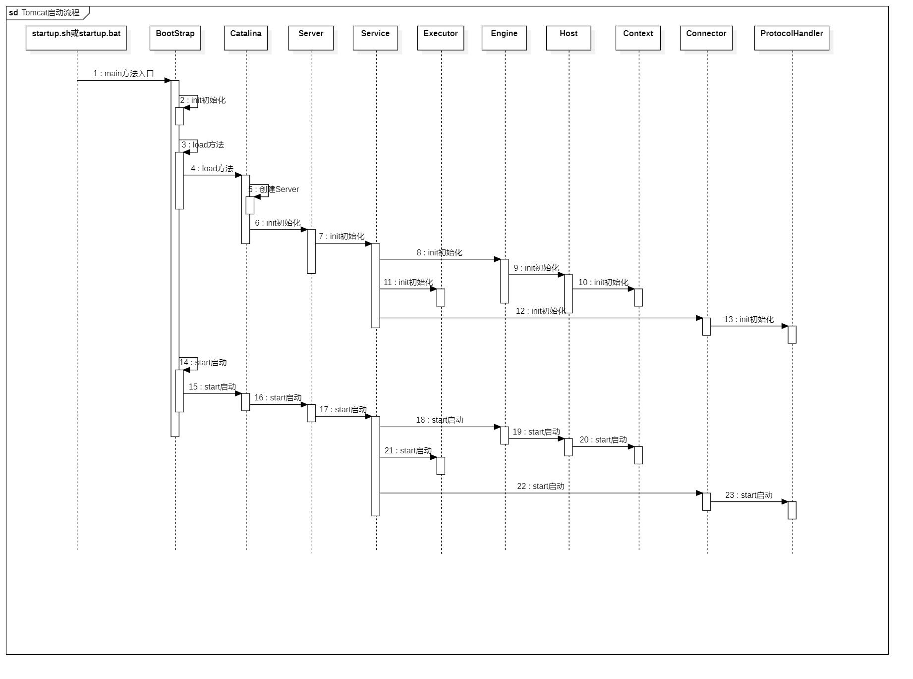
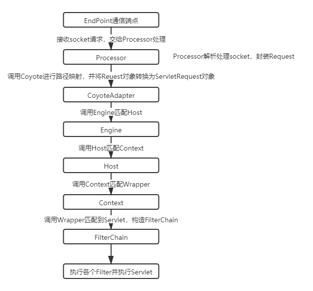
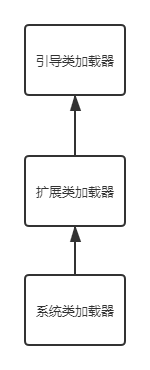
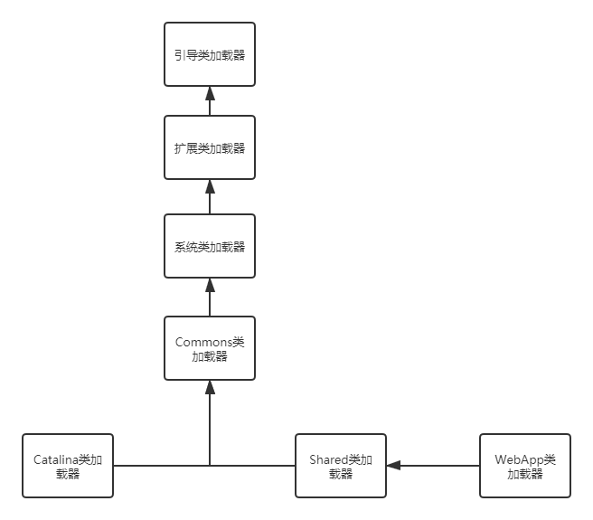
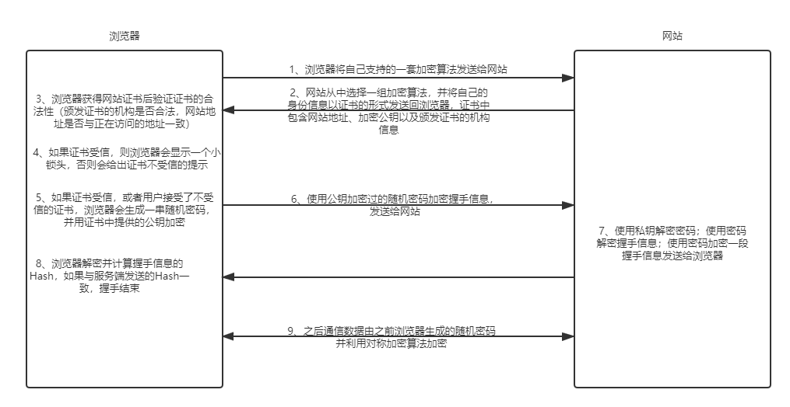

------

# Tomcat源码剖析及调优

## 1 核⼼流程源码剖析

### 1.1 Tomcat启动流程

- 

### 1.2 请求处理流程示意图

- 

- Mapper组件完成url和Host、Context、Wrapper等容器的映射

## 2 Tomcat类加载机制剖析

### 2.1 JVM类加载机制

- 

- | 类加载器 | 作用 |
  | :-----| :---- |
  | 引导启动类加载器BootstrapClassLoader | c++编写，加载java核⼼库 java.*，⽐如rt.jar中的类，构造ExtClassLoader和AppClassLoader |
  | 扩展类加载器 ExtClassLoader | java编写，加载扩展库 JAVA_HOME/lib/ext⽬录下的jar中的类，如classpath中的jre，javax.*或者java.ext.dir指定位置中的类 |
  | 系统类加载器SystemClassLoader/AppClassLoader | 默认的类加载器，搜索环境变量classpath中指明的路径 |

    - ⽤户可以⾃定义类加载器（Java编写，⽤户⾃定义的类加载器，可加载指定路径的class⽂件）

- ⽗类委托机制：

    - ⽤户⾃⼰的类加载器，把加载请求传给⽗加载器，⽗加载器再传给其⽗加载器，⼀直到加载器树的顶层
    
    - 最顶层的类加载器⾸先针对其特定的位置加载，如果加载不到就转交给⼦类
    
    - 如果⼀直到底层的类加载都没有加载到，那么就会抛出异常ClassNotFoundException

### 2.2 双亲委派机制

- 当某个类加载器需要加载某个.class⽂件时，⾸先把这个任务委托给上级类加载器，递归这个操作，如果上级的类加载器没有加载，⾃⼰才会去加载这个类

- 作用：

    - 防⽌重复加载同⼀个.class。通过委托向父类加载器确认是否加载过了，就不⽤再加载⼀遍。保证数据安全
    
    - 保证核⼼.class不能被篡改。通过委托⽅式，不会去篡改核⼼.class，即使篡改也不会去加载，即使加载也不会是同⼀个.class对象了

### 2.3 Tomcat类加载机制

- Tomcat的类加载机制没有严格的遵从双亲委派机制，也可以说打破了双亲委派机制

- 原因：Tomcat下不同应用加载不同版本类库，每个类只加载一次，不同版本类库代码可能不同，因此报错

- 

    - 引导类加载器和扩展类加载器的作⽤不变
    
    - 系统类加载器正常情况下加载的是CLASSPATH下的类，但是Tomcat的启动脚本并未使⽤该变量，⽽是加载tomcat启动的类，⽐如bootstrap.jar，通常在catalina.bat或者catalina.sh中指定。位于CATALINA_HOME/bin下
    
    - Common通⽤类加载器加载Tomcat使⽤以及应⽤通⽤的⼀些类，位于CATALINA_HOME/lib下，⽐如servlet-api.jar
    
    - Catalina ClassLoader⽤于加载服务器内部可⻅类，这些类应⽤程序不能访问
    
    - Shared ClassLoader⽤于加载应⽤程序共享类，这些类服务器不会依赖
    
    - Webapp ClassLoader，每个应⽤程序都会有⼀个独⼀⽆⼆的Webapp ClassLoader，⽤来加载本应⽤程序/WEB-INF/classes和/WEB-INF/lib下的类

- tomcat 8.5 默认改变了严格的双亲委派机制

    - ⾸先从Bootstrap Classloader加载指定的类
    
    - 如果未加载到，则从/WEB-INF/classes加载（Webapp类加载器）
    
    - 如果未加载到，则从/WEB-INF/lib/*.jar加载（Webapp类加载器）
    
    - 如果未加载到，则依次从System、Common、Shared加载（在这最后⼀步，遵从双亲委派机制）

## 3 Tomcat对Https的⽀持

### 3.1 HTTPS和HTTP的主要区别

- HTTPS协议使⽤时需要到电⼦商务认证授权机构（CA）申请SSL证书

- HTTP默认使⽤8080端⼝，HTTPS默认使⽤8443端⼝

- HTTPS则是具有SSL加密的安全性传输协议，对数据的传输进⾏加密，效果上相当于HTTP的升级版

- HTTP的连接是⽆状态的，不安全的；HTTPS协议是由SSL+HTTP协议构建的可进⾏加密传输、身份认证的⽹络协议，⽐HTTP协议安全

### 3.2 HTTPS原理

- 

## 4 Tomcat性能优化策略

### 4.1 系统性能的衡量指标

- 响应时间：执⾏某个操作的耗时

- 吞吐量：系统在给定时间内能够⽀持的事务数量，单位为TPS（Transactions PerSecond的缩写，也就是事务数/秒，⼀个事务是指⼀个客户机向服务器发送请求然后服务器做出反应的过程）

### 4.2 虚拟机运⾏优化

- 内存直接影响服务的运⾏效率和吞吐量

- 垃圾回收机制会不同程度地导致程序运⾏中断（垃圾回收策略不同，垃圾回收次数和回收效率都是不同的）

- | 参数 | 参数作⽤ | 优化建议 |
  | :-----| :---- | :---- |
  | -server | 启动Server，以服务端模式运⾏ | 服务端模式建议开启 |
  | -Xms | 最⼩堆内存 | 建议与-Xmx设置相同 |
  | -Xmx | 最⼤堆内存 | 建议设置为可⽤内存的80% |
  | -XX:MetaspaceSize | -XX:MetaspaceSize |  |
  | -XX:MaxMetaspaceSize | 元空间最⼤内存 | 默认⽆限 |
  | -XX:NewRatio | 年轻代和⽼年代⼤⼩⽐值，取值为整数，默认为2 | 不需要修改 |
  | -XX:SurvivorRatio | Eden区与Survivor区⼤⼩的⽐值，取值为整数，默认为8 | 不需要修改 |

    - 调整示例（catalina.sh）：`JAVA_OPTS="-server -Xms2048m -Xmx2048m -XX:MetaspaceSize=256m -XX:MaxMetaspaceSize=512m"`

- 垃圾回收性能指标：

    - 吞吐量：⼯作时间（排除GC时间）占总时间的百分⽐，⼯作时间并不仅是程序运⾏的时间，还包含内存分配时间
    
    - 暂停时间：由垃圾回收导致的应⽤程序停⽌响应次数/时间

- 垃圾收集器：

    - 串⾏收集器（Serial Collector）：
    
        - 单线程执⾏所有的垃圾回收⼯作， 适⽤于单核CPU服务器
        
    - 并⾏收集器（Parallel Collector）：
    
        - ⼜称为吞吐量收集器（关注吞吐量），以并⾏的⽅式执⾏年轻代的垃圾回收， 该⽅式可以显著降低垃圾回收的开销(指多条垃圾收集线程并⾏⼯作，但此时⽤户线程仍然处于等待状态)。适⽤于多处理器或多线程硬件上运⾏的数据量较⼤的应⽤
        
    - 并发收集器（Concurrent Collector）：
    
        - 以并发的⽅式执⾏⼤部分垃圾回收⼯作，以缩短垃圾回收的暂停时间。适⽤于那些响应时间优先于吞吐量的应⽤，因为该收集器虽然最⼩化了暂停时间(指⽤户线程与垃圾收集线程同时执⾏，但不⼀定是并⾏的，可能会交替进⾏)， 但是会降低应⽤程序的性能
    
    - CMS收集器（Concurrent Mark Sweep Collector）：
    
        - 并发标记清除收集器，适⽤于那些更愿意缩短垃圾回收暂停时间并且负担的起与垃圾回收共享处理器资源的应⽤
    
    - G1收集器（Garbage-First Garbage Collector）：
    
        - 适⽤于⼤容量内存的多核服务器，可以在满⾜垃圾回收暂停时间⽬标的同时，以最⼤可能性实现⾼吞吐量(JDK1.7之后)

- 垃圾回收器参数：

    - | 参数 | 描述 |
      | :-----| :---- |
      | -XX:+UseSerialGC | 启⽤串⾏收集器 |
      | -XX:+UseParallelGC | 启⽤并⾏垃圾收集器，配置了该选项，那么-XX:+UseParallelOldGC默认启⽤ |
      | -XX:+UseParNewGC | 年轻代采⽤并⾏收集器，如果设置了-XX:+UseConcMarkSweepGC选项，⾃动启⽤ |
      | -XX:ParallelGCThreads | 年轻代及⽼年代垃圾回收使⽤的线程数。默认值依赖于JVM使⽤的CPU个数 |
      | XX:+UseConcMarkSweepGC（CMS） | 对于⽼年代，启⽤CMS垃圾收集器。 当并⾏收集器⽆法满⾜应⽤的延迟需求是，推荐使⽤CMS或G1收集器。启⽤该选项后，-XX:+UseParNewGC⾃动启⽤ |
      | -XX:+UseG1GC | 启⽤G1收集器。G1是服务器类型的收集器，⽤于多核、⼤内存的机器。它在保持⾼吞吐量的情况下，⾼概率满⾜GC暂停时间的⽬标 |
      
        - 调整示例（catalina.sh）：`JAVA_OPTS="-XX:+UseConcMarkSweepGC"`

### 4.3 Tomcat配置调优

- 调整tomcat线程池

- 调整tomcat的连接器

    - | 参数 | 描述 |
      | :-----| :---- |
      | maxConnections | 最⼤连接数，当到达该值后，服务器接收但不会处理更多的请求，额外的请求将会阻塞直到连接数低于maxConnections。可通过ulimit -a查看服务器限制。对于CPU要求更⾼(计算密集型)时，建议不要配置过⼤ ; 对于CPU要求不是特别⾼时，建议配置在2000左右(受服务器性能影响)。当然这个需要服务器硬件的⽀持 |
      | maxThreads | 最⼤线程数，需要根据服务器的硬件情况，进⾏⼀个合理的设置 |
      | acceptCount | 最⼤排队等待数,当服务器接收的请求数量到达maxConnections，此时Tomcat会将后⾯的请求，存放在任务队列中进⾏排序， acceptCount指的就是任务队列中排队等待的请求数。⼀台Tomcat的最⼤的请求处理数量，是maxConnections+acceptCount |

- 禁⽤AJP连接器

- 调整IO模式

    - Tomcat8之前的版本默认使⽤BIO（阻塞式IO），对于每⼀个请求都要创建⼀个线程来处理，不适合⾼并发；Tomcat8以后的版本默认使⽤NIO模式（⾮阻塞式IO）
    
    - 当Tomcat并发性能有较⾼要求或者出现瓶颈时，可以尝试使⽤APR模式，APR（Apache Portable Runtime）是从操作系统级别解决异步IO问题，使⽤时需要在操作系统上安装APR和Native（因为APR原理是使⽤使⽤JNI技术调⽤操作系统底层的IO接⼝）

- 动静分离

    - 可以使⽤Nginx+Tomcat相结合的部署⽅案，Nginx负责静态资源访问，Tomcat负责Jsp等动态资源访问处理（因为Tomcat不擅⻓处理静态资源）